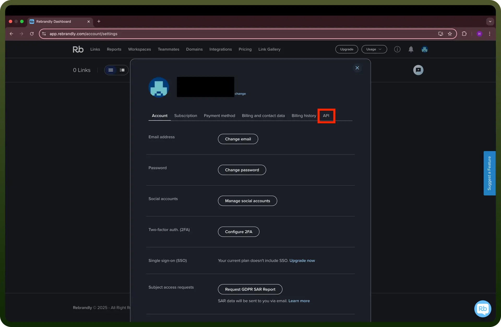

# Rebrandly connector

Source: https://www.unifyapps.com/docs/unify-integrations/rebrandly
Section: integrations

---

Rebrandly is a link management platform that lets you create, customize, and track branded short URLs. It helps enhance brand visibility and improve link trust across digital campaigns.

Integrating Rebrandly streamlines link tracking, boosts brand recognition, and enhances click-through rates with custom branded URLs.

## Authentication

Before you begin, make sure you have the following information:

- `Connection Name`**:** Choose a descriptive name for your connection, such as "MyAppRebrandlyIntegration". This helps in easily identifying the connection in your application or integration settings.
- `Authentication Type`**:** Rebrandly supports API Key authentication.

### API Key Based Authentication

- Log in into [app.rebrandly.com](https://app.rebrandly.com/)
- Click on your profile avatar in the top-right corner.
- Select "`Account Settings`" from the dropdown menu.
- Go to the "`API Keys`" section.

  

- Click "`Create API Key`" if you haven’t generated one yet.
- Copy the API Key and keep it secure, as it grants access to your Rebrandly account.

## Actions

| Actions | Description |
|---|---|
| `Create branded link` | Create a new branded link in Rebrandly |
| `Find branded link` | Find branded link in Rebrandly |
| `Update branded link` | Update branded link in Rebrandly |

## Triggers

| Triggers | Description |
|---|---|
| `New branded link` | Triggers when a new branded link is added to your account in Rebrandly |
