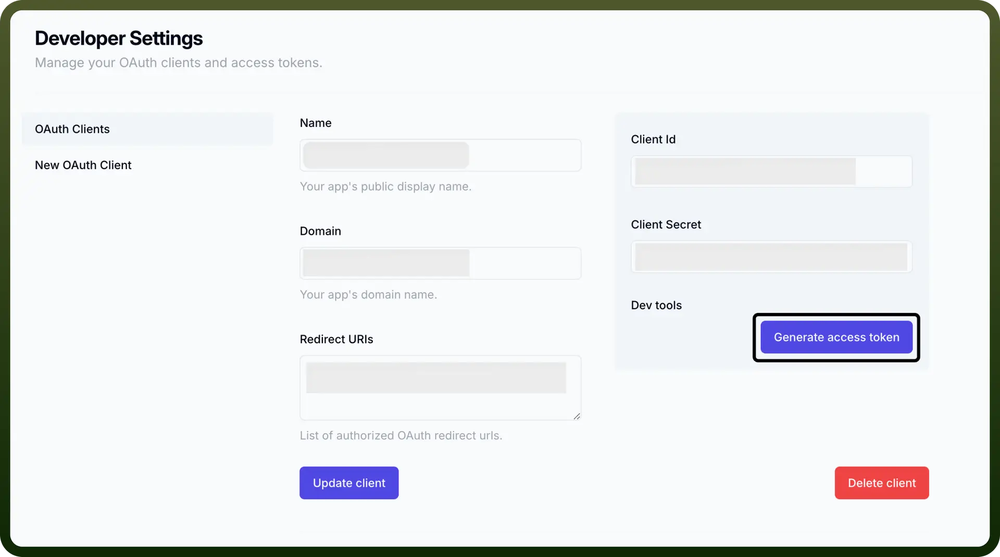

# Reflect connector

Source: https://www.unifyapps.com/docs/unify-integrations/reflect
Section: integrations

---

**Reflect** is a note-taking and knowledge management app that integrates seamlessly with tools like Kindle and calendar to help you capture, organize, and recall ideas. It supports backlinking, daily notes, and minimal UI for focused thinking.

Integrating Reflect boosts productivity by automatically syncing notes, links, and highlights into a structured, easily searchable knowledge base.

## Authentication

Before you begin, make sure you have the following information:

- Connection Name: Choose a meaningful name for your connection. This name helps you identify the connection within your application or integration settings. It could be something descriptive like "`MyAppReflectIntegration`".
- Authentication Type: Reflect supports OAuth 2.0 Authentication for secure access.

### OAuth Based Authentication

1. Visit [Reflect Developer Portal](https://reflect.app/developer/oauth).
2. Provide the required details such as name, domain, and redirect URI to generate your Client ID and Client Secret.
3. Click on '`Generate Access Token`' to obtain your access token.
4. Store these securely as they provide access to your Reflect account.

  

## Actions Supported

| Actions | Description |
|---|---|
| `Append to daily note` | Appends to daily note in Reflect |
| `Create link` | Creates a new link in Reflect |
| `Create note` | Creates a new note in Reflect |

## Triggers Supported

| Triggers | Description |
|---|---|
| `New book` | Triggers when a new book is added to your Kindle in Reflect |
| `New link` | Triggers when a new link is created in Reflect |
