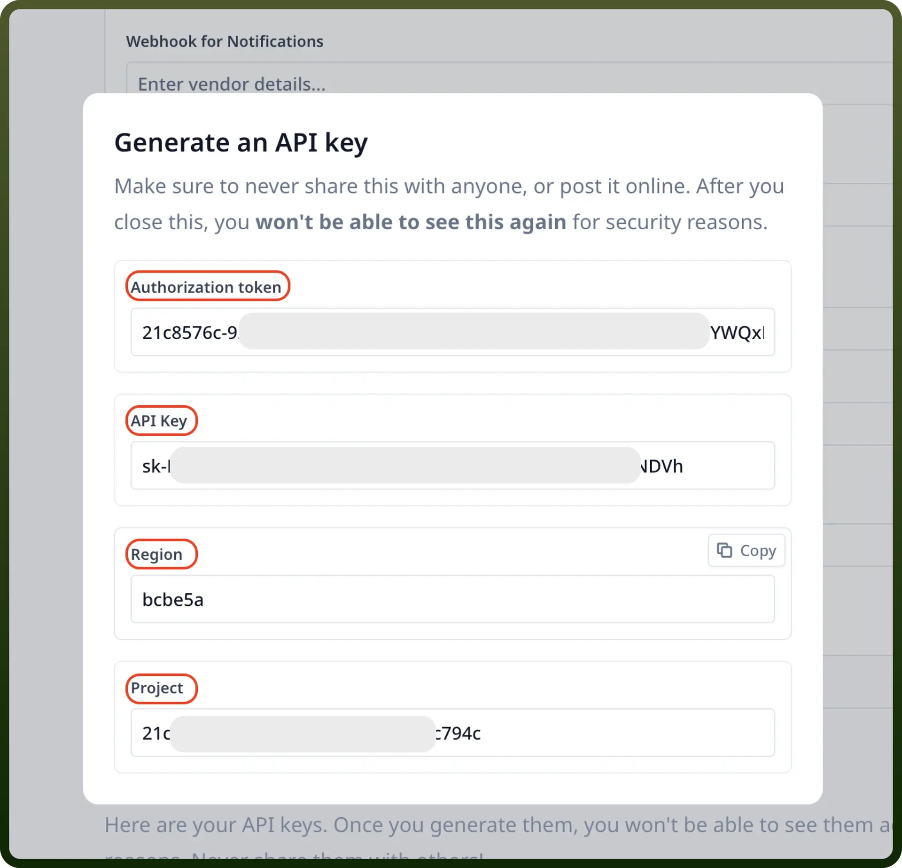

# Relevance AI integration

Source: https://www.unifyapps.com/docs/unify-integrations/relevance-ai
Section: integrations

---

Relevance AI is a no-code platform that enables businesses to build and manage AI agents and multi-agent systems, automating tasks across various functions such as sales, marketing, operations, and customer support. It empowers teams to create customizable AI agents without coding, streamlining workflows and enhancing productivity.

Integrating your application with Relevance AI enhances data-driven workflows with powerful machine learning and AI automation.

### Authentication

Before you begin, make sure you have the following information:

- `Connection Name`**:** Choose a meaningful name for your connection. This name helps you identify the connection within your application or integration settings. It could be something descriptive like "MyAppRelevanceAIIntegration".
- `Authentication Type`**:** Relevance AI supports API tokens for authentication.

### API Key Based Authentication

1. Login to your Relevance AI account and navigate to the API Keys section.
2. Scroll down to the Region code and your Project Id.
3. To generate your Relevance API key, click on "`Create new secret key`", with the role "`Admin`".
4. Click on "`Generate API key`".
5. Copy the values shown on the modal and store them securely as they provide access to your Relevance AI account.

  

## Actions

| Actions | Description |
|---|---|
| `Message Agent` | Sends a message to an Agent in Relevance AI. Doesn’t wait for a response. |
| `Upsert Data` | Upserts data into a knowledge table in Relevance AI. |
