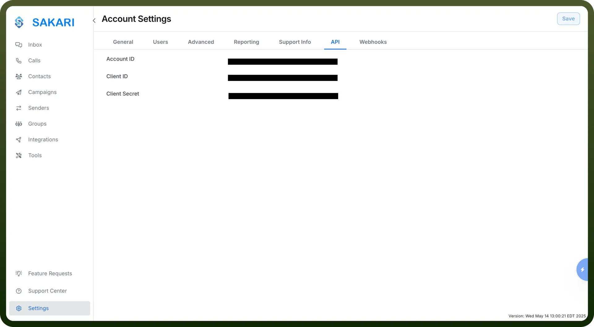

# Sakari SMS connector

Source: https://www.unifyapps.com/docs/unify-integrations/sakari-sms
Section: integrations

---

Sakari SMS is a cloud-based messaging platform that enables businesses to send and receive SMS messages at scale for marketing, sales, and customer support. It offers automation, personalized messaging, and real-time communication tools.

Integrating Sakari SMS allows seamless, automated texting workflows to improve engagement, response rates, and operational efficiency.

## Authentication

Before you begin, make sure you have the following information:

- `Connection Name`: Select a descriptive name for your connection, like "MyAppSakariSMSIntegration". This helps in easily identifying the connection within your application or integration settings.
- `Authentication Type`: Sakari SMS supports API tokens for authentication.

### API Token Based Authentication

1. Log in to your Sakari account.
2. Click on the '`settings`' icon in the left bottom corner to access '`Account Settings`'.
3. Click on '`Account Settings`' and navigate to the API section.
4. Generate new account ID, client ID and client secret.
5. Store these securely to prevent unauthorised access.

## Actions Supported

| Actions | Description |
|---|---|
| `Create contact` | Creates a new contact in Sakari SMS |
| `Find contact` | Finds a contact by ID from Sakari SMS |
| `Send message` | Sends a message to a contact in Sakari SMS |

## Triggers Supported

| Triggers | Description |
|---|---|
| `Contact created` | Triggers when a new contact is created in Sakari SMS |
| `Contact deleted` | Triggers when a contact is deleted in Sakari SMS |
| `Contact updated` | Triggers when a contact is updated in Sakari SMS |
