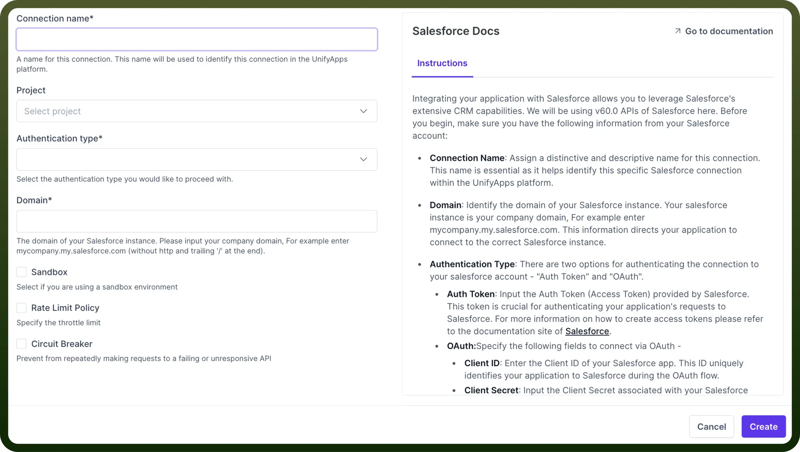

# Salesforce

Source: https://www.unifyapps.com/docs/unify-integrations/salesforce
Section: integrations

---

Using Salesforce streamlines managing customer relationships and sales processes. It helps **track** customer interactions, **manage** sales deals, and **analyze** data for better decisions.Salesforce ensures your customer data is protected with strong security. It's a tool for boosting sales efficiency and keeping customer information organized and safe.

Integrating your application with Salesforce allows you to leverage Salesforce's extensive CRM capabilities.

## Authentication

Before you begin, make sure you have the following information:



- **Connection Name**: Assign a descriptive name for this connection. This name is essential as it helps identify this specific Salesforce connection within UnifyWorkflow.
- **Domain**: This information directs your application to connect to the correct Salesforce instance. If your Salesforce instance URL is[https://mycompany.my.salesforce.com](https://mycompany.my.salesforce.com), then your domain is[mycompany.my.salesforce.com](http://mycompany.my.salesforce.com).
- **Authentication Type**: There are two options for authenticating the connection to your salesforce account - `OAuth` & `JWT Token`.

### OAuth

After entering the Domain of your company, click `Authorise`. 
It will redirect you to the login page of Salesforce, from where you can login to your Salesforce account to directly authorize and connect your salesforce account in UnifyApps.

### Salesforce JWT Token

**Step 1: Create a Private Key and Digital Cert**

Authorizing an org with the org login **jwt** command requires a digital certificate and the private key used to sign the certificate. You can use your own **private** key and **certificate** issued by a certification authority.

Alternatively, you can use OpenSSL to create a key and a self-signed digital certificate. Using a **private** key and certificate is optional when you authorize an org by logging into a browser.

This process produces two files:

- `server.key`—The private key. You specify this file when you authorize an org with the org login jwt command.
- `server.crt`—The digital certificate. You upload this file when you create the required connected app.
1. Open a **terminal** (macOS and Linux) or command prompt (Windows).
2. If necessary, install `OpenSSL` on your computer. To check whether OpenSSL is installed on your computer, run the which command on macOS or Linux or the where command on Windows.`which openssl`
3. Create a directory for **storing** the generated files, and change to the directory.`mkdir /Users/jdoe/JWT``cd /Users/jdoe/JWT`
4. Generate a private key, and store it in a file called `server.key``openssl genpkey -des3 -algorithm RSA -pass pass:SomePassword -out server.pass.key -pkeyopt rsa_keygen_bits:2048``openssl rsa -passin pass:SomePassword -in server.pass.key -out server.key`You can **delete** the `server.pass.key` file because you no longer need it.
  - Generate a certificate signing request using the server.key file. Store the certificate signing request in a file called `server.csr`. Enter information about your company when prompted.`openssl req -new -key server.key -out server.csr`
  - Generate a self-signed digital certificate from the `server.key` and `server.csr` files. Store the certificate in a file called `server.crt`.`openssl x509 -req -sha256 -days 365 -in server.csr -signkey server.key -out server.crt` **Note:** For more information, kindly lookup the[Salesforce documentation](https://developer.salesforce.com/docs/atlas.en-us.sfdx_dev.meta/sfdx_dev/sfdx_dev_auth_key_and_cert.htm).

**Step 2 : Create a External Client App**

Salesforce CLI requires a external client app in the org that you're authorizing. A external client app is a framework that enables an **external** application, in this case Salesforce CLI, to integrate with Salesforce using APIs and standard protocols, such as OAuth.

We provide a default external client app when you authorize an org with the org login **web command**. For extra security, you can create your own external client app in your org using Setup and configure it with the settings of your choice. 

You're required to create a connected app when authorizing the org with the org login jwt command.

Log in to your org.

1. From `Setup`, enter `App Manager` in the Quick Find box, then select `App Manager`.
2. In the **top-right** corner, click `New External Client App`.
3. Update the[basic information](https://help.salesforce.com/articleView?id=connected_app_create_basics.htm&language=en_US) as needed, such as the connected app name and your email address.
4. Select `Enable OAuth Settings`.
5. For the callback URL, enter[http://localhost:1717/OauthRedirect](http://localhost:1717/OauthRedirect). `fIf port 1717` (the default) is already in use on your local machine, specify an available one instead. Then update your **sfdx-project.json** file by setting the **oauthLocalPort** property to the new port. For example, if you set the callback URL to[http://localhost:1919/OauthRedirect:](http://localhost:1919/OauthRedirect:)`"oauthLocalPort" : "1919"`
6. (Required for JWT) Select `Use digital signatures`.
7. (Required for JWT) Click Choose File and upload file that contains your digital certificate, such as `server.crt`.
8. Add these OAuth scopes:
  - Manage user data via APIs (`api`)
  - Manage user data via Web browsers (`web`)
  - Perform requests at any time (`refresh_token`, `offline_access`)
9. Click `Save`, then `Continue`.
10. Click `Manage Consumer Details`.
  - If prompted, verify your identity by entering the verification code that was automatically sent to your email address.
11. Click `Copy next to Consumer Key` because you need it later when you run an org login command.
12. Click `Back to Manage External client Apps`.
13. Click `Manage`.
14. Click `Edit Policies`.
15. In the OAuth Policies section, for the Refresh Token Policy field, click `Expire refresh` **token** after: and enter 90 days or less. Setting a maximum of 90 days for the refresh token expiration is a security best practice. To continue running CLI commands against an org whose refresh tokens have expired, reauthorize it with the org login web or org login jwt command.
16. In the Session Policies section, set `Timeout Value` to 15 minutes. Setting a timeout for **access tokens** is a security best practice. Salesforce CLI automatically handles an expired access token by referring to the refresh token.
17. (Required for JWT) In the OAuth Policies section, select **Admin** approved users are pre-authorized for permitted users, and click `OK`.
18. Click `Save`.
19. (Required for JWT) Click `Manage Profiles`, select the profiles that are pre-authorized to use this connected app, and click `Save`. Similarly, click Manage Permission Sets to select the permission sets. Create permission sets if necessary.

> **Note:** For more information you can lookup the[Salesforce documentation](https://developer.salesforce.com/docs/atlas.en-us.sfdx_dev.meta/sfdx_dev/sfdx_dev_auth_connected_app.htm).

**Step 3: Login with JWT**

Logging into an org authorizes the CLI to run other commands that connect to that org, such as deploying or retrieving a project. 

You can log into many types of orgs, such as sandboxes, **Dev Hubs**, **Env Hubs**, production orgs, and scratch orgs.

Complete these steps before you run this command:

1. Create a `digital certificate` (also called digital signature) and the private key to sign the certificate. You can use your own key and certificate issued by a certification authority. Or use OpenSSL to create a key and a self-signed digital certificate.
2. Store the `private key` in a file on your computer. When you run this command, you set the `--jwt-key-file` flag to this file.
3. Create a `custom connected app` in your org using the digital certificate. Make note of the consumer key (also called client id) that’s generated for you. Be sure the username of the user logging in is approved to use the connected app. When you run this command, you set the `--client-id` flag to the consumer key.

> **Note:** See[https://developer.salesforce.com/docs/atlas.en-us.sfdx_dev.meta/sfdx_dev/sfdx_dev_auth_jwt_flow.htm](https://developer.salesforce.com/docs/atlas.en-us.sfdx_dev.meta/sfdx_dev/sfdx_dev_auth_jwt_flow.htm) for more information.

We recommend that you set an alias when you log into an org. Aliases make it easy to later reference this org when running commands that require it. If you don’t set an alias, you use the username that you specified when you logged in to the org. 

If you run multiple commands that reference the same org, consider setting the org as your default. Use `--set-default` for your default scratch org or sandbox, or `--set-default-dev-hub` for your default Dev Hub.

**Examples for org login jwt**

Log into an org with username jdoe@example.org and on the default instance URL ([https://login.salesforce.com](https://login.salesforce.com)). The private key is stored in the file `/Users/jdoe/JWT/server.key` and the command uses the connected app with consumer key (client id) 04580y4051234051.

```
sf org login jwt --username jdoe@example.org --jwt-key-file /Users/jdoe/JWT/server.key --client-id 04580y4051234051
```

Set the org as the default and give it an alias:

```
sf org login jwt --username jdoe@example.org --jwt-key-file /Users/jdoe/JWT/server.key --client-id 04580y4051234051 --alias ci-org --set-default
```

Set the org as the default Dev Hub and give it an alias:

```
sf org login jwt --username jdoe@example.org --jwt-key-file /Users/jdoe/JWT/server.key --client-id 04580y4051234051 --alias ci-dev-hub --set-default-dev-hub
```

Log in to a sandbox using URL : [https://MyDomainName-SandboxName.sandbox.my.salesforce.com](https://MyDomainName-SandboxName.sandbox.my.salesforce.com)

```
sf org login jwt --username jdoe@example.org --jwt-key-file /Users/jdoe/JWT/server.key --client-id 04
```

> **Note:** For more information you can lookup the[Salesforce documentation](https://developer.salesforce.com/docs/atlas.en-us.248.0.sfdx_cli_reference.meta/sfdx_cli_reference/cli_reference_org_commands_unified.htm#cli_reference_org_login_jwt_unified).

## Triggers

| **Triggers** | **Description** |
|---|---|
| `Monitor changes in a record` | Use this trigger to start the automation when selected fields in a record are changed, utilizing Salesforce Change data capture events. |
| `New outbound message` | Use this trigger to start the automation when a Salesforce outbound message is retrieved |
| `New record` | Use this trigger to start the automation when a record is created in Salesforce |
| `Update record` | Use this trigger to start the automation when a record is updated in Salesforce |
| `Deleted record` | Use this trigger to start the automation when a record is Deleted in Salesforce |
| `New or updated record (Batch)` | Use this polling trigger to start the automation when a record is created or updated in Salesforce |
| `New platform event` | Use this polling trigger to start the automation when a event is created in Salesforce |
| `New record (Batch)` | Use this polling trigger to start the automation when a record is created in Salesforce |

## Actions

| **Actions** | **Description** |
|---|---|
| `Create record` | Use this action to create a new record in Salesforce |
| `Delete record` | Use this action to delete a record from Salesforce |
| `Get object schema` | Use this action to get object schema in Salesforce |
| `Get record details by ID` | Use this action to get details of any standard or custom object in Salesforce |
| `Get report by ID` | Use this action to get details of a report in Salesforce |
| `Update record` | Use this action to update an existing record in Salesforce |
| `Approve record in approval process` | Use this action to approve the objects that are in the approval process in Salesforce |
| `Reject record in approval process` | Use this action to reject the objects that are in the approval process in Salesforce |
| `Submit a record for approval` | Use this action to subject a record for approval in Salesforce |
| `Create records in bulk from CSV file API 1.0` | Use this action to create records from a CSV file content in Salesforce |
| `Download attachments` | Use this action to download an attachment attached to an object in Salesforce |
| `Execute SOQL` | Use this action to execute a SOQL query and return its results from salesforce |
| `Fetch dashboard metadata` | Use this action to retrieve the metadata for a dashboard in Salesforce |
| `Fetch dashboards` | Use this action to get all the dashboard associated to your Salesforce account |
| `Fetch object fields` | Use this action to get all the fields associated to an object in Salesforce |
| `Fetch object metadata` | Use this action to fetch the metadata for a object in Salesforce |
| `Fetch organisation metadata` | Use this action to fetch the metadata for a organization in Salesforce |
| `Fetch report metadata` | Use this action to fetch the metadata for a report in Salesforce |
| `Get record details by ID` | Use this action to get details of a record from its ID in Salesforce |
| `Publish platform event` | Use this action to publish platform events in Salesforce |
| `Search records using SOQL query (API 2.0)` | Use this action to search your Salesforce data for specific records using SOQL query |
| `Search records using SOQL query(Batch)` | Use this action to search records in Bulk from your Salesforce data |
| `Update record` | Use this action to update the record in Salesforce |
| `Update record in bulk from CSV file API 1.0` | Use this action to update the records from CSV file content in Salesforce |
