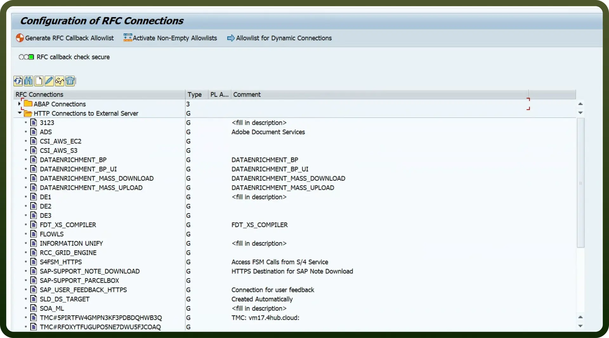
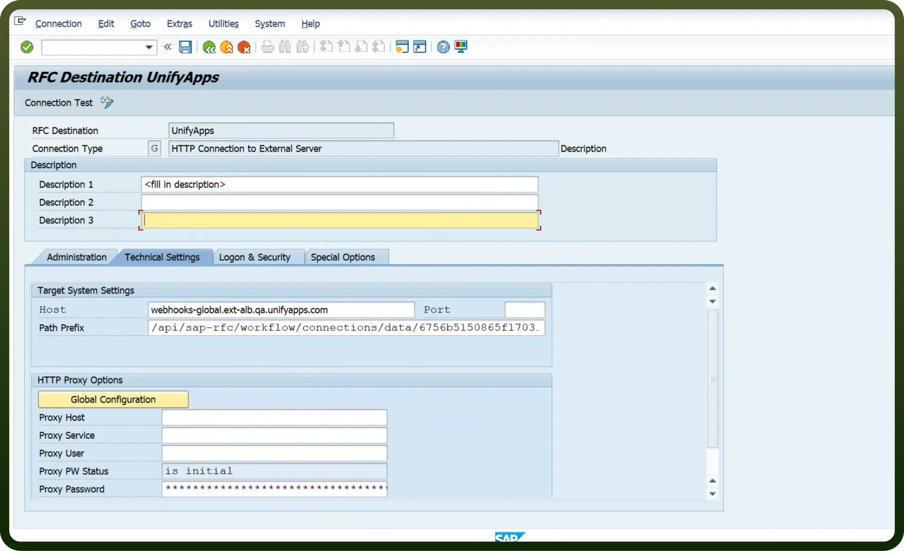
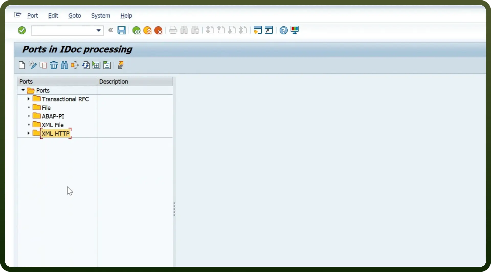
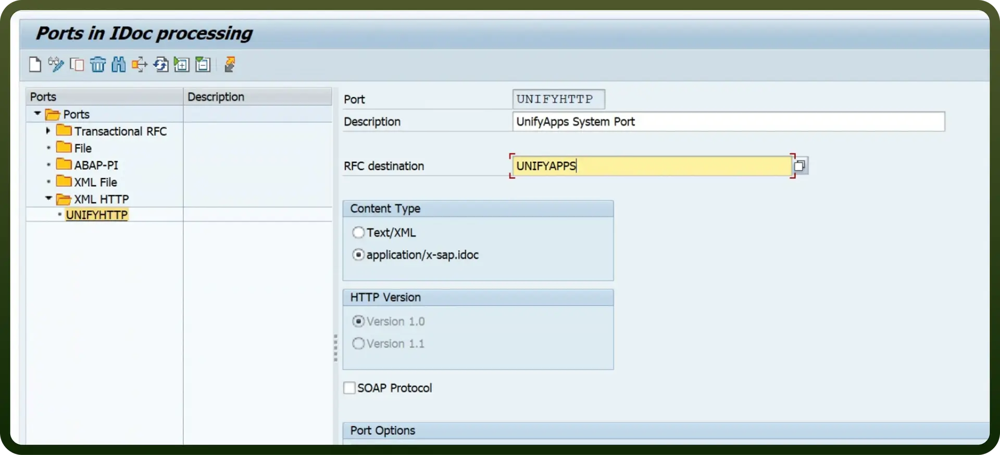
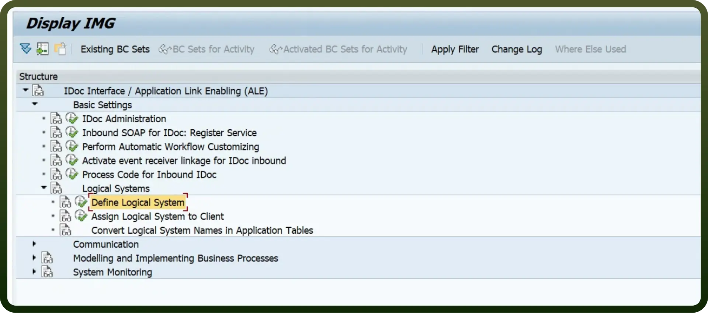
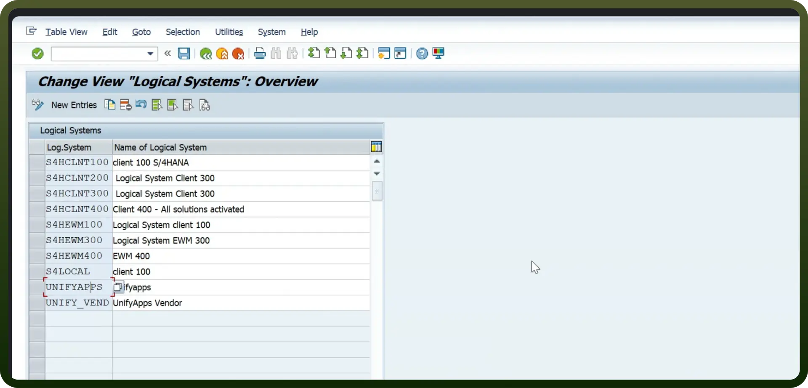
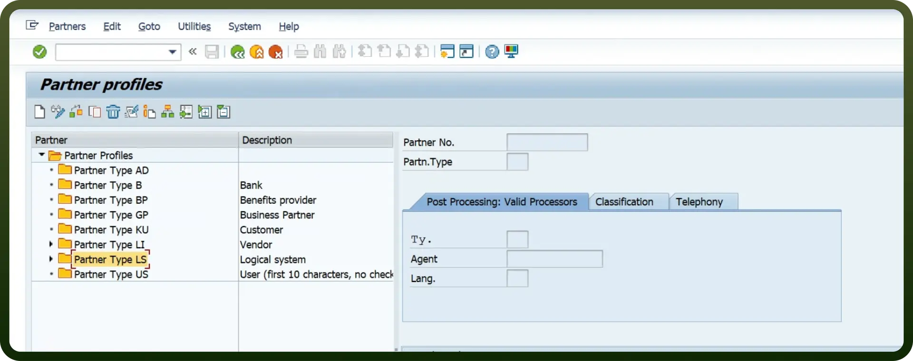
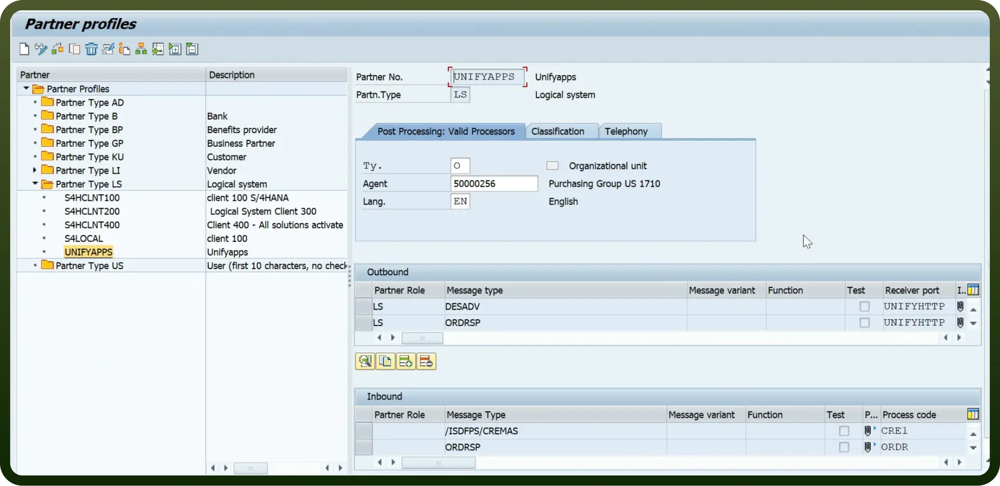
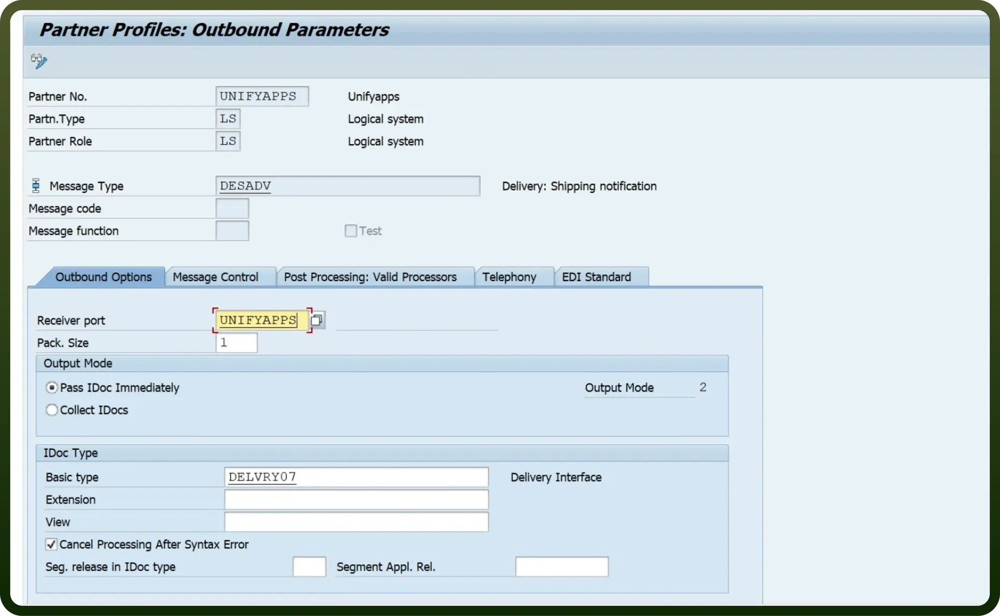
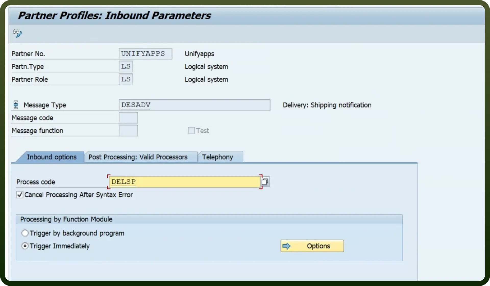

# SAP RFC connector

Source: https://www.unifyapps.com/docs/unify-integrations/sap-rfc
Section: integrations

---

SAP Remote Function Call (RFC) is a widely used interface protocol by SAP, allowing you to execute functions in remote SAP systems effortlessly. It offers robust features like secure communication, error handling, and integration with various SAP modules such as SAP ERP and SAP S/4HANA. With strong reliability and real-time access, SAP RFC is ideal for efficient, secure data exchange and process automation within SAP environments.

## Authentication

Before integrating SAP RFC, ensure you have the following information:

- `Connection Name`: Choose a descriptive name for your SAP RFC connection to help you identify it within your application or integration settings. A meaningful name, like "MyAppSAPRFCIntegration," helps maintain organisation, especially when managing multiple integrations.
- `Gateway host`: The SAP host to connect to. It could be either a DNS name (e.g., sapserver.company.com) or an IP address in format xx.xx.xx.xx.
- `System number`**:** A two-digit number representing the SAP instance (e.g., 00, 10).This identifies which application server instance the RFC will communicate with.
- `Program ID`**:** The unique identifier assigned to the RFC destination. Ensure this matches the configuration set on the SAP system. It often follows a naming convention like RFC_IntegrationID.
- `Client`**:** A three-digit SAP client number (e.g., 100, 800). SAP clients partition the system; ensure you use the correct one for your integration environment.
- `User`**:** The SAP username for authentication. This user must have the necessary permissions to execute RFC calls. Create or use a dedicated integration user for better security.
- `Password`**:** The password for the specified SAP user. Ensure secure storage and transmission of this credential, preferably using an encrypted environment variable or a secure vault.

## Configuration setup for RFC communication with SAP

Follow these steps to connect the SAP RFC connector to UnifyApps for Sending and receiving IDocs.

### **Create a RFC Connection In SAP**

- Navigate to Transaction SM59 in SAP to set up a new RFC Destination. Select the "`HTTP Connections to External Server`" folder and click the "`Create`" button.

  

- In the "`Create Destination`" modal, Provide the "`Destination`” name and "`Connection Type`" as ”`HTTP Connections to External Server`" and click on the "`Create`" Button.

  

- In the Technical Setting tab, provide the host and prefix of the webhook that you will receive from the SAP Trigger.
- Provide the Port of the server. The default port is usually 443.
- Click `Save`. Your newly created RFC destination will now appear in the list.

## Configuration for partner type LS

1. **Define a port** Log in to the SAP system and go to the transaction code WE21 to define a port for sending and receiving IDocs with the XML HTTP type.
  - Click `Create`, and when prompted for your port, you can select to either create a new port or have one generated for you.

    

  - Save this port name, as you must use it later in the ALE configuration process.

    

  - Enter the RFC Destination created in the preceding steps. In this example, the RFC Destination is UnifyApps.
2. **Create a Logical System**
  - Go to transaction code SALE and define a Logical System dedicated to UnifyApps.

    

  - Create a new Logical System to interface IDocs. The name you select will also be used for the Partner Profile created in the following steps.

    

3. **Create a Partner profile** Go to transaction code `WE20` to define a Partner profile to send and receive IDocs

  

  - Create a Partner profile using the LS (Logical System) type. Use the same name as the Logical System in the preceding step.
  - Define the Message types that you plan to send and receive in UnifyApps

    

  - **Outbound parameters:** Outbound parameters correspond to IDocs sent from SAP to UnifyApps.
  - **Inbound parameters:** Inbound parameters correspond to IDocs sent from UnifyApps to SAP.
  - While adding Outbound parameters, when prompted for the Basic Type of the IDoc message type, register all the IDocs you plan to use individually. For IDocs with extensions, ensure that you enter the extension as well

    

  - When prompted for your receiver port, provide the same port you defined in the preceding steps, and then toggle the Output Mode to Pass IDoc Immediately.
  - Add the Inbound parameters you plan to use when prompted for the process code, and choose the appropriate process code for the message type.
  - Toggle the Processing by Function Module to Trigger Immediately and select the Cancel Processing After Syntax Error check box.

    

## Actions

| **Action** | **Description** |
|---|---|
| `Check IDoc status` | Checks IDoc status in SAP RFC |
| `Send IDoc` | Sends IDoc on SAP RFC |

## Triggers

| **Trigger** | **Description** |
|---|---|
| `New IDoc` | Triggers when a new IDoc is created |
