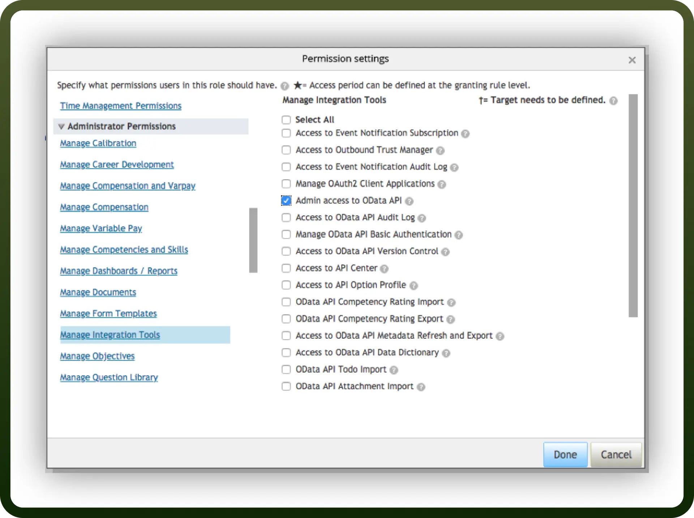
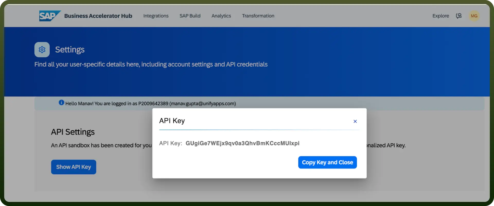

# SAP SuccessFactors

Source: https://www.unifyapps.com/docs/unify-integrations/sap-successfactors
Section: integrations

---

SAP SuccessFactors is a cloud-based human capital management (HCM) suite that helps organizations manage HR functions like recruiting, onboarding, performance, and learning. It enables data-driven HR decisions and employee lifecycle optimization.

Integrating SAP SuccessFactors streamlines HR processes, enhances workforce insights, and improves employee engagement across the organization.

## Authentication

Before you begin, make sure you have the following information:

- `Connection Name`: Select a descriptive name for your connection, like "MyAppSAPSuccessFactorsIntegration". This helps in easily identifying the connection within your application or integration settings.
- `Instance Details`:
  - Company ID (also known as Company Identifier)
  - Environment information (Eg. Sandbox, Production)
  - Data center location
- `Authentication Type`**:** SAP SuccessFactors supports Username Password and API keys for authentication.

## Prerequisites for SAP SuccessFactors Connection

Before establishing a connection to SAP SuccessFactors, ensure you have the following prerequisites in place:

1. **Valid SAP SuccessFactors Subscription**: An active subscription to the SAP SuccessFactors modules you intend to integrate with.
2. **Required Access Permissions**: Administrative access rights within your SuccessFactors environment to configure integrations. Specifically, we need:
  - Employee Central Foundation SOAP API
  - Employee Central HRIS SOAP API or Employee Central Compound Employee API (restricted access)
  - Employee Central Compound Employee API (restricted segment access)
  - Employee Central Foundation OData API (read-only)
  - Employee Central HRIS OData API (read-only)
  - Employee Central Foundation OData API (editable)
  - Employee Central HRIS OData API (editable)
  - Admin access to MDF OData API

    

### Basic Authentication

- Go to **“**`Admin Centre`**”** > **“**`Company Settings`**”** > **“**`Password & Login Policy Settings`**”**.
- Select API Login Exceptions.
- Create an appropriate user name and password.
- Save your changes.
- Grant relevant API permissions as listed above.
- Enable following IP address whitelisting settings by going to “`Admin Center`**”** > “`Manage OData API Basic Authentication`**”**.
- Select “`Always`” option.

### API Key Based Authentication

- Go to `SAP Business Accelerator Sub` > `Profile` > `Settings`
- You can see an option to generate API key, which can be used in integration.
- Copy the key and store is securely to prevent unauthorised access.

  

## Actions

| Actions | Description |
|---|---|
| `Add internal work experience` | Adds internal work experience in SAP SuccessFactors |
| `Add new entity to background community` | Add new entity to background community in SAP SuccessFactors |
| `Approve leave application` | Approve leave application in SAP SuccessFactors |
| `Create background outside work experience` | Creates background outside work experience in SAP SuccessFactors |
| `Create background promotability` | Creates a new background promotability in SAP SuccessFactors |
| `Create feedback request` | Creates a feedback request in SAP SuccessFactors |
| `Create goal` | Creates goal in SAP SuccessFactors |
| `Create record` | Creates record in SAP SuccessFactors |
| `Delete background outside work experience` | Deletes background outside work experience in SAP SuccessFactors |
| `Delete background promotability` | Deletes a background promotability in SAP SuccessFactors |
| `Delete background promotability` | Deletes a background promotability in SAP SuccessFactors (duplicate entry) |
| `Delete entity to background community` | Delete entity to background community in SAP SuccessFactors |
| `Delete goal` | Deletes goal in SAP SuccessFactors |
| `Delete internal work experience` | Deletes internal work experience in SAP SuccessFactors |
| `Delete record` | Deletes record in SAP SuccessFactors |
| `Fetch background community` | Fetch background community in SAP SuccessFactors |
| `Fetch background promotability` | Fetches background promotability in SAP SuccessFactors |
| `Fetch leave details of employee` | Fetch leave details of an employee in SAP SuccessFactors |
| `Get form audit trail` | Gets form audit trail in SAP SuccessFactors |
| `Get form header audit trail` | Gets form header audit trail or meta information of a given form |
| `Get form objective` | Gets information of an objective in a given form |
| `Get goal by ID` | Gets goal information by ID |
| `List background outside work experience` | Lists background outside work experience |
| `List customized weighted rating sections` | Lists customized weighted rating sections |
| `List employment information of user` | Lists employment information of user |
| `List form audit trails` | Lists audit trails about a form |
| `List form folders` | Lists form folders |
| `List form objective competency summary` | Lists form objective competency summary |
| `List form objective sections` | Lists form objective sections |
| `List form summary sections` | Lists form summary sections |
| `List form templates` | Lists form templates |
| `List form user information` | Lists form user information sections |
| `List internal work experience` | Lists internal work experience |
| `List performance potential summary sections` | Lists performance potential summary sections |
| `List personal emergency contacts` | Lists personal emergency contacts |
| `Replace goal` | Replaces goal |
| `Respond to feedback request` | Responds to a feedback request |
| `Search records` | Search records in SAP SuccessFactors |
| `Submit 360 Reviews form` | Submits 360 Reviews form in SAP SuccessFactors |
| `Update background outside work experience` | Updates background outside work experience in SAP SuccessFactors |
| `Update background promotability` | Updates a background promotability in SAP SuccessFactors |
| `Update background promotability` | Updates a background promotability in SAP SuccessFactors (duplicate entry) |
| `Update bank` | Updates a bank in SAP SuccessFactors |
| `Update candidate` | Updates a candidate in SAP SuccessFactors |
| `Update entity to background community` | Update entity to background community in SAP SuccessFactors |
| `Update form summary section` | Updates form summary section in SAP SuccessFactors |
| `Update job application` | Updates a job application in SAP SuccessFactors |
| `Update record` | Updates record in SAP SuccessFactors |
| `Update self rating and comment` | Updates self rating and comment of an objective in a given form |
| `Upsert external user record` | Upsert external user record in SAP SuccessFactors |
| Upsert goal | Upsert goal in SAP SuccessFactors |
| `Upsert internal work experience` | Upsert internal work experience in SAP SuccessFactors |
| `Upsert objective rating and competency rating` | Upsert objective rating and competency rating in SAP SuccessFactors |
| `Upsert record` | Upsert record in SAP SuccessFactors |
| `Upsert section comment` | Upsert section comment in SAP SuccessFactors |

## Triggers

| Triggers | Description |
|---|---|
| `On New User` | Triggers when a new user is created in SAP SuccessFactors |
| `On new or updated record` | Triggers when a new record is created or an existing record is updated |
| `On new or updated record` | Retrieves a list of new or updated records in SAP SuccessFactors |
