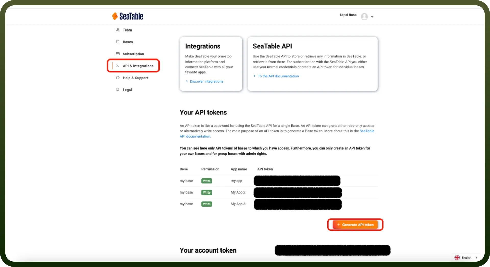

# SeaTable connector

Source: https://www.unifyapps.com/docs/unify-integrations/seatable
Section: integrations

---

**SeaTable** is a collaborative online spreadsheet-database hybrid that lets teams organize, manage, and analyze structured data with ease. It combines spreadsheet familiarity with database functionalities and supports automation, scripting, and integration.

Integrating SeaTable enables dynamic workflows, centralized data management, and automation across tools like `Zapier`, `Make`, and `APIs` for enhanced team productivity.

## Authentication

Before you begin, make sure you have the following information:

- `Connection Name`**:** Select a descriptive name for your connection, like “MyAppSeaTableIntegration”. This helps in easily identifying the connection within your application or integration settings.
- `Authentication Type`**:** SeaTable supports Token based authentication.

### API Token Based Authentication

- Log into your SeaTable account and navigate to the `Team admin` section from the profile menu.
- In the `API & Integrations` section in the sidebar, you will find your `API tokens`.
- You can generate API token by clicking on `Generate API token` button.
- Copy the API token and keep it secure, as it grants access to your SeaTable account.

## Actions

| Actions | Description |
|---|---|
| `Create rows` | Creates rows in SeaTable |
| `Delete rows` | Deletes rows in SeaTable |
| `Get row` | Gets a row in SeaTable |
| `List rows` | Lists all rows in SeaTable |
| `Lock rows` | Locks rows in SeaTable |
| `Unlock rows` | Unlocks rows in SeaTable |
| `Update rows` | Updates rows in SeaTable |

## Triggers

| Triggers | Description |
|---|---|
| `Create or update row` | Triggers when a row is created or updated in SeaTable |
