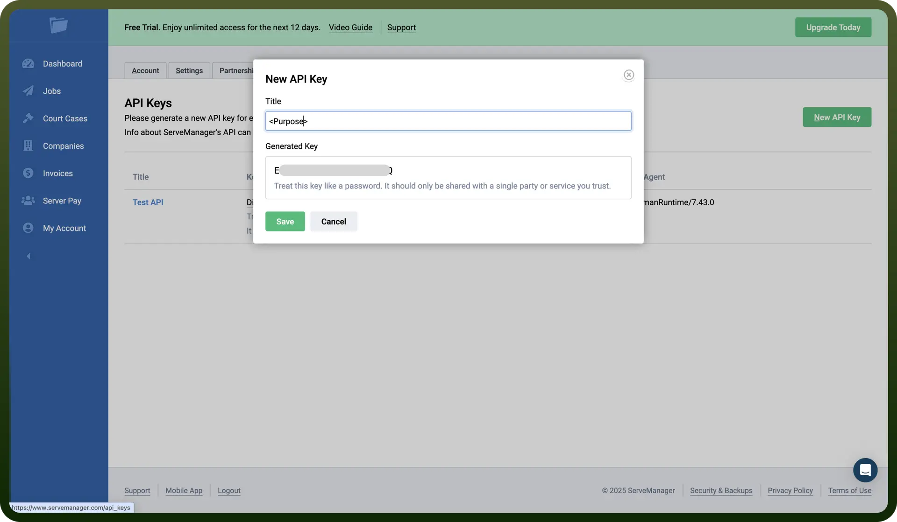

# ServeManager

Source: https://www.unifyapps.com/docs/unify-integrations/servemanager
Section: integrations

---

ServeManager is a cloud-based field service platform tailored for legal professionals and process servers, centralizing case details, court documents, and client communications into a single dashboard. It provides end-to-end job management with mobile-native dispatch, electronic proof of service, and real-time status updates.

Integrating ServeManager automates data sync and job workflows, cutting down manual entry, speeding up service delivery, and boosting operational accuracy.

## Authentication

Before you begin, make sure you have the following information:

- `Connection Name`: Select a descriptive name for your connection, like "MyAppServeManagerIntegration". This helps in easily identifying the connection within your application or integration settings.
- `Authentication Type`**:** ServeManager supports API tokens for authentication.

### API Key Based Authentication

1. Navigate to `My Account` from the left-hand panel.
2. In the top navigation bar, click on `Settings`.
3. Select `Integrations` from the settings menu.
4. Click `Manage` next to the `API Keys` section.
5. Click `New API Key` to generate a new key.
6. Copy the generated API key and store it securely to prevent unauthorized access.

  

## Actions

| Actions | Description |
|---|---|
| `Create company` | Creates a new company in ServeManager |
| `Create court case` | Creates a new court case in ServeManager |
| `Create job` | Creates a new job in ServeManager |
| `Create note` | Creates a new note in ServeManager |
| `List companies` | Lists companies from ServeManager |
| `List court cases` | Lists court cases from ServeManager |
| `List jobs` | Lists jobs from ServeManager |
| `Upload job attachments` | Uploads attachments for a job in ServeManager |

## Triggers

| Triggers | Description |
|---|---|
| `New affidavit created` | Triggers when a new affidavit is created in ServeManager |
| `New attempt created` | Triggers when a new attempt is created in ServeManager |
| `New invoice issued` | Triggers when a new invoice is issued in ServeManager |
| `New job created` | Triggers when a new job is created in ServeManager |
