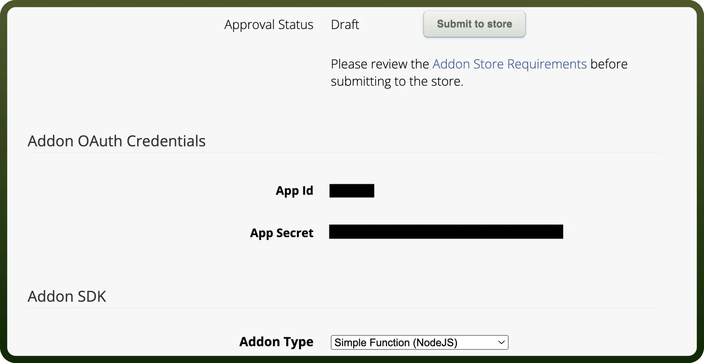

# ServiceM8 connector

Source: https://www.unifyapps.com/docs/unify-integrations/servicem8
Section: integrations

---

ServiceM8 is a job management software designed for trade and service businesses, helping streamline scheduling, quoting, invoicing, and customer communication. It enables real-time job tracking and automation to improve efficiency and service delivery.

Integrating your application with ServiceM8 enhances field service management, enabling efficient scheduling, job tracking, and invoicing.

## Authentication

Before you begin, make sure you have the following information:

- `Connection Name`**:** Choose a descriptive name for your integration. For example, "MyAppServiceM8Integration" will help you easily identify the connection within your application or integration settings.
- `Authentication Type`**:** ServiceM8 uses OAuth 2.0 for secure authentication and authorization.

### **OAuth Based Authentication**

1. Register as a [Development Partner](https://www.servicem8.com/developer-registration).
2. Login, navigate to the account section in the main menu and then click `Developer`.
3. Click "`Add Item`" to create your add-on.
4. After you save your add-on, you'll be issued with an `App Id` and `App Secret`.

  

5. While setting up your application in ServiceM8, specify the permissions your application needs (e.g., access to Jobs, Clients, Staff).
6. Copy the `Client ID` and `Client Secret` for use in your application's integration setup. Treat these credentials with high confidentiality to prevent unauthorized access.
7. Implement an OAuth 2.0 authorization flow in your application. Refer the docs for more details- [ServiceM8 API Documentation](https://developer.servicem8.com/).
8. Direct users to the authorization URL provided by ServiceM8. Include your Client ID and Redirect URL in the request.
9. Exchange the authorization code for an access token by making a POST request to the ServiceM8 token endpoint.
10. Store the access token securely in your application for making API requests.

## Actions

| Actions | Description |
|---|---|
| `Create client` | Creates a new client in ServiceM8. |
| `Create job` | Creates a new job in ServiceM8. |
| `Delete client` | Deletes a client from ServiceM8. |
| `Delete job` | Deletes a job from ServiceM8. |
| `List all clients` | Lists all clients in ServiceM8. |
| `List all jobs` | Lists all jobs in ServiceM8. |
| `Retrieve client` | Retrieves a client from ServiceM8. |
| `Retrieve job` | Retrieves a job from ServiceM8. |
| `Update client` | Updates a client from ServiceM8. |
| `Update job` | Updates a job from ServiceM8. |

## Triggers

| Triggers | Description |
|---|---|
| `Job completed` | Triggers when a job's status changes to completed in ServiceM8. |
| `Job queued` | Triggers when a job is assigned to a queue in ServiceM8. |
| `New client` | Triggers when a new client is created in ServiceM8. |
| `New form response` | Triggers when a form is completed in ServiceM8. |
| `New job` | Triggers when a new job is created in ServiceM8. |
