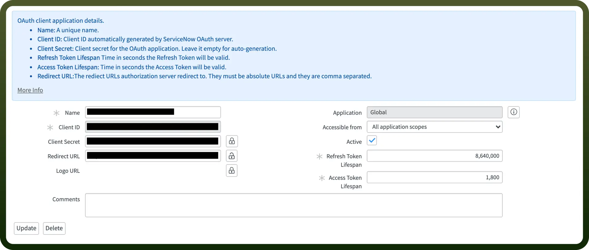
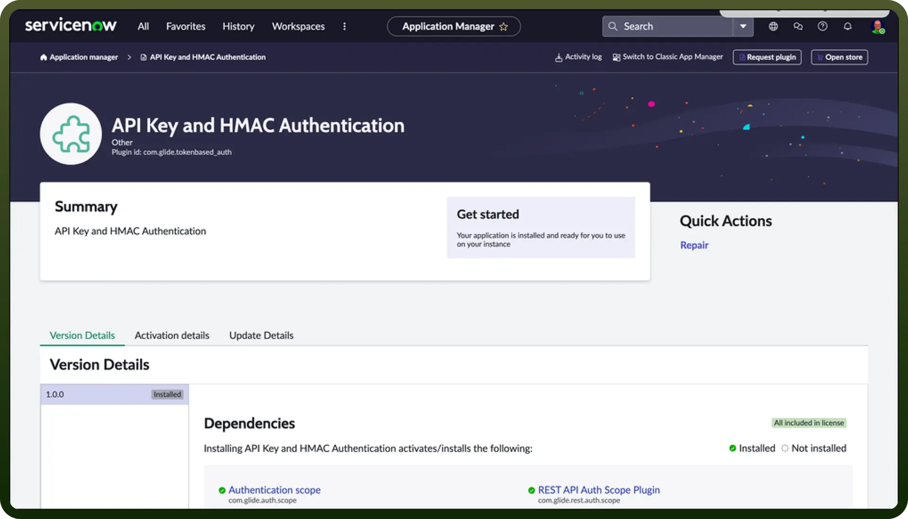
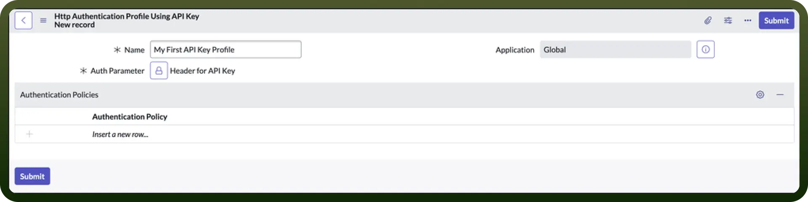
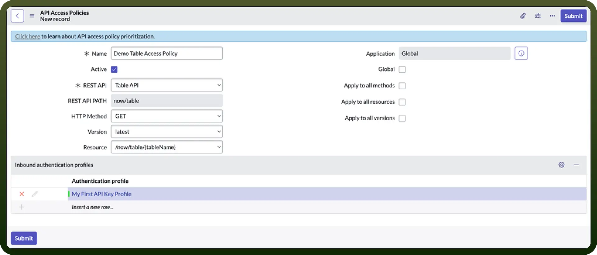

# ServiceNow connector

Source: https://www.unifyapps.com/docs/unify-integrations/servicenow
Section: integrations

---

Using ServiceNow helps you manage work requests and services smoothly. It lets you track issues, automate tasks, and analyze how things are going to get better over time. ServiceNow makes sure your information stays safe with strong security measures. It's a great tool for organizing service tasks and keeping everything running smoothly and securely.

Integrating your application with a ServiceNow account can significantly streamline your business processes, automate tasks, and enable seamless data flow between systems.

## Authentication

Before you begin, make sure you have the following information:

- `Connection Name`: Select a descriptive name for your connection that will be visible in all automations.
- `Instance Name`: Identify your ServiceNow instance name from your ServiceNow URL; for example, 'acme' from[https://acme.service-now.com](https://acme.service-now.com).
- `Select Authentication Type`: Choose the type of authentication you wish to use for the connection.
  - Username/Password
  - OAuth 2.0
  - Password grant
  - API token

### User Credentials Based Authentication

- `Username`: Provide the username you plan to use to connect to ServiceNow.
- `Password`: Provide the password you plan to use to connect to ServiceNow.

### OAuth 2.0 Based Authentication

- Navigate to `All` > `System OAuth` > `Application Registry` and then click `New`.
- On the interceptor page, click `Create an OAuth API endpoint for external clients` and then fill in the form. **Note:** In the Redirect URL section paste the following link [https://webhooks-global.ext-alb.qa.unifyapps.com/api/connector-auth-callback/oauth](https://webhooks-global.ext-alb.qa.unifyapps.com/api/connector-auth-callback/oauth).
- Copy the Client ID and Secret and store them securely to prevent unauthorised access.

  

### Password Grant Based Authentication

- Provide the username you plan to use to connect to ServiceNow.
- Provide the password you plan to use to connect to ServiceNow.
- Provide the Client ID for the connection to use for authorization.
- Provide the Client secret for this OAuth application.
- Refer the OAuth 2.0 Section for details to obtain Client ID and Secret.

### API Token Based Authentication

1. **The Plugin**
  - Navigate to `All` > `Admin Center` > `Application Manager` and verify the plug API Key and HMAC Authentication (com.glide.tokenbased_auth) is activated. If not please activate.

    

2. **Create the Inbound Authentication Profile**
  - Navigate to `All` > `System Web Services` > `API Access Policies` > `Inbound Authentication Profile`.
  - Click `New`.
  - Click Create API Key authentication profiles.
  - Provide a descriptive name in the Name field.
  - In the Auth Parameter field, add either the *Query Parameter* or *Auth Header* record for *x-sn-apikey*.
  - Click `Submit`.

    

3. **Create the REST API key**
  - Navigate to `All` **>** `System Web Services` **>** `API Access Policies` **>** `REST API Key`.
  - Click `New`.
  - Provide a descriptive name and select a user.
  - Use the form menu and choose `Save`.
4. **The API Access Policy**
  - Navigate to `All` **>** `System Web Services` **>** `API Access Policies` **>** `REST API Access Policies`.
  - Click `New`.
  - Provide a descriptive name, and select the REST API you want to use.
  - Add your new API Authentication Profile to the embedded list on the form.
  - Click `Submit`.

    

## Triggers

| **Trigger** | **Description** |
|---|---|
| `New or updated incident` | Triggers when an incident is created or updated in ServiceNow |
| `New or updated record` | Triggers when a record is created or updated in a selected table in ServiceNow |
| `New or updated records` | Triggers when a batch of records is created or updated in a selected table in ServiceNow |
| `New record` | Triggers when a record is created in a selected table in ServiceNow |
| `New records` | Triggers when a batch of records is created in a selected table in ServiceNow |
| `Scheduled record search` | Execute query on specified schedule and return results as list of records |

## Actions

| Actions | Description |
|---|---|
| `Add comment to item` | Adds comment to a item in ServiceNow |
| `Create order` | Creates an order in ServiceNow |
| `Create record` | Creates a record in a table in ServiceNow |
| `Create record using template` | Creates a record using template in ServiceNow |
| `Create user` | Creates a new user record in the sys_user table in ServiceNow |
| `Delete user` | Deletes a user record in the sys_user table in ServiceNow |
| `Fetch attachments` | Fetches attachments for a given record of the table in ServiceNow |
| `Get attachment contents` | Gets the contents of a file attachment in ServiceNow |
| `Get comment by Sys ID` | Gets comment by SYS ID from ServiceNow |
| `Get object schema` | Gets object schema from ServiceNow |
| `Get table` | Get a table in ServiceNow |
| `Get tables` | Get a table in ServiceNow |
| `Get user by ID` | Gets user by ID from ServiceNow |
| `List service catalog items` | List all the items in service catalogs in ServiceNow |
| `List tables` | List all the tables in ServiceNow |
| `Search records using query` | Searches for records using query in a table in ServiceNow |
| `Update record` | Updates a record in ServiceNow |
| `Update record using template` | Updates a record using template in ServiceNow |
| `Update user` | Updates a user in ServiceNow |
| `Upload attachment` | Uploads an attachment to a given record of a table in ServiceNow |
