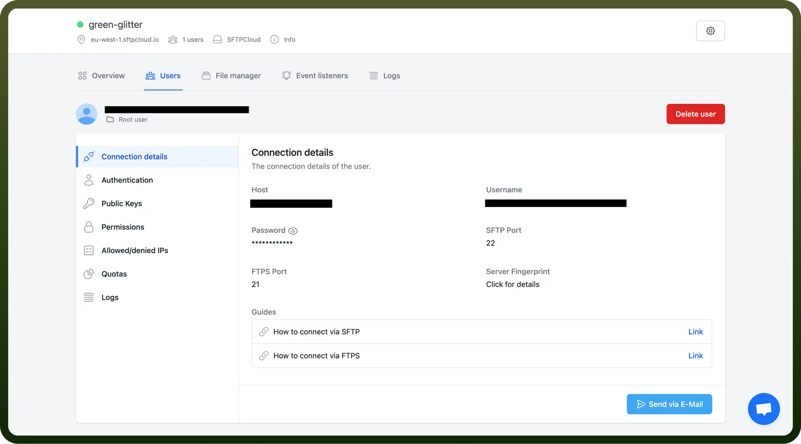

# SFTP connector

Source: https://www.unifyapps.com/docs/unify-integrations/sftp
Section: integrations

---

SFTP (Secure File Transfer Protocol) enables secure file transfers between systems by encrypting all data and credentials. It allows users to easily upload, download, and manage files on remote servers, supports resumable transfers, and offers compression for efficient handling of large files.

Integrating SFTP enhances secure file transfers, automates workflows, and ensures compliance with data protection standards in a single solution.

## Authentication

Before you begin, make sure you have the following information:

- `Connection Name`**:** Choose a meaningful name for your connection. This name helps you identify the connection within your application or integration settings. It could be something descriptive like "MyAppSFTPIntegration."
- `Authentication Type`**:** Select the type of authentication for connecting to your SFTP server:
  - Basic
  - Private Key
  - Private Key with Password

### Basic authentication

**How to setup Server**

1. Log into your server or hosting platform
2. Navigate to the SFTP settings or user management area
3. Create a new user account specifically for SFTP access
4. Assign necessary permissions and set up the home directory
5. Obtain the SFTP credentials (username and password)

**Connecting with SFTP Client**

Using an SFTP client (like SFTP Cloud.io):

1. Open the client and add a new connection
2. Enter the connection details:
  - `Host address`
  - `Port` (usually 22)
  - `Username`
  - `Password`
3. Connect to the server and begin transferring files securely

### Private key

1. Generate a key pair on your local machine. ([https://dev.to/risafj/ssh-key-authentication-for-absolute-beginners-in-plain-english-2m3f](https://dev.to/risafj/ssh-key-authentication-for-absolute-beginners-in-plain-english-2m3f))
2. Copy the public key to the remote server's authorized_keys file.
3. Configure your SSH client to use the private key.
4. Attempt to connect to the remote server.
5. If successful, you'll be logged in without needing a password.

### Private Key with Password

1. Generate a key pair on your local machine. ([https://dev.to/risafj/ssh-key-authentication-for-absolute-beginners-in-plain-english-2m3f](https://dev.to/risafj/ssh-key-authentication-for-absolute-beginners-in-plain-english-2m3f))
2. Copy the public key to the remote server's authorized_keys file.
3. Configure your SSH client to use the private key.
4. When connecting, provide the password (refer **Connecting with SFTP Client section**).
5. Attempt to connect to the remote server.
6. If successful, you'll be logged in after providing your private key password.

## Actions

| **Action** | **Description** |
|---|---|
| `Create Folder` | Creates a folder in SFTP server |
| `List Folder` | Lists a folder in SFTP server |
| `Delete Folder` | Deletes a folder from SFTP sever |
| `Upload File` | Uploads a file to SFTP server |
| `Get File Information` | Gets information about a file from SFTP server |
| `Download File` | Downloads a file from SFTP server |
| `Rename/Move a File` | Renames/moves a file on SFTP server |
| `Delete File` | Deletes a file from SFTP server |

## Triggers

| **Trigger** | **Description** |
|---|---|
| `On new or updated file` | Triggers for each newly added or modified file. |
| `On new or updated csv file` | Triggers when a new csv file is added or an existing csv file is updated in a directory. Trigger per single or batch of lines in parsed csv file. |
