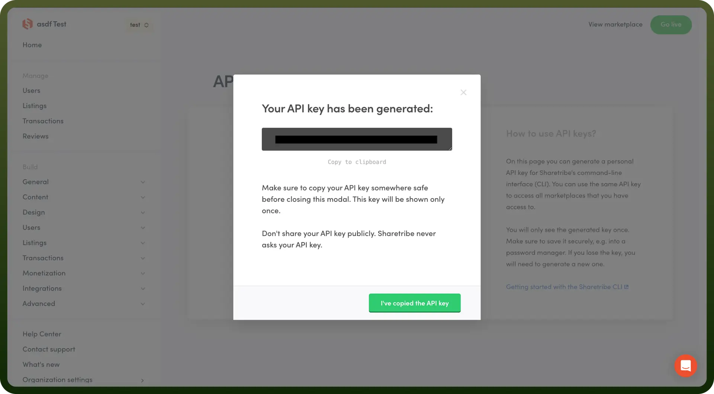

# Sharetribe connector

Source: https://www.unifyapps.com/docs/unify-integrations/sharetribe
Section: integrations

---

Sharetribe is a no-code platform for building and launching online marketplaces. It provides customizable tools for managing listings, payments, and user interactions.

Integrating your application with Sharetribe enhances your event management capabilities by enabling streamlined lead management, automated workflows, and detailed analytics.

## Authentication

Before you begin, make sure you have the following information:

- `Connection Name`**:** Choose a meaningful name for your connection. This name helps you identify the connection within your application or integration settings. It could be something descriptive like "SharetribeIntegration".
- `Authentication Type`**:** Sharetribe provides the Access Token Authentication.

### Access Token Based Authentication

1. Log in to your Sharetribe account.
2. Click on the "`Advanced`" option on the left side navigation panel.
3. Click on the option to create an application and choose an application name and select "`Integration API`".
4. Copy the generated Client ID and Client secret, as they won't be fully visible again after you leave the page. Store these securely to prevent unauthorised access.
5. You need to use these credentials in the authentication section along with scope as "`integ`" and grant_type as "`client_credentials`" to get the access token.

  

## Actions

| Actions | Description |
|---|---|
| `Approve listing` | Approves listing in Sharetribe |
| `Approve user` | Approves user in Sharetribe |
| `Close listing` | Closes listing in Sharetribe |
| `Open listing` | Opens listing in Sharetribe |
| `Query transaction` | Queries transaction in Sharetribe |
| `Show listing` | Shows listing in Sharetribe |
| `Show transaction` | Shows transaction in Sharetribe |
| `Show user` | Shows user in Sharetribe |
| `Update permissions of user` | Updates permissions of user in Sharetribe |
