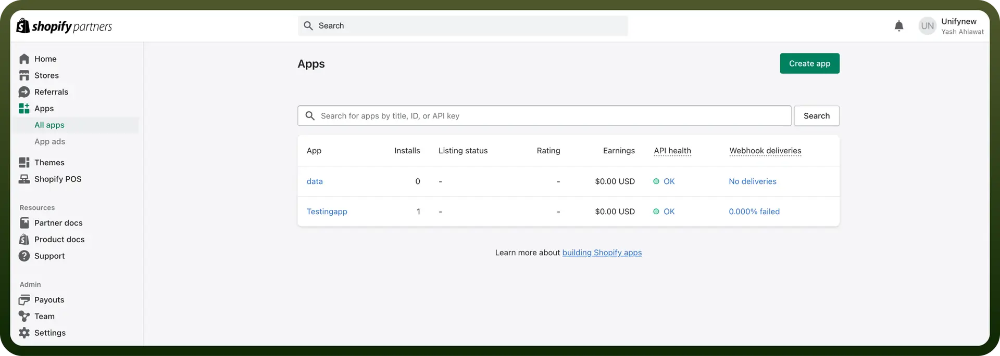
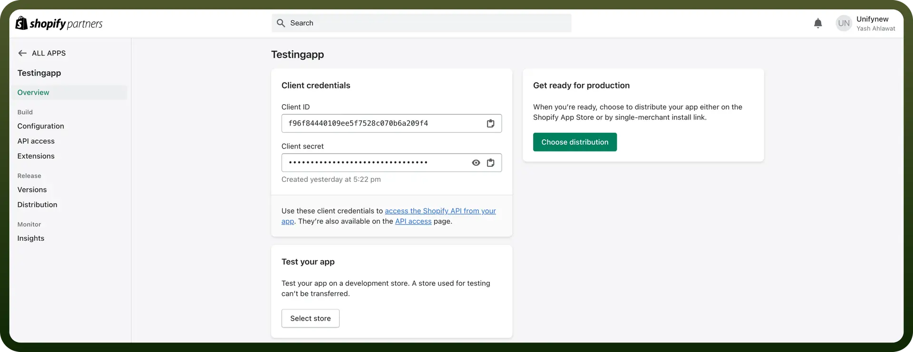
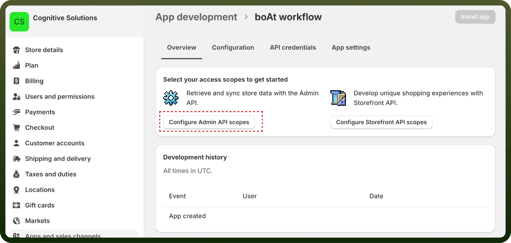
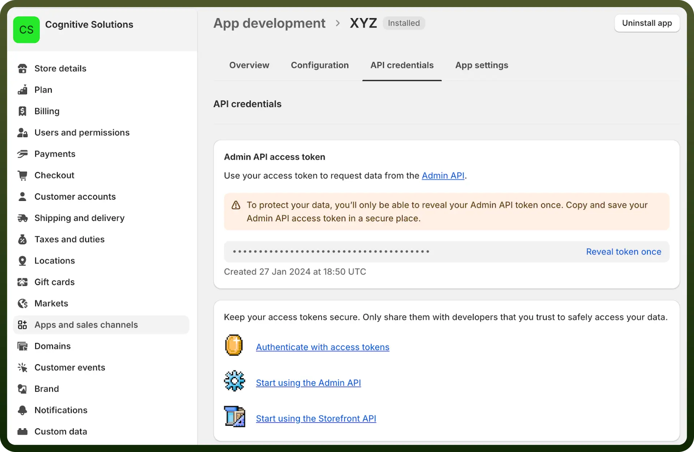

# Shopify connector

Source: https://www.unifyapps.com/docs/unify-integrations/shopify
Section: integrations

---

Shopify is a leading e-commerce platform that allows businesses to create, customize, and manage online stores effortlessly. It provides tools for inventory management, payment processing, shipping, and marketing, making it ideal for entrepreneurs and enterprises alike.

Integrating Shopify streamlines e-commerce operations, enhances customer experience, and boosts sales with seamless tools for inventory, payments, and marketing.

## Authentication

Before you begin, make sure you have the following information:

- `Connection Name`: Select a descriptive name for your connection, like "MyAppShopifyIntegration". This helps in easily identifying the connection within your application or integration settings.
- `Access Token`: Enter the admin token provided when installing your custom app.
- `Shop name`**:** If your shopify address looks like https://shopname.myshopify.com/admin, we need 'shopname' from it.

### OAuth Based Authentication

Complete the following steps to locate the necessary `client ID` and `client secret`:

- Sign in to or register for your [Partner account](https://www.shopify.com/partners?shpxid=ee398401-FDF0-456F-8A98-1F6A1FF9BB37)
- Click `Apps` and then `Create app` and provide a name for your app.

  

- Click `Create app manually` and Click `Create`.
- Shopify redirects you to the app dashboard, which contains the `Client ID` and `Client secret key`.
- Click API access on the left navigation. Type https://www.unifyapps.com into the App URL and https://webhooks-global.ext-alb.qa.unifyapps.com/api/connector-auth-callback/oauth into the Allowed redirection URL(s) fields.
- Refer to the [Shopify documentation](https://shopify.dev/apps/auth/oauth/getting-started) on OAuth apps for more information.

  

### Access Token Based Authentication

Follow the steps below to create a custom app and find the necessary access token:

- Login to Shopify, and navigate to "`App and sales channel settings`" in the left hand menu.
- Click on "`Develop apps for your store`", then "`Create an app`".
- Name the App, and then confirm by clicking on "`Create an app`"
- You will be redirected to the app dashboard. In the "`Overview`" tab, click "`Configure Admin API scopes`" and select the required scopes. Rest assured, you can still edit the scopes post-installation **Note:** Please ensure that the app has at least read_products permission scope to connect UnifyApps to Shopify successfully.

  

- Click "`Save`", then click "`Install App`" at the top right corner
- Once the app is installed, there will be an option to get the access token. Reveal and copy the access token. Make sure to record the token somewhere secure, as you can only see it once on both Shopify and UnifyApps

  

## Actions

| Actions | Description |
|---|---|
| `Add metafields to customer` | Adds metafields for customer in Shopify |
| `Add metafields to objects` | Add metafields to object in Shopify |
| `Add metafields to product` | Adds metafields to product in Shopify |
| `Add metafields to store` | Add meta fields to store in Shopify |
| `Adjust inventory level` | Adjust inventory level of inventory item in Shopify |
| `Calculate refund` | Calculates refund transactions in Shopify |
| `Cancel a fulfillment` | Cancels a fulfillment for an order in Shopify |
| `Cancel order` | Cancels an order in Shopify |
| `Create customer` | Creates a customer in Shopify |
| `Create draft order` | Creates a new draft order in Shopify |
| `Create fulfillment` | Creates a fulfillment for one or many fulfillment orders in Shopify |
| `Create order` | Creates a new order in Shopify |
| `Create product` | Creates a new product for Shopify |
| `Create product image` | Creates a product image in Shopify |
| `Create product variant` | Create a product variant in Shopify |
| `Create refund` | Creates a refund in Shopify |
| `Delete a customer` |  |
| `Delete a product` | Deletes a product in Shopify |
| `Delete a product image` | Deletes a product image in Shopify |
| `Delete draft order` | Delete draft order in Shopify |
| `Get a list of metafields associated with a store (shop)` | Gets store metafields in Shopify |
| `Get a customer` | Gets customer details in Shopify |
| `Get a product` | Gets a product in Shopify |
| `Get a product image by ID` | Get a product image by ID in Shopify |
| `Get draft order by ID` | Retrieves a draft order by ID in Shopify |
| `Get fulfillment by ID` | Gets a single fulfillment in Shopify |
| `Get list of fulfillment orders for a specific order in Shopify` | Lists fulfillment orders for a specific order in Shopify |
| `Get location` | Gets location details in Shopify |
| `Get order by ID` | Get order by ID in Shopify |
| `Get payment details` | Gets payment details of an order in Shopify |
| `Get transactions in Shopify` | Gets transactions batch in Shopify |
| `List draft orders` | List draft orders in Shopify |
| `List locations` | List locations in Shopify |
| `List metafields` | Retrieves a list of metafields attached to a particular resource (product, order, etc.) in Shopify |
| `List product images` | List product images in Shopify |
| `List product variants` | List product variants in Shopify |
| `Retrieve a list orders` | Retrieves a list of orders in Shopify |
| `Retrieve abandoned checkouts list` | Retrieves a list of abandoned checkouts in Shopify |
| `Retrieve customer orders` | Retrieves all orders that belong to a customer in Shopify |
| `Retrieve fulfillment` | Retrieves fulfillment by order ID from Shopify |
| `Retrieve list of inventory levels` | Retrieves a list of inventory levels for a set of items and locations in Shopify |
| `Retrieve specific order` | Retrieves an order from Shopify |
| `Search customers` | Search customers in Shopify |
| `Search orders` | Search orders in Shopify |
| `Search product` | Searches products in Shopify |
| `Search products` | Searches for specific products in Shopify |
| `Send cancellation request` | Sends cancellation request to a fulfillment service of a fulfillment order in Shopify |
| `Send email invoice` | Send an email invoice for a draft order on Shopify |
| `Set inventory level` | Set inventory level in Shopify |
| `Split the fulfillment of an order into multiple fulfillments` | Splits the fulfillment of an order into multiple fulfillments in Shopify |
| `Update SKU` | Update inventory item SKU in Shopify |
| `Update a customer` | Updates customer details in Shopify |
| `Update inventory level` | Updates inventory level of an item at a location in Shopify |
| `Update order` | Updates an order in Shopify |
| `Update product` | Updates a product in Shopify |
| `Update product image` | Update product image in Shopify |
| `Update product variant` | Update product variant in Shopify |
| `Update store metafields` | Update store metafields in Shopify |
| `Update tracking info of a fulfillment` | Update tracking info of a fulfillment in Shopify |

## Triggers

| Triggers | Description |
|---|---|
| `Customer created` | Triggers when a new customer is created in Shopify |
| `Customer update` | Triggers when a customer is updated in Shopify |
| `Order created` | Triggers when a new order is created in Shopify |
| `Order updated` | Triggers when an order is updated in Shopify |
| `Product created` | Triggers when a new product is created in Shopify |
| `Product variant created` | Triggers when a product variant is created |
| `Product updated` | Triggers when a product is updated in Shopify |
