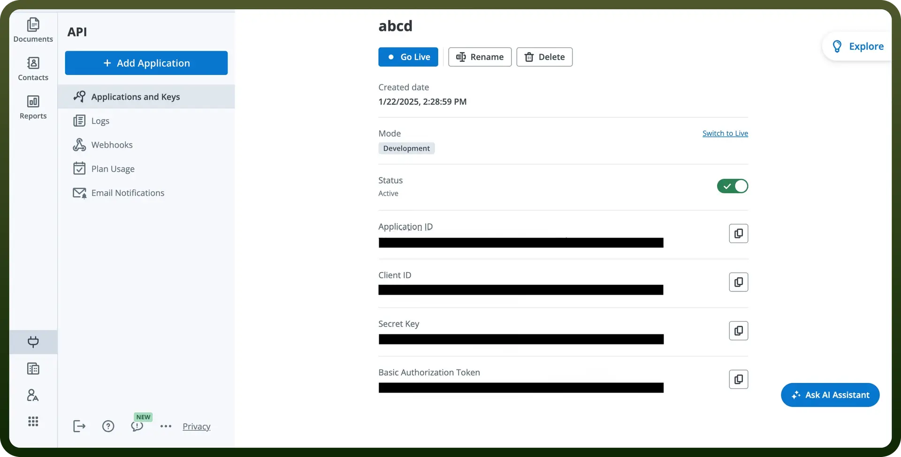

# SignNow connector

Source: https://www.unifyapps.com/docs/unify-integrations/signnow
Section: integrations

---

SignNow is an e-signature solution that enables users to sign, send, and manage documents digitally. It offers secure, legally binding signatures with automation and integration capabilities.

Integrating your application with SignNow enables seamless and efficient electronic signature workflows, document management, and collaboration.

## Authentication

Before you begin, make sure you have the following information:

- `Connection Name`**:** Select a descriptive name for your connection, like "MyAppSignnowIntegration". This helps in easily identifying the connection within your application or integration settings.
- `Authentication Type`**:** Signnow supports OAuth authentication for integrations.

### OAuth Based Authentication

- Login into the Signnow Portal by clicking [here](https://www.signnow.com/).
- In the search Bar, enter your email and try for free Registration.
- Create your Application by clicking on `Add Application.`
- Click on the newly created Application to access your client ID and secret key and store them securely to prevent unauthorised access.

  

## Actions

| Actions | Description |
|---|---|
| `Cancel invite to sign` | Revokes an invite to sign in SignNow |
| `Create document from template` | Creates a new document from a selected template in SignNow |
| `Delete document` | Deletes a document in SignNow |
| `Invite to sign` | Sends an email with the invite to sign a document that contains fillable fields in SignNow |
| `Send free form invite` | Sends an invite to a signer for a document that does not contain fillable fields in SignNow |
| `Upload document` | Uploads a new document in SignNow |

## Triggers

| Triggers | Description |
|---|---|
| `Document completed` | Triggers when all signers have filled in and signed the document in SignNow |
| `Document opened` | Triggers when a document has been opened in SignNow |
| `Document updated` | Triggers when a document has been updated in SignNow |
