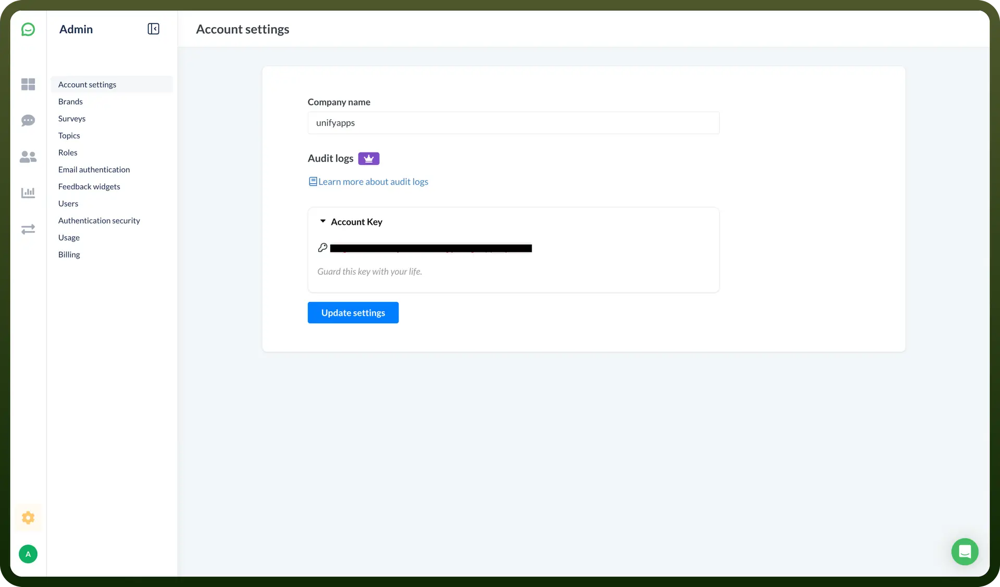

# Simplesat

Source: https://www.unifyapps.com/docs/unify-integrations/simplesat
Section: integrations

---

Simplesat is a customer feedback platform designed for service teams to easily collect, manage, and showcase client satisfaction data. It integrates with major help desks and CRMs to capture real-time feedback through CSAT, CES, and NPS surveys.

Integrating Simplesat helps teams improve service quality by capturing actionable customer insights seamlessly.

## Authentication

Before you begin, make sure you have the following information:

- `Connection Name`: Select a descriptive name for your connection, like "MyAppSimplesatIntegration". This helps in easily identifying the connection within your application or integration settings.
- `Authentication Type`**:** Simplesat supports API tokens for authentication.

### API Key Based Authentication

1. Sign up or log in to your Simplesat account by visiting the [Simplesat dashboard](https://app.simplesat.io/).
2. Navigate to the API Key section by clicking on your setting icon and selecting '`Account settings`' from the dropdown menu.
3. Your API Key is in the Account Key dropdown.
4. Copy the generated API Key and store it securely to prevent unauthorized access.

## Actions

| Actions | Description |
|---|---|
| `Find customer` | Finds a customer in Simplesat |
| `Find response` | Finds a response in Simplesat |
| `Find team member` | Finds a team member in Simplesat |
| `Upsert customer` | Upserts a customer in Simplesat |
| `Upsert response` | Upserts a response in Simplesat |
| `Upsert team member` | Upserts a team member in Simplesat |

## Triggers

| Triggers | Description |
|---|---|
| `New feedback` | Triggers when a new feedback is added in Simplesat |
