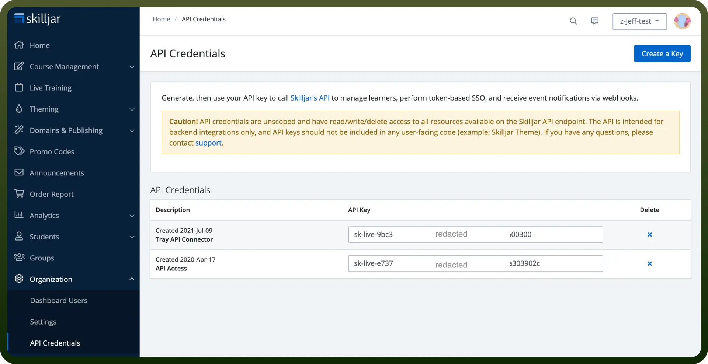

# Skilljar connector

Source: https://www.unifyapps.com/docs/unify-integrations/skilljar
Section: integrations

---

Skilljar is a learning management system (LMS) designed for customer and partner training. It helps businesses deliver, track, and manage online courses efficiently.

Connecting your application to a Skilljar account allows you to interact with Skilljar's training platform via API calls.

## Authentication

Before you begin, make sure you have the following information:

- `Connection Name`**:** Select a descriptive name for your connection, like "MyAppSkilljarIntegration". This helps in easily identifying the connection within your application or integration settings.
- `Authentication Type`**:** Skilljar supports authentication via API Key.

### API Key Based Authentication

- Log in to your Skilljar admin account. Only the **admin** can generate API keys in the Skilljar account.
- Navigate to `Organization Settings` and then `API Credentials`.
- On the credentials page, select `Create a Key` to generate a new API Key.
- Store this securely as it provides access to your skilljar account. For more details, refer to [Skilljar's official documentation.](https://codebeautify.org/%22https://support.skilljar.com/hc/en-us/articles/203811260-Getting-started-with-the-Skilljar-API/%22)

## Actions

| Actions | Description |
|---|---|
| `Create asset` | Creates an asset in Skilljar |
| `Create course` | Creates a course in Skilljar |
| `Create group` | Creates a group in Skilljar |
| `Create quiz` | Creates a quiz in Skilljar |
| `Create quiz question` | Creates a quiz question in Skilljar |
| `Delete group` | Deletes a group by ID in Skilljar |
| `Get asset` | Gets an asset by ID in Skilljar |
| `Get course` | Gets a course by ID in Skilljar |
| `Get group` | Gets a group by ID in Skilljar |
| `List assets` | Lists all assets in Skilljar |
| `List courses` | Lists all courses in Skilljar |
| `List groups` | Lists all groups in Skilljar |
| `List quizzes` | Lists all quizzes in Skilljar |
| `Update course` | Updates a course by ID in Skilljar |
| `Update group` | Updates a group by ID in Skilljar |
| `Create asset` | Creates an asset in Skilljar |
| `Get asset` | Gets an asset by ID in Skilljar |
