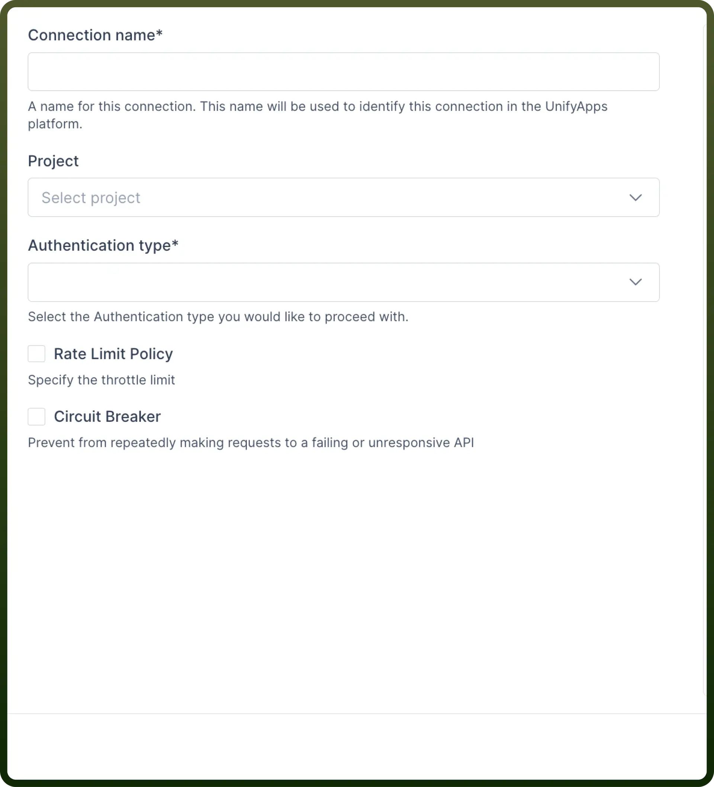
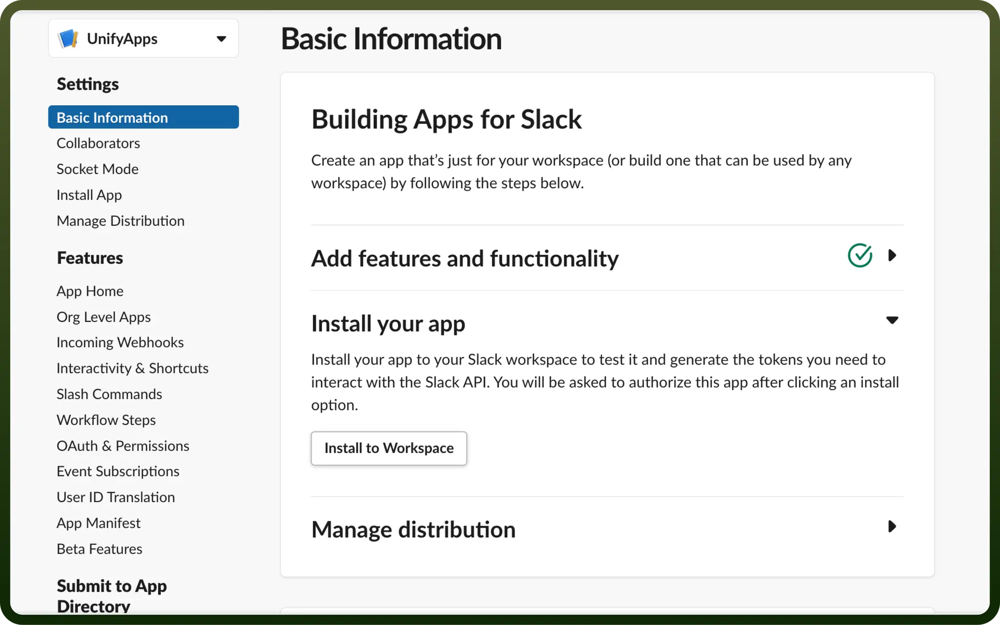

# Slack connector

Source: https://www.unifyapps.com/docs/unify-integrations/slack
Section: integrations

---

Using Slack with your work can help your team talk better and get more done. With Slack, you can automatically send messages about updates or tasks, which makes it easier for different systems to talk to each other.

Connecting your application to a Slack account enables integration for messaging, automation, and various Slack workspace functionalities.

## Authentication

Before you begin, make sure you have the following information:

- `Connection Name`: Choose a meaningful name for your connection. This name helps you identify the connection within your application or integration settings. It could be something descriptive like "MyAppSlackIntegration".
- `Authentication Type`**:** Select the type of authentication for connecting to your Slack account:
  - OAuth based
  - Token-based

### OAuth Authentication

Select `OAuth` as the authentication type and click on `Authorize`. A pop-up screen opens up with the necessary permissions required to set up UnifyApps application. Granting these permissions will setup UnifyApps Slack bot within your Application.

### Token based Authentication

You can opt for a token-based authentication method, where you can create a[custom application](https://api.slack.com/apps) within their Slack workspace and install it to workspace to generate App tokens. These tokens will then be used to authenticate the Slack bot within their workspace.

There are 2 types of token’s that are generated within the custom application i.e

- **Bot Token**: Used primarily for automated tasks and interactions within Slack channels.
- **User Token**: Represents the identity of a user and is used for user-specific actions and permissions.

Both bot & user tokens are utilized to send automated messages within public and private channels.

**User token** is required to fetch all public channels and private channels that the user is part of.

**B****ot token** is used to send automated messages to these channels.

## Granular Permissions

**Bot OAuth Scope**

| **OAuth Scope** | **Description** |
|---|---|
| `channels:join` | Join public channels in a workspace. |
| `channels:manage` | Manage public channels that Acme_Automation_Bot has been added to and create new ones. |
| `channels:read` | View basic information about public channels in a workspace. |
| `chat:write` | Send messages as @Acme_Automation_Bot. |
| `chat:write.customize` | Send messages as @Acme_Automation_Bot with a customized username and avatar. |
| `chat:write.public` | Send messages to channels @Acme_Automation_Bot isn't a member of. |
| `groups:read` | View basic information about private channels that Acme_Automation_Bot has been added to. |
| `groups:write` | Manage private channels that Acme_Automation_Bot has been added to and create new ones. |
| `users.profile:read` | View profile details about people in a workspace. |
| `users:read` | View people in a workspace. |
| `users:read.email` | View email addresses of people in a workspace. |

**User OAuth Scope**

| **OAuth Scope** | **Description** |
|---|---|
| `channels:read` | View basic information about public channels in a workspace. |
| `channels:write` | Manage a user's public channels and create new ones on a user's behalf. |
| `channels:write.invites` | Invite members to public channels. |
| `channels:write.topic` | Set the description of public channels. |
| `chat:write` | Send messages on a user's behalf. |
| `groups:read` | View basic information about a user's private channels. |
| `groups:write` | Manage a user's private channels and create new ones on a user's behalf. |
| `users.profile:read` | View profile details about people in a workspace. |
| `users:read` | View people in a workspace. |
| `users:read.email` | View email addresses of people in a workspace. |

## Install the application

Install the application within your workspace by clicking on “`Install to Workspace`” within Basic Information tab. A pop-up screen opens up with the necessary permissions required to setup UnifyApps application.

Granting these permissions will setup UnifyApps Slack bot within your Application.

## Triggers

| **Triggers** | **Description** |
|---|---|
| `On button click` | Use this trigger to start the automation when a user clicks on a button in Slack. |
| `New message` | Use this trigger to start the automation when a new message is posted in a channel in Slack. |

## Actions

| **Actions** | **Description** |
|---|---|
| `Archive conversation` | Use this action to archive a conversation in Slack. |
| `Conversation invite` | Use this action to invite users to a conversation in Slack. |
| `Set conversation purpose` | Use this action to set conversation purpose in Slack. |
| `Set conversation topic` | Use this action to set a conversation topic in Slack. |
| `Unarchive conversation` | Use this action to unarchive a conversation in Slack. |
| `Create conversation` | Use this action to create a new conversation in Slack. |
| `Fetch conversation history` | Use this action to fetch conversation history from Slack. |
| `Get upload URL` | Use this action to return the URL to upload a file to Slack. |
| `Get user info by email` | Use this action to get user info by email from Slack. |
| `Get user info by ID` | Use this action to get user info by ID from Slack. |
| `Post message` | Use this action to send a message to a channel in Slack. |
| `Respond to button click` | Use this action to respond to a button click in a Slack message. |
| `Send file in channel` | Use this action to send a file to a channel in Slack. |
| `Upload file` | Use this action to upload a file to Slack. |
| `Update issue` | Use this action to update issue in Jira. |
| `Update attachment` | Use this action to upload attachment to an issue in Jira. |
