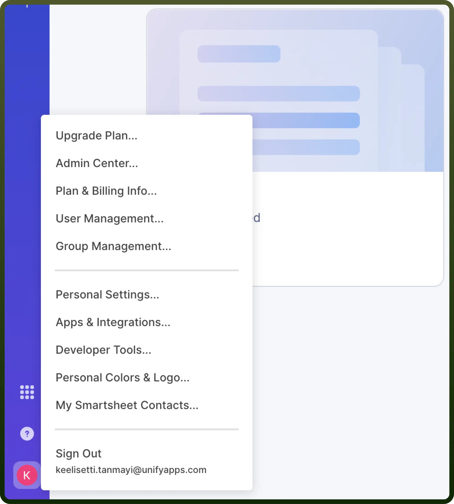
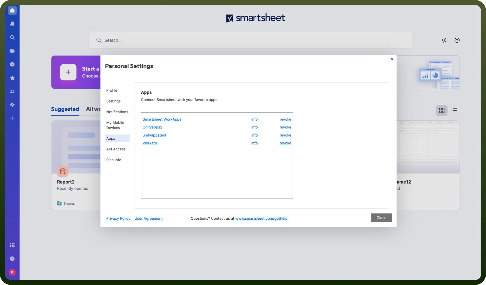
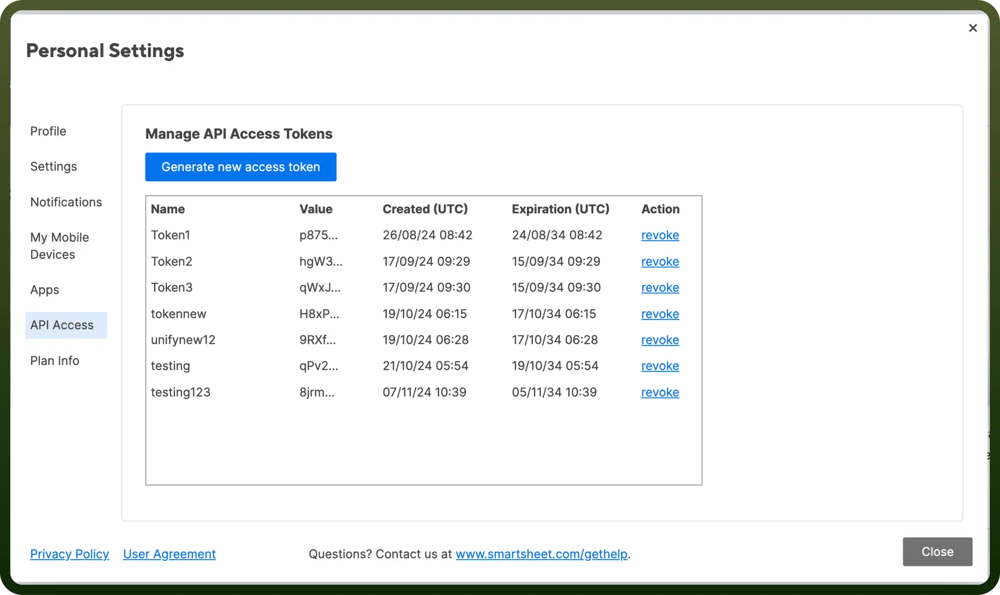
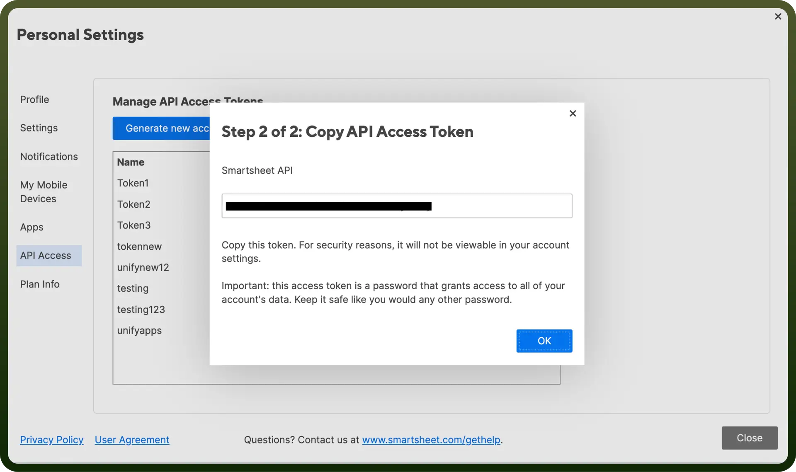
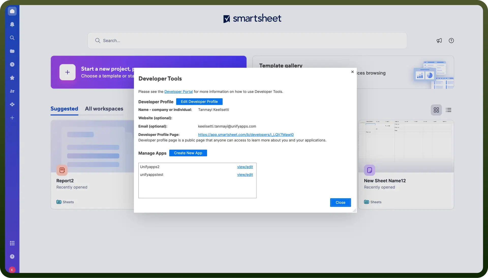
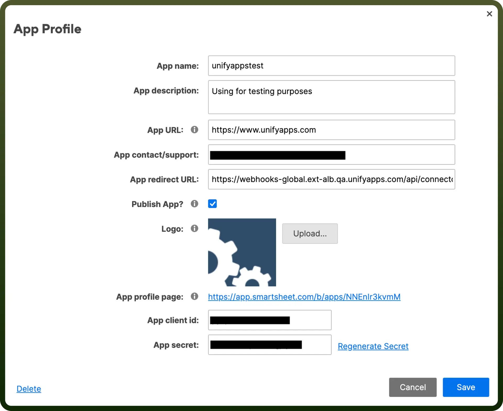

# Smartsheet connector

Source: https://www.unifyapps.com/docs/unify-integrations/smartsheet
Section: integrations

---

Smartsheet is a cloud-based platform for work management and collaboration, enabling users to track projects, automate workflows, and visualise tasks in customizable sheets and dashboards. It combines spreadsheet functionality with powerful project management tools to streamline team coordination and productivity.

Connecting your application to Smartsheet enables integration for project management and collaboration features.

## Authentication

Before you begin, make sure you have the following information:

- `Connection Name`**:** Choose a meaningful name for your connection. This name helps you identify the connection within your application or integration settings. It could be something descriptive like "MyAppSmartsheetIntegration"
- `Authentication Type`**:**Select the type of authentication for connecting to your Smartsheet account:
  - Auth Token
  - OAuth

## Token Based Authentication

1. Log in to the Smartsheet Account.
2. Click on the user icon at the bottom left corner.

  

3. Select the Apps & integrations.

  

4. In Personal Settings, navigate to API Access to verify the existing token. You can also refer to Apps for managing and viewing your tokens.

  

5. In API Access choose Generate new access token .
6. Once the Generate New Access Token option is selected, the user will be prompted to enter a name for the access token.
7. Afterward, you will receive a popup displaying the access token. Copy this token and treat it with high confidentiality, as it allows access to your smartsheet account.

  

### OAuth Based Authentication

1. Create a New OAuth Application: After selecting Create New App, enter the necessary details for your application:
  - App Name
  - App Description
  - App URL
  - App Contact/Support Information
  - App Redirect URL (for OAuth authentication)
  - Optionally, select the checkbox to Publish App if you want to make the app available publicly.

    

2. Retrieve Client ID and Client Secret: Once the application is created, Smartsheet will provide a Client ID and Client Secret for your OAuth application. Keep these credentials secure, as they are required to authenticate users through OAuth.

  

## Actions

| **Action** | **Description** |
|---|---|
| `Create a new row` | Create a new row in smartsheet |
| `Get report` | Gets a report from smartsheet |
| `Get row` | Gets a row from smartsheet |
| `Get sheet summary` | Gets a sheet summary in smartsheet |
| `List folders` | List folders in smartsheet |
| `List public templates` | Lists public templates in smartsheet |
| `List reports` | List reports from smartsheet |
| `List home contents` | Lists home contents in smartsheet |
| `List users` | List users in smartsheet |
| `Search sheet` | Searches a sheet for the specified text in smartsheet |
| `Update row in sheet` | Update a row in a sheet in smartsheet |

## Triggers

| **Trigger** | **Description** |
|---|---|
| `On a new row` | Triggers on a new row in smartsheet |
| `On new or updated report in sheet` | Triggers on a new or updated report row in smartsheet |
| `On new or updated row in sheet` | Triggers on a new or updated row in a sheet in smartsheet |
