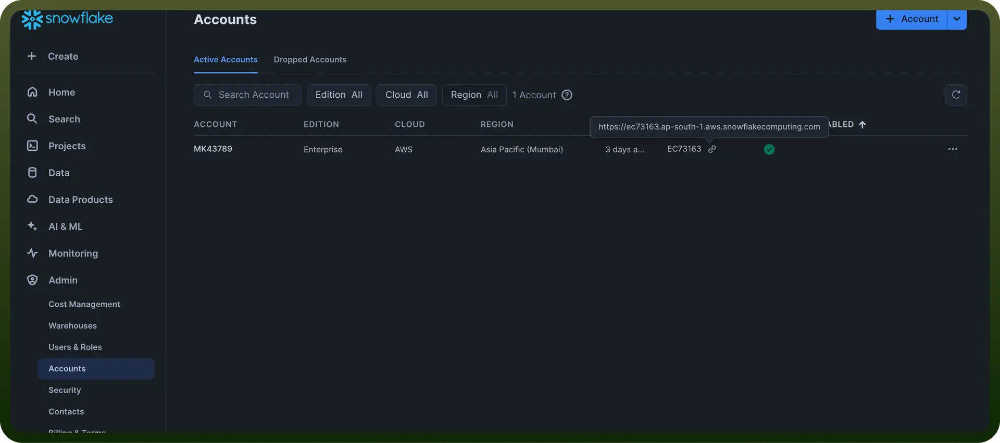
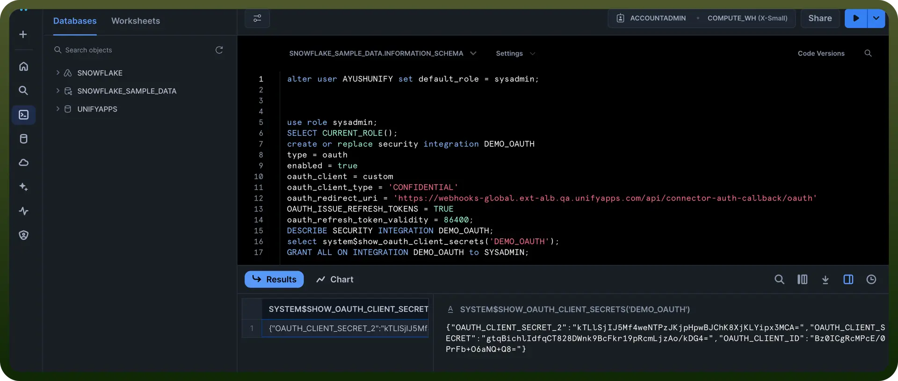
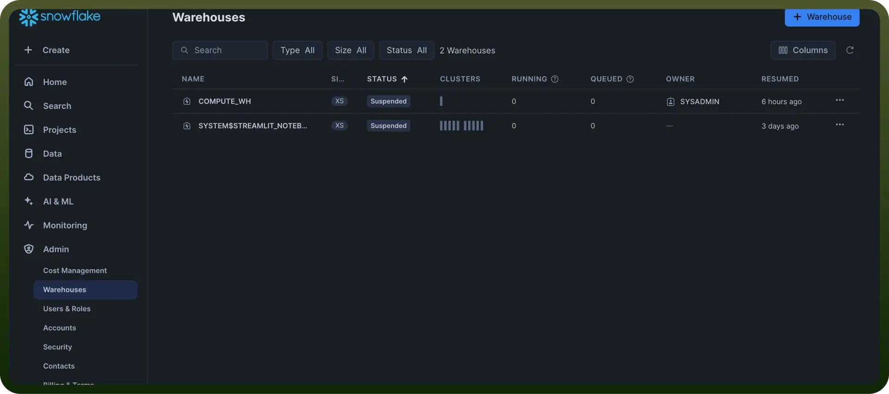
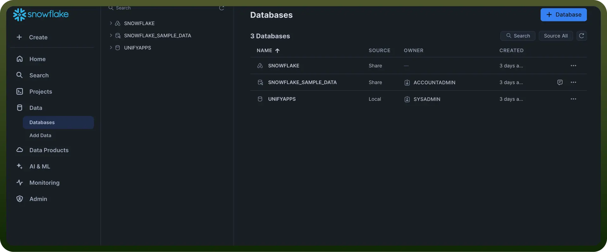
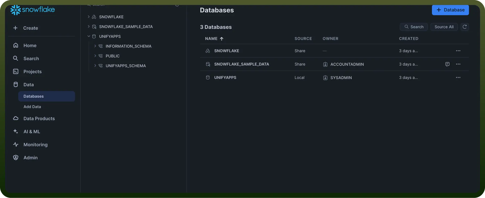

# Snowflake connector

Source: https://www.unifyapps.com/docs/unify-integrations/snowflake
Section: integrations

---

Integrating your application with Snowflake transforms your data warehousing and analytics capabilities, offering a cloud-native platform for scalable, flexible, and high-performance data processing.

Connecting your application to a Snowflake account allows you to interact with Snowflake's data warehousing capabilities directly from your application.

## Authentication

Before you begin, make sure you have the following information:

`Connection Name`: Select a descriptive name for your Snowflake connection. This identifier will help you recognize the connection within your application or integration settings. For example, you might choose something like "MyAppSnowflakeDataWarehouse"

`Account Identifier`: This is your unique Snowflake account locator. To find this, click on "`admin`" in the Snowflake interface, then click on "`your accounts`." Hover over the "`locator`" field, and you'll see the Account Identifier displayed as something like abc12345.region.snowflakecomputing.com.

`Client ID and Secret:` Fetch the Client ID and Secret for your Snowflake account basis this documentation.

`Warehouse Name`**:** It is the compute resource that executes SQL queries. To view your warehouses, go to the left sidebar and click "`Admin`" then click "`Warehouses`". Here, you'll see a list of warehouse names and their details.

`Database Name`**:** It is another crucial piece of information. This is the container for your schemas and tables. To view your databases, go to the left sidebar and click "`Data`" then click "`Databases`". You'll see a list of all available databases.

`Schema Name`**:** To view schemas, first select a database, then click "`Schemas`" within that database. You'll see a list of all schemas in the selected database.

### Actions

| **Action** | **Description** |
|---|---|
| `Delete rows` | Deletes rows in a table using Snowflake |
| `Execute SQL` | Executes SQL in Snowflake |
| `Insert a row` | Inserts a row in a table in Snowflake |
| `Replicate batch rows` | Replicates a batch of rows to a table in Snowflake |
| `Select rows` | Selects rows from a table in Snowflake |
