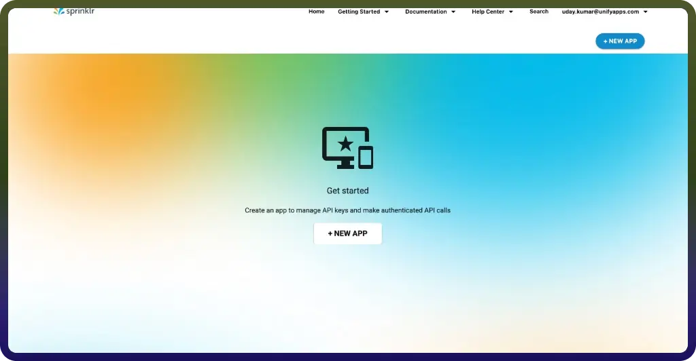
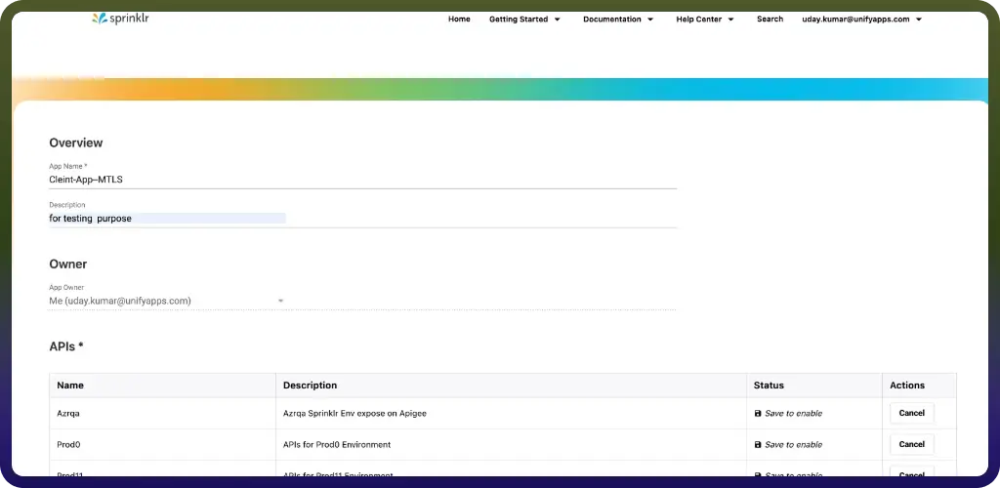
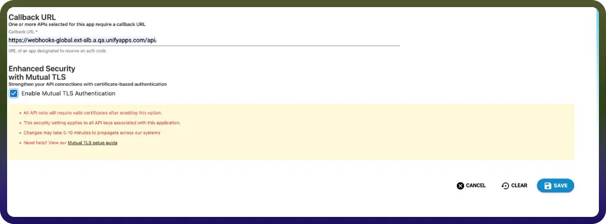
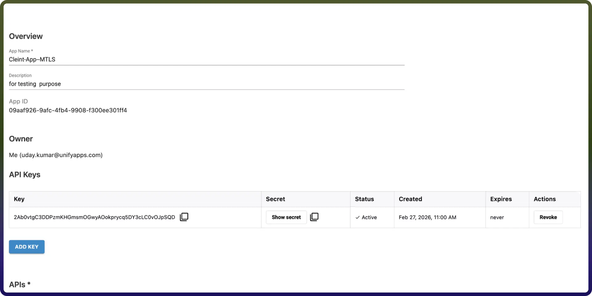
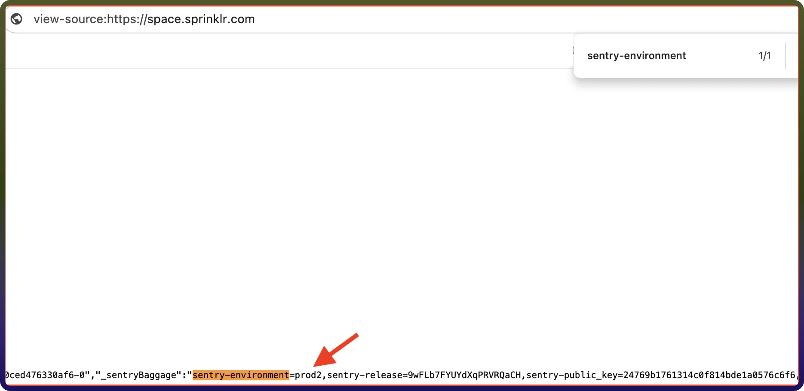

# Sprinklr connector

Source: https://www.unifyapps.com/docs/unify-integrations/sprinklr
Section: integrations

---

Integrating your application with Sprinklr transforms your customer experience strategy by centralizing massive social, clinical, and marketing datasets into a high-performance, unified platform. Sprinklr enables teams to execute complex cross-channel queries in seconds, leverage AI-powered sentiment and trend analysis, and drive real-time engagement—all while maintaining enterprise-grade security and seamless scalability across the modern digital landscape.

## Authentication:

Before you begin, ensure you have the following information:

- `Connection Name`: Choose a descriptive name for your Sprinklr connection to help you identify it within your application or integration settings. A meaningful name, like "MyAppSprinklrntegration," helps maintain organization, especially when managing multiple integrations.
- `Authentication Type`: Select the type of authentication to connect to your Sprinklr account securely:
- `OAuth`

#### **OAuth Based Authentication :**

The OAuth method involves signing in with your Sprinklr account credentials on Sprinklr's Single Sign-On or login page and granting the necessary permissions to your application. For OAuth-based authentication, you'll need to perform the following steps to generate access credentials:

##### **1. Register an Application in the Developer Portal**

To start, you must create a developer account and register your application to receive your **API Key** and **Secret**.

- Go to the[Sprinklr Developer Portal](https://dev.sprinklr.com/) and sign in.
- Navigate to **My Account > Applications** and click **CREATE A NEW APP**.

- **Important Fields:**

- Once saved, your **API Key (Client ID)** and **API Secret (Client Secret)** will be visible under your app details.

##### **2. Identify Your Sprinklr Environment**

Sprinklr tokens are environment-specific. Before initiating the flow, you must confirm your host instance.

- Log in to the Sprinklr UI.
- Right-click on the page and select `"View Page Source"`.
- Search for sentry-environment to find your instance name (e.g., prod2 ).
- **Note:** For the global Production environment, no specific environment parameter is needed in the URL.

Notes: To generate an authorization token and access Sprinklr APIs, you must be granted the 'Generate Token' permission within the Sprinklr Platform. This security measure ensures that only authorized users can create tokens. For additional information, please consult the Add Roles article.

Ensure that the following permissions are granted for OAuth authentication and provide public access to your data in Sprinklr**Actions**

| **Action Name** | **Description** |
|---|---|
| `Add comment` | Adds a comment in Sprinklr |
| `Case associated messages` | Fetches all the message IDs associated with a case in Sprinklr |
| `Create Case` | Creates a case in Sprinklr and associates a message with it |
| `Create a case via profile` | Creates a case via profile in Sprinklr |
| `Create a profile` | Creates a profile in Sprinklr |
| `Create custom entity` | Creates a custom entity in Sprinklr |
| `Deflect customer call` | Deflect the customer call to Modern Engagement channels in Sprinklr |
| `Delete case by case ID` | Deletes a case by its case ID in Sprinklr |
| `Delete case by case number` | Deletes a case by its case number in Sprinklr |
| `Fetch ACW to trigger` | Fetches ACW to trigger in Sprinklr |
| `Fetch associated comments` | Fetches associated comments in Sprinklr |
| `Fetch default campaign` | Fetches the default campaign in Sprinklr |
| `Fetch nudges for case` | Fetches nudges for a case in Sprinklr |
| `Fetch profile by profile ID` | Fetches a profile based on the provided profile ID in Sprinklr |
| `Fetch profile by sntype and snuserID` | Fetches a profile by social network type and social network user ID in Sprinklr |
| `Fetch profile by sntype and username` | Fetches a profile by social network type and username in Sprinklr |
| `Generate OTA` | Generates OTA in Sprinklr |
| `Get KB by content ID` | Fetch the knowledge base content in Sprinklr |
| `Get message by ID` | Gets a message by ID from Sprinklr |
| `List cases by profile id` | Lists cases by profile ID in Sprinklr |
| `Publish message` | Publishes a message in Sprinklr |
| `Read case by ID` | Fetches a case through case ID in Sprinklr |
| `Read case by case number` | Fetches a case through case number in Sprinklr |
| `Reads multiple messages` | Reads multiple messages in Sprinklr |
| `Smart assist search` | Performs smart assist search in Sprinklr |
| `Trigger customer journey` | Triggers customer journey in Sprinklr |
| `Update Case` | Updates the case details in Sprinklr |
| `Update a profile` | Updates a profile in Sprinklr |
| `Upload media` | Upload media in Sprinklr |
| `Upload media in bulk` | Upload media in bulk Sprinklr |
