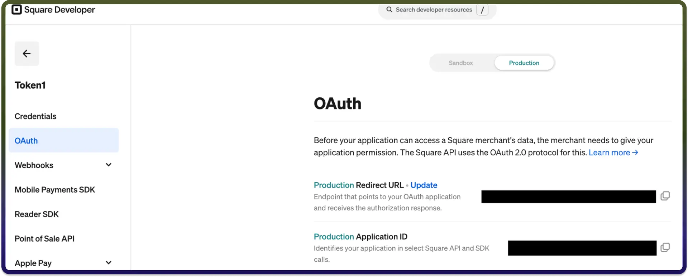
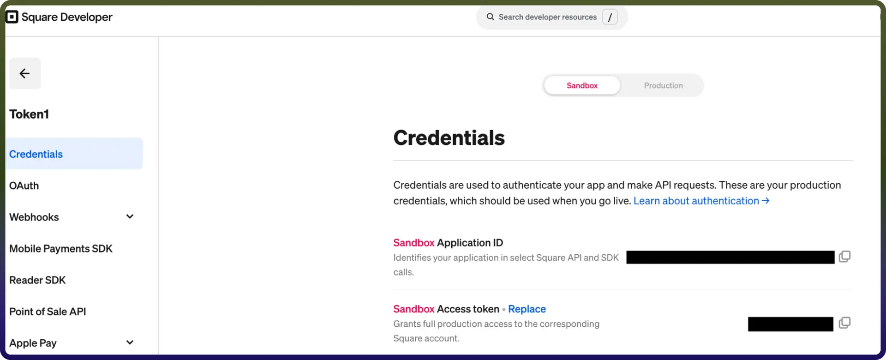

# Square connector

Source: https://www.unifyapps.com/docs/unify-integrations/square
Section: integrations

---

Integrating your application with Square enhances payment processing and business operations by enabling you to manage transactions, customers, and orders seamlessly within your workflows. Square provides APIs to handle payments, refunds, inventory, and reporting efficiently, helping businesses streamline operations and deliver better customer experiences.

## Authentication:

Connecting your application to Square enables you to process payments, manage sales activity, and track customer transactions efficiently across your business systems. Before you begin, ensure you have the following information:

`Connection Name :` Choose a meaningful name for your connection. This name helps you identify the connection within your application or integration settings. It could be something descriptive like "MyAppSquareIntegration".

`Authentication type :` Select the authentication type you would like to proceed with.

1. Product
2. Sandbox

### Product Based:

1. Log in to your Square Developer Console.
2. Navigate to Applications and click on the Add (+) button.
3. Provide a name for your application and create it.
4. Open the newly created application and go to the OAuth section.
5. Switch to Production and update the redirect URL.
6. Copy the Application ID and use it for further authentication purposes.

### Sandbox Based:

1. Log in to your Square Developer Console.
2. Navigate to Applications and click on the Add (+) button.
3. Provide a name for your application and create it.
4. Open the newly created application and go to the Credentials section.
5. Switch to Sandbox and copy the Access token.
6. Use the generated token for further authentication purposes.

  

## Actions

| **Action Name** | **Description** |
|---|---|
| `Batch retrieves order` | This action help user to batch retrieves orders in Square |
| `Calculate order` | Calculate order in Square |
| `Create customer` | Creates a new customer for a business in Square |
| `Create customer group` | Creates a new customer group in Square |
| `Create invoice` | Creates a new invoice in Square |
| `Create order` | Creates an order in Square |
| `Create a new payment` | Creates a new payment in Square |
| `Gets an invoice` | Gets an invoice by ID in Square |
| `Get payment by ID` | Gets a payment by ID in Square |
| `List customer groups` | Retrieves the list of customer groups in Square |
| `List invoices` | Lists invoices in Square |
| `List payments` | This action helps list payments in Square |
| `Retrieve order` | This action helps user to retrieve an order |
| `Create search orders` | Search all orders from one or more locations in Square |
| `Update customer group` | Updates a customer group by group ID in Square |
