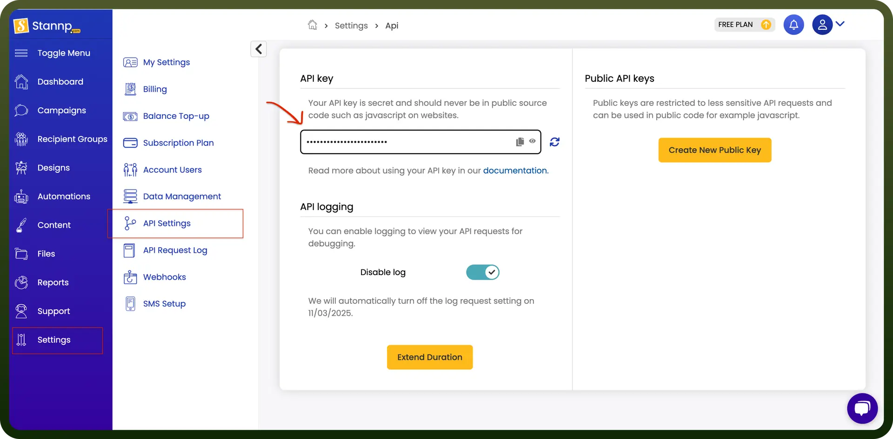

# Stannp connector

Source: https://www.unifyapps.com/docs/unify-integrations/stannp
Section: integrations

---

Stannp is a direct mail automation platform that helps businesses send personalized letters, postcards, and mail campaigns. It streamlines offline communication by integrating with CRMs and marketing tools.

Integrating your application with Stannp's REST API simplifies direct mail automation, enabling efficient and seamless workflows.

## Authentication

Before you begin, make sure you have the following information:

- `Connection Name`: Select a descriptive name for your connection, like "MyAppStannpIntegration". This helps in easily identifying the connection within your application or integration settings.
- `Authentication Type`**:** Stannp uses API Key-based authentication.

### API Key Based Authentication

1. Log in to your Stannp account and navigate to Settings and then to API Settings.
2. Generate an API key if you haven't already.
3. Treat this API key as confidential and store it securely to prevent unauthorised access.

  

## Actions

| Actions | Description |
|---|---|
| `Add recipient` | Creates a new recipient with the provided details in Stannp |
| `Add recipients to group` | Adds existing recipients to a specified mailing group in Stannp |
| `Create group` | Creates a new empty mailing list group in Stannp |
| `Create letter` | Creates a letter which is then printed and dispatched by Stannp |
| `Create postcard` | Creates a postcard which is then printed and dispatched by Stannp |
| `Delete campaign` | Deletes a campaign permanently from your account in Stannp |
| `Delete group` | Deletes a mailing group in Stannp |
| `Delete recipient` | Deletes a recipient permanently from your account in Stannp |
| `Get campaign by ID` | Gets the campaign details using a specified campaign ID from Stannp |
| `Get campaigns` | Retrieves a list of campaigns from Stannp |
| `Get groups` | Retrieves a list of groups from Stannp |
| `Get mailpieces` | Retrieves a list of mailpieces from Stannp |
| `Get recipient by ID` | Gets the recipient details using a specified recipient ID from Stannp |
| `Get recipients` | Retrieves a list of recipients from Stannp |
| `Get reporting summary` | Retrieves a status summary on individual items within a date range from Stannp |
| `Purge group` | Removes all recipients from a mailing group in Stannp |
| `Recalculate group` | Recalculates a group to make sure stats are up to date in Stannp |
| `Remove recipients from group` | Removes recipients from a mailing group without deleting them in Stannp |
| `Validate address` | Allows you to check whether an address is validated by Stannp |

## Triggers

| Triggers | Description |
|---|---|
| `On create campaign` | Triggers when a new campaign is created in Stannp |
| `On create group` | Triggers when a new group is created in Stannp |
| `On create recipient` | Triggers when a new recipient is added in Stannp |
