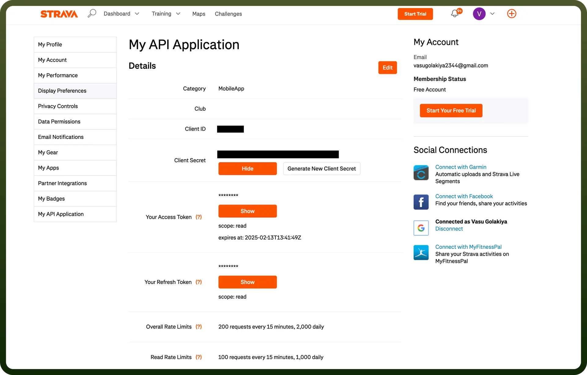

# Strava connector

Source: https://www.unifyapps.com/docs/unify-integrations/strava
Section: integrations

---

Strava is a fitness tracking app designed for athletes, allowing users to record activities like running and cycling using GPS. It offers performance analytics, social features, and challenges to keep users motivated and engaged.

Integrating your application with Strava empowers you to access athlete data, track activities, and create fitness-focused features for your users.

## Authentication

Before you begin, make sure you have the following information:

- `Connection Name`**:** Select a descriptive name for your connection, like "MyAppStravaIntegration." This helps in easily identifying the connection within your application or integration settings.
- `Authentication Type`**:** Strava supports OAuth 2.0 for authentication. This secure method allows your app to access Strava’s functionalities and data with user consent.

### OAuth Based Authentication

- Client ID and Client Secret:
  - Once sign up is done, go to the Strava Developer [website](https://developers.strava.com/).
  - Click on "`Create & Manage Your App`" and provide the necessary information.
  - Once the app is created, note down the Client ID and Client Secret from the app details section. These will be required to authenticate API requests.
  - Treat the Client Secret with high confidentiality, as it grants access to your Strava API functionality.

    

- Access Token:
  - Use the OAuth 2.0 flow to exchange the user’s authorization code for an access token. One can refer to this [documentation](https://developers.strava.com/docs/authentication/) to get personal access token.
  - Copy this [link](https://www.strava.com/oauth/authorize?client_id=your_client_id&redirect_uri=http://localhost&response_type=code&scope=activity:read_all) and exchange the necessary information in the link and press enter to get the authorization code. After that one can get the access token referring to the API documentation.
  - The token grants your application access to the user’s Strava data based on the requested scopes (e.g., read, read_all, activity:write).
  - Refresh tokens can also be used to regenerate the access token after it expires.
  - Treat the access token with high confidentiality, as it allows access to the user’s Strava account data.

## Actions

| Actions | Description |
|---|---|
| `Create activity` | Create an activity in Strava |
| `Get activity` | Gets activity in Strava |
| `Get athlete stats` | Get the activity stats of an athlete in Strava |
| `List athlete activities` | Get all the activities of an athlete in Strava |
| `Update activity` | Update activity in Strava |
| `Update athlete` | Update the currently authenticated athlete in Strava |
| `Upload activity file` | Upload a data file to create an activity in Strava |

## Triggers

| Triggers | Description |
|---|---|
| `New Activity` | Triggers when an activity is created by athlete in Strava |
