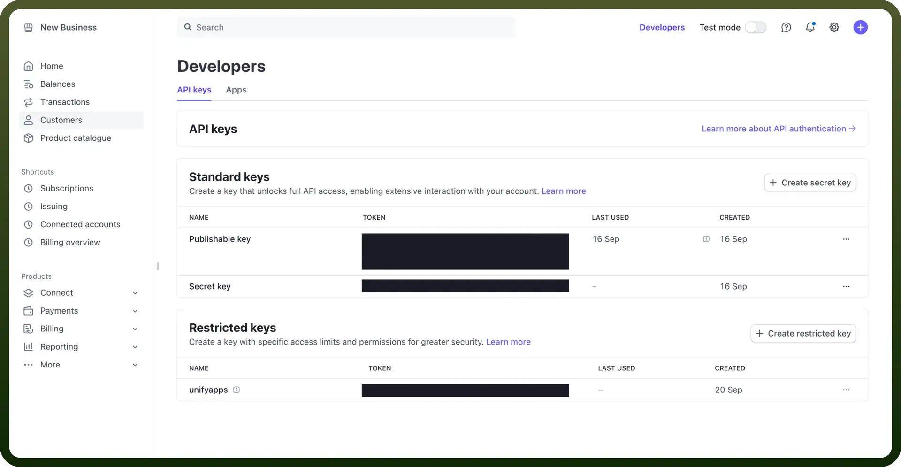

# Stripe connector

Source: https://www.unifyapps.com/docs/unify-integrations/stripe
Section: integrations

---

Stripe is a leading financial technology company that provides tools and APIs for businesses to accept payments online, manage revenue, and expand globally. Its platform supports various payment methods, including cards, digital wallets, and bank transfers, with a focus on scalability and security.

Connecting your application to a Stripe account allows you to process payments, manage transactions, and utilise many other financial services provided by Stripe.

## Authentication

Before you begin, ensure you have the following information:

- `Connection Name`: Choose a descriptive name for your connection. This will help you easily identify it within your application or integration settings. For example, "MyAppStripeIntegration".
- `Authentication Type`: You can authenticate using the api key in stripe.

### API Key based

Complete the following steps to connect to Stripe using an API key

1. Navigate to the Developers dashboard and then to API keys to manage your API keys.
2. Provide the test mode secret key if you plan to access test mode data. Otherwise, use the live mode secret key to access actual account data.

  

## Actions

| **Action** | **Description** |
|---|---|
| `Update a customer` | Updates a customer in Stripe |
| `Create a new customer` | Creates a new customer in Stripe |
| `Create new invoice item` | Creates a new invoice item in Stripe |
| `Create a new payment link` | Creates a new payment link in Stripe |
| `Create a new product` | Creates a new product in Stripe |
| `Create subscription` | Create subscription |
| `Cancel a subscription` | Cancels a subscription in Stripe |
| `Search invoice item` | Retrieves the details of the invoice item in Stripe |
| `Create charge` | Create charge in Stripe |
| `Create invoice` | creates an invoice in Stripe. |
| `List objects` | List objects in Stripe. |
| `Get object by id` | Get object by id in Stripe. |

## Triggers

| New object trigger | New object in Stripe |
|---|---|
| `New objects trigger (batch)` | New objects in Stripe |
| `New object events trigger (real-time)` | New object events in Stripe |
