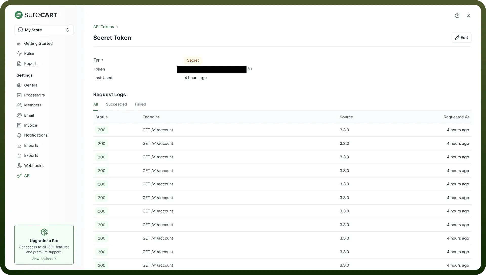

# SureCart connector

Source: https://www.unifyapps.com/docs/unify-integrations/surecart
Section: integrations

---

**SureCart** is a modern eCommerce and checkout platform built for WordPress, designed to help businesses sell digital and physical products with ease. It offers flexible billing, secure payments, and powerful automation features without requiring complex setups.

Integrating SureCart enables seamless eCommerce operations with automated checkouts, real-time data access, and streamlined payment processing.

## Authentication

Before you begin, make sure you have the following information:

- `Connection Name`: Select a descriptive name for your connection, like "MyAppSureCartIntegration". This helps in easily identifying the connection within your application or integration settings.
- `Authentication Type`**:** SureCart uses API tokens for authentication.

### API Token Based Authentication

1. Navigate to the [SureCart](https://app.surecart.com/setup) cloud platform and sign in.
2. Access the API Section and click on the "`API`" menu item.
3. In the API section, navigate to the "`Secret Token`" subsection.
4. Copy the generated token and store it securely as it provides access to your SureCart account.

  

## Actions

| Actions | Description |
|---|---|
| `Fetch affiliation by ID` | Fetches an affiliation using a specified ID from SureCart |
| `Fetch affiliation request by ID` | Fetches an affiliation request using a specified ID from SureCart |
| `Fetch checkout by ID` | Fetches a checkout using a specified ID from SureCart |
| `Fetch click by ID` | Fetches a click using a specified ID from SureCart |
| `Fetch coupon by ID` | Fetches a coupon using a specified ID from SureCart |
| `Fetch customer by ID` | Fetches a customer using a specified ID from SureCart |
| `Fetch fulfillment by ID` | Fetches a fulfillment using a specified ID from SureCart |
| `Fetch order by ID` | Fetches an order using a specified ID from SureCart |
| `Fetch price by ID` | Fetches a price using a specified ID from SureCart |
| `Fetch product by ID` | Fetches a product using a specified ID from SureCart |
| `Fetch promotion by ID` | Fetches a promotion using a specified ID from SureCart |
| `Fetch return request by ID` | Fetches a return request using a specified ID from SureCart |
