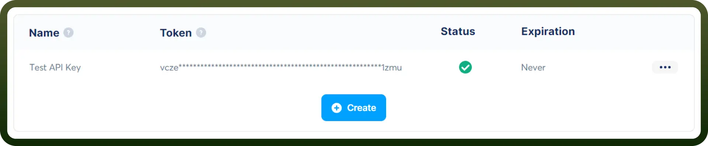

# Systeme connector

Source: https://www.unifyapps.com/docs/unify-integrations/systeme
Section: integrations

---

Systeme.io is an all-in-one marketing platform that helps entrepreneurs build sales funnels, automate marketing, and manage online businesses. It includes tools for email marketing, course creation, and e-commerce without needing technical expertise.

Integrating your application with Systeme.io allows you to streamline your marketing, automate workflows, and manage your business more efficiently.

## Authentication

Before you begin, make sure you have the following information:

- `Connection Name`**:** Choose a descriptive name for your connection, such as "MyAppSystemeIntegration". This helps in easily identifying the connection in your application or integration settings.
- `Authentication Type`**:** Systeme.io supports API Key authentication.

### API Key Based Authentication

- Log into your Systeme.io account and navigate to the "`Settings`" section from the menu.
- In the "`API`" tab, you will find your unique API Key.
- If an API Key is not yet generated, click on "`Generate New API Key`" to create one.
- Copy the API Key and keep it secure, as it grants access to your Systeme.io account.

## Actions

| Actions | Description |
|---|---|
| `Create Contact Resource` | Creates contact resource in Systeme |
| `Get Contact Resource` | Gets particular contact from Systeme |
| `Remove Contact Resource` | Removes particular contact from Systeme |
| `Remove Tag` | Removes tag from a contact in Systeme |
| `Revoke Access to Course` | Revokes access to a course for a particular contact in Systeme |
| `Update Contact Resource` | Updates contact resource in Systeme |

## Triggers

| Triggers | Description |
|---|---|
| `New Tag Added to Contact` | Triggers when a tag is added to contact in Systeme |
