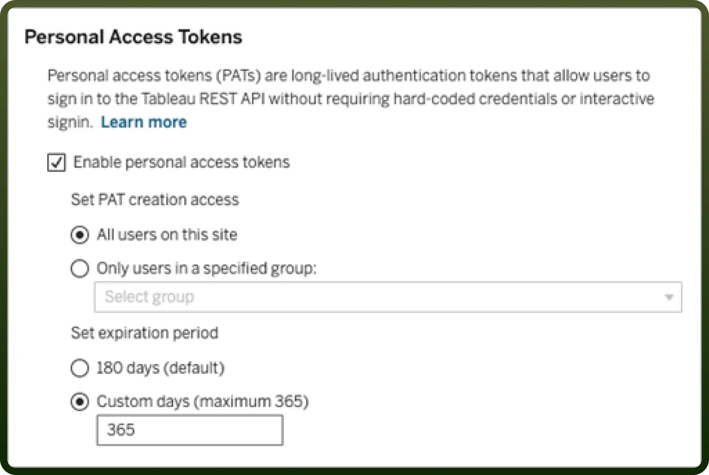
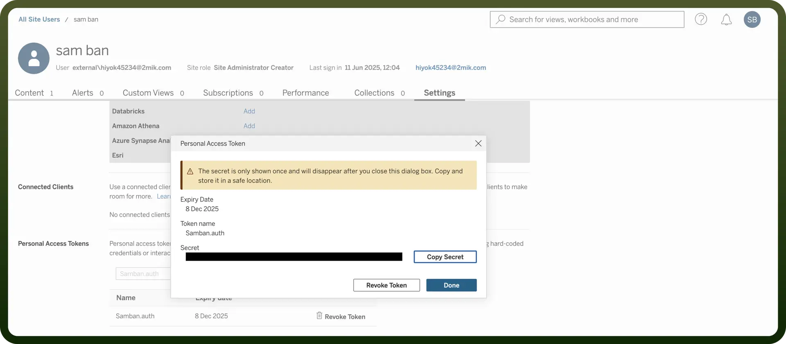

# Tableau connector

Source: https://www.unifyapps.com/docs/unify-integrations/tableau
Section: integrations

---

Tableau is a powerful data visualisation and business intelligence platform that helps users analyse and understand their data. It enables the creation of interactive, shareable dashboards from various data sources with drag-and-drop ease. Widely used for data storytelling, Tableau supports real-time insights and informed decision-making across organisations.

Tableau stands out with its intuitive drag-and-drop interface, allowing even non-technical users to create complex visualisations easily.

## Authentication

Before you begin, make sure you have the following information:

- `Connection Name`: Select a descriptive name for your connection, like "MyTabeauSetup". This helps in easily identifying the connection within your application or integration settings.
- `Authentication Type`**:** Select the type of authentication for connecting to your Tableau account. Tableau supports personal access tokens and Basic Authentication for authentication.

### Personal Access Token

- Sign In to Tableau Cloud
- Click on the profile icon in the top right corner and navigate to “`My Account Settings`”
- In the left nav, click on “`Settings`” and open the “`General`” tab

  

- Navigate to “`Personal Access token`” and enable it.
- In the left nav, click on the “`Users`” and then open the “`Settings`” tab
- Fill in a name for the token and click on “`Personal Access Token`”

  

- Copy and securely store this to prevent unauthorised access.
- Identify and note the server name and site name from your Tableau site URL. For example, if your URL is: https://company.online.tableau.com/#/site/unifyapps/,
- The server name is company.online.tableau.com
- The site name is unifyapps

### Basic Authentication

- Sign in to Tableau Cloud and securely note your username and password, as these credentials will be required for basic authentication.
- Use the same method outlined in the Personal Access Token section to identify the server name and site name from your Tableau Cloud URL.

## Actions

| **Actions** | **Description** |
|---|---|
| `Add user to site` | Adds a user to site in Tableau |
| `Download datasource` | Download a datasource from Tableau |
| `Download view` | Download a view from Tableau |
| `Fetch datasource permission` | Fetches a permission details for datasource in Tableau |
| `Fetch datasources` | Fetch all datasources from Tableau |
| `Fetch user details` | Fetches a user details in Tableau |
| `Fetch user details from group` | Fetches user details from group in Tableau |
| `Fetch view permission` | Fetches a permission details for view in Tableau |
| `Fetch workbook by ID` | Fetches a workbook by ID in Tableau |
| `List extract refresh tasks` | Lists extract refresh tasks in Tableau |
| `Refresh workbook` | Refreshes workbook in Tableau |
| `Run extract refresh task` | Runs extract refresh task in Tableau |
| `Search views` | Searches site views in Tableau |
| `Search workbooks` | Searches site workbooks in Tableau |
| `Update user` | Updates a user in Tableau |
