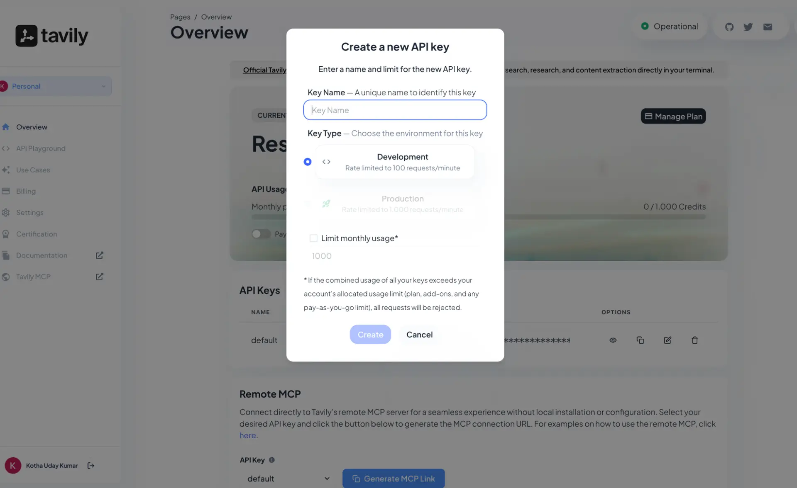
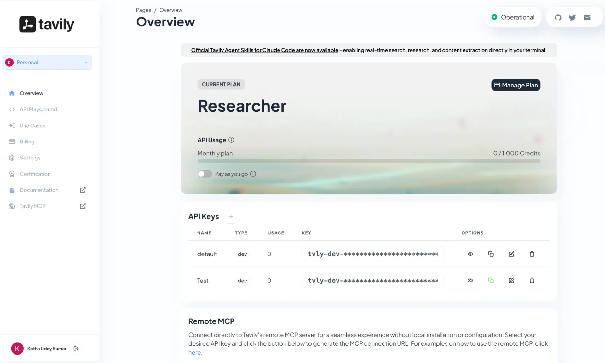

# Tavily connector

Source: https://www.unifyapps.com/docs/unify-integrations/tavily
Section: integrations

---

# Tavily

Integrating your application with **Tavily** enhances AI-driven research by streamlining **real-time data retrieval**, factual grounding, and RAG (Retrieval-Augmented Generation) workflows in one centralized API. Tavily helps teams automate web searches, aggregate high-quality sources, and maintain information accuracy with improved efficiency and speed.

### Authentication:

Integrating your application with **Tavily** enables automated real-time web research, factual grounding, and dynamic information retrieval workflows. Before you begin, ensure you have the following information:

`Connection Name` : Choose a meaningful name for your connection. This name helps you identify the connection within your application or integration settings. It could be something descriptive like "MyAppTavilyIntegration".

### API Key Based:

1. Log in to your Tavily account [here](https://auth.tavily.com/u/login/identifier?state=hKFo2SBrMlR6SGY0Q3VCSmhuZHd1VHE1TVlCREs1TWlzRUtPVKFur3VuaXZlcnNhbC1sb2dpbqN0aWTZIDZNZXBVRFJNSTV3VnhMQWJMYlEwX19Hbm93ZzVZbU5Ho2NpZNkgUlJJQXZ2WE5GeHBmVFdJb3pYMW1YcUxueVVtWVNUclE).
2. Click the overview in the top left corner.
3. Navigate to and select the API Keys.
4. Create new api keys and store them securely for authentication purposes.

- Store the below Api keys generated.

### **ACTIONS :**

| **Action Name** | **Description** |
|---|---|
| `Extract Content` | Extracts web page content from one or more specified URLs in Tavily |
| `Search query` | Executes a search query in Tavily |
