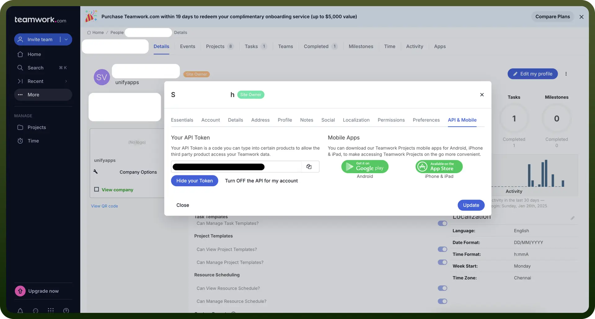
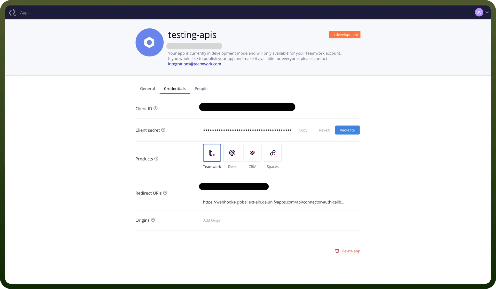

# Teamwork connector

Source: https://www.unifyapps.com/docs/unify-integrations/teamwork
Section: integrations

---

Teamwork is a project management software designed to help teams collaborate efficiently, track tasks, and manage workflows. It offers features like task assignments, time tracking, and file sharing to streamline project execution.

Integrating Teamwork with your application enhances project management, collaboration, and overall productivity.

## Authentication

Before you begin, make sure you have the following information:

- `Connection Name`**:** Choose a descriptive name for your Teamwork connection to help identify it within your application or integration settings. A meaningful name, like "MyAppTeamworkIntegration," helps maintain organization, especially when managing multiple integrations.
- `Authentication Type`**:** Select the type of authentication to connect to your Teamwork account securely:
  - API Key
  - OAuth

### API Key Authentication

1. Go to Teamwork.com, click your avatar in the bottom left.
2. Click "`Edit my details`".
3. Go to "`API & Mobile`".
4. Turn on the API for my account.
5. Click on the "`Show your token`".
6. Copy the API Token and store it securely to prevent unauthorized access.

  

### OAuth Based Authentication

- Create an account on teamwork and go to https://{yourSiteName}.teamwork.com/developer.
- Create a new app and provide required details.
- In redirect URIs enter the Callback URL provided from the new connection details page.
- Go to the Credentials section and copy the Client ID and Client Secret.
- Ensure you store them securely as they provide access to your teamwork account.

  

## Actions

| Actions | Description |
|---|---|
| `Create project` | Creates a project in Teamwork |
| `Create subtask` | Creates a subtask for a specified task in Teamwork |
| `Create task in task list` | Creates a task in a specified task list in Teamwork |
| `Create task list` | Creates a new task list in Teamwork |
| `Create task on project` | Creates a task on a project in Teamwork |
| `Delete project` | Deletes a project in Teamwork |
| `Delete task` | Deletes a task in Teamwork |
| `Delete task list` | Deletes a task list in Teamwork |
| `Get all projects` | Retrieves all projects from Teamwork |
| `Get all task lists` | Retrieves all task lists from Teamwork |
| `Get all task lists for project` | Retrieves all task lists for a project from Teamwork |
| `Get all tasks` | Retrieves tasks across all projects in Teamwork |
| `Retrieve task` | Retrieves a task from Teamwork |
| `Update project` | Updates a project in Teamwork |
| `Update task` | Updates an existing task in Teamwork |
| `Update task list` | Updates a task list in Teamwork |

## Triggers

| Triggers | Description |
|---|---|
| `Project created` | Project created on Teamwork |
| `Task created` | Task created on Teamwork |
| `Task list created` | Task list created on Teamwork |
