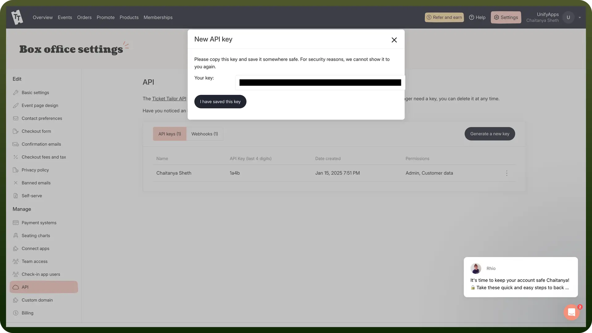

# Ticket Tailor integration | connect with UnifyApps

Source: https://www.unifyapps.com/docs/unify-integrations/ticket-tailor
Section: integrations

---

Ticket Tailor is an online ticketing platform that allows event organizers to sell tickets directly to their audience with low fees. It offers customizable event pages, seamless integrations, and robust reporting tools to manage events efficiently.

Integrating your application with Ticket Tailor enhances your event management capabilities by enabling streamlined lead management, automated workflows, and detailed analytics.

## Authentication

Before you begin, make sure you have the following information:

- `Connection Name`**:** Choose a meaningful name for your connection. This name helps you identify the connection within your application or integration settings. It could be something descriptive like "TicketTailorIntegration".
- `Authentication Type`**:** Ticket Tailor provides the API Key Authentication.

### API Key Based Authentication

1. Log in to your Ticket Tailor account.
2. As soon as you login, you will be asked to create a box office for your organization, which will help you manage your events.
3. After creating the box office, you will be redirected to the dashboard.
4. Click on the settings on the right top and navigate to the API section.
5. Click on "`Generate a new key`" and copy it, as it won't be fully visible again after you leave the page.

  

6. Store the API key securely, as it provides access to your Ticket Tailor account.
7. You need to use this api key as your username and leave the password field empty in order to authorize your account.

## Actions

| Actions | Description |
|---|---|
| `Create a ticket type` | Creates a ticket type in Ticket Tailor |
| `Create an issued ticket` | Creates a new issued ticket in Ticket Tailor |
| `Delete a ticket type` | Deletes a ticket type in Ticket Tailor |
| `Get a single issued ticket` | Gets a single issued ticket in Ticket Tailor |
| `Get a single order` | Gets a single order in Ticket Tailor |
| `List issued tickets` | Lists all issued tickets in Ticket Tailor |
| `List orders` | Lists all orders in Ticket Tailor |
| `Update a ticket type` | Updates a ticket type in Ticket Tailor |
| `Update an order` | Updates an existing order in Ticket Tailor |
| `Void an issued ticket` | Voids an existing issued ticket in Ticket Tailor |

## Triggers

| Triggers | Description |
|---|---|
| `Create issued ticket` | Creates an issued ticket in Ticket Tailor |
| `Create new order` | Creates a new order in Ticket Tailor |
| `Update an order` | Updates an order in Ticket Tailor |
| `Update issued ticket` | Updates an issued ticket in Ticket Tailor |
