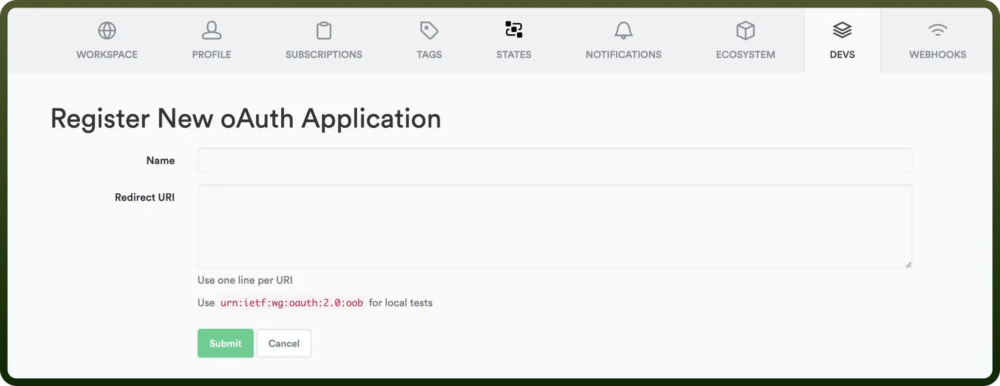

# Timely

Source: https://www.unifyapps.com/docs/unify-integrations/timely
Section: integrations

---

Timely is an automatic time tracking and project management tool designed to help teams log hours, manage projects, and track productivity without manual input. It uses AI to capture activity across tools and organize time data intelligently.

Automates time tracking and improves project visibility for accurate reporting and efficient resource planning.

## Authentication

Before you begin, make sure you have the following information:

- `Connection Name`: Select a descriptive name for your connection, like "MyAppTimelyIntegration". This helps in easily identifying the connection within your application or integration settings.
- `Authentication Type`**:** Timely uses OAuth2 for authentication.

### OAuth 2.0  Based Authentication

1. Log in to your Timely account.
2. Navigate to the DEVS section in settings.
3. Click on New Application to create a new application.
4. Enter your application name and redirect URI. **Note:** In the Redirect URL section paste the following link [https://webhooks-global.ext-alb.qa.unifyapps.com/api/connector-auth-callback/oauth](https://webhooks-global.ext-alb.qa.unifyapps.com/api/connector-auth-callback/oauth).
5. After creating the application, acquire the Application ID(Client ID) and Secret(Client Secret) and store them securely to prevent unauthorized access.

  

## Actions

| Actions | Description |
|---|---|
| `Create client` | Creates a client in Timely |
| `Create project` | Creates a project in Timely |
| `Create task` | Creates a task in Timely |
| `Create user` | Creates a user in Timely |
| `Find client` | Finds a client in Timely |
| `Find tag` | Finds a tag in Timely |

## Triggers

| Triggers | Description |
|---|---|
| `Client created polling` | Triggers when a new client is created in Timely |
| `Project created` | Triggers when a new project is created in Timely |
| `Project updated` | Triggers when a project is updated in Timely |
