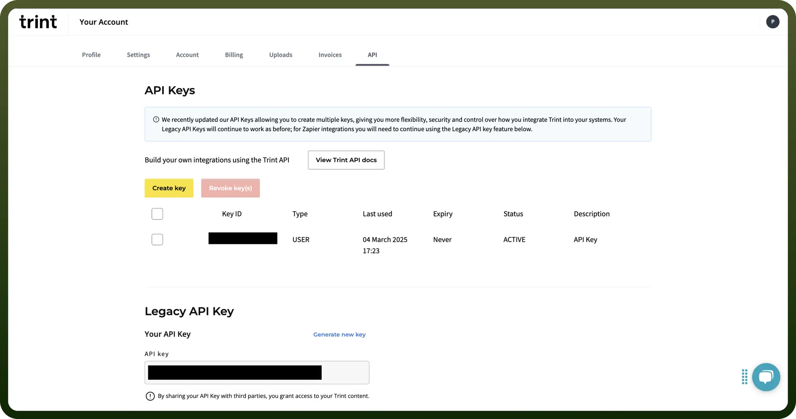

# Trint connector

Source: https://www.unifyapps.com/docs/unify-integrations/trint
Section: integrations

---

Trint is an AI-powered transcription platform that converts audio and video into searchable, editable text. It supports multi-language transcription, real-time collaboration, and publishing workflows.

Streamlines transcription, editing, and content repurposing directly into your workflow.

## Authentication

Before you begin, make sure you have the following information:

- `Connection Name`: Select a descriptive name for your connection, like "MyAppTrintIntegration". This helps in easily identifying the connection within your application or integration settings.
- `Authentication Type`**:** Trint supports API key for authentication.

### **API Key Based Authentication**

1. Log in to your [Trint account](https://app.trint.com/).
2. Click on your profile icon in the top-right corner and select `Settings`.
3. Navigate to the `API section`.
4. Click `Create Key` to generate a new API key.
5. Copy your `keyId` and `keySecret` and store them securely to prevent unauthorized access.
6. For more details, visit the [Trint API Documentation](https://dev.trint.com/docs/trint-api-keys).

  

## Actions

| Actions | Description |
|---|---|
| `Create folder` | Creates a folder in Trint |
| `Export file` | Exports a file in Trint |
| `Get file` | Gets a file in Trint |
| `Get folder` | Gets a folder in Trint |
| `Get workspace` | Gets a workspace in Trint |

## Triggers

| Triggers | Description |
|---|---|
| `On folder completed` | Triggers when a folder is created |
| `On new transcript` | Triggers when transcript is ready |
| `On transcript verified` | Triggers when transcript is verified |
