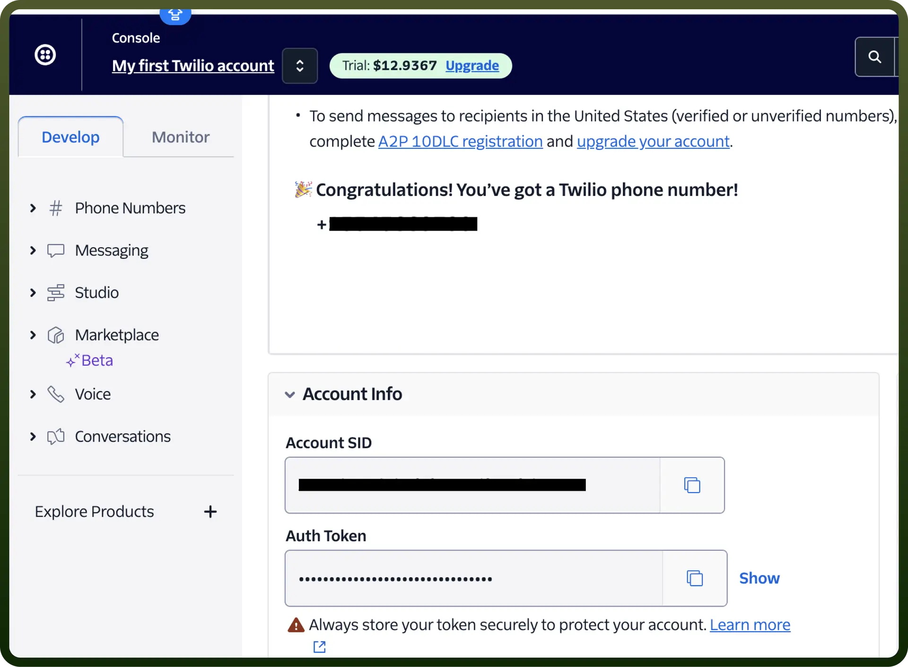

# Twilio connector

Source: https://www.unifyapps.com/docs/unify-integrations/twilio
Section: integrations

---

Twilio is a cloud communications platform that enables businesses to integrate voice, messaging, video, and email into their applications through APIs. It simplifies building scalable communication solutions for customer engagement and operational efficiency.

Integrating your application with Twilio revolutionizes communication infrastructure, facilitating seamless messaging, voice calls, and automation.

## Authentication

Ensure you have the following information ready for a seamless integration process:

- **Connection Name:** Select a descriptive name for your connection, like "MyAppTwilioIntegration". This helps in easily identifying the connection within your application or integration settings.
- **Authentication Type:** Twilio supports API Token based authentication for simpler, individual use or single-account access.

## API Token Based Authentication

- Go on to the [https://console.twilio.com/](https://console.twilio.com/) and scroll down to the account Info section
- In the account setting section, you’ll get the Account SID and Auth Token required for Authentication.

  

## Actions

| Actions | Description |
|---|---|
| `Make phone call` | Makes a phone call in Twilio |
| `Make voicebot call` | Makes a voicebot call in Twilio |
| `Send SMS` | Sends SMS in Twilio |

## Triggers

| Actions | Description |
|---|---|
| `New Recording` | Triggers when a new recording is created in a Twilio account |
| `New SMS received` | Triggers when a new SMS is received by a specific Twilio number |
| `New Transcription` | Triggers when a new transcription is available in a Twilio account |
| `On New Voice Event` | This trigger will be invoked when a new voice event comes from Twilio |
