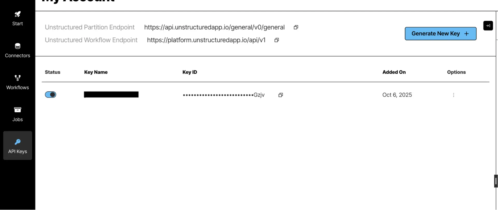

# Unstructured integration

Source: https://www.unifyapps.com/docs/unify-integrations/unstructured
Section: integrations

---

## Unstructured

Unstructured enables developers to preprocess and transform unstructured data (PDFs, HTML, Word documents, PowerPoints, and more) into clean, structured formats that can be used in LLM applications, RAG pipelines, and AI workflows. By integrating Unstructured, teams can streamline document ingestion, improve parsing accuracy, and reduce the overhead of manually handling multiple content types.

### Authentication :

Integrating your application with Unstructured allows secure access to document parsing and data transformation APIs using API Key–based authentication. Before starting, ensure you have the following information from your Unstructured account:

`Connection Name`**:** Choose a meaningful name for your connection. This name helps you identify the connection within your application or integration settings, such as “MyAppUnstructuredIntegration”.

`API URL`**:** Enter the base URL of your Unstructured API environment .

### API Key–Based Authentication:

1. Log in to your Unstructured account.
2. Navigate to your Account Settings or API Keys section.
3. Click Generate New API Key (or copy an existing key if already created).
4. Copy the generated API key and store it securely.
5. In your application, enter the API URL and the copied API Key in their respective fields to complete the connection setup**.**
6. Click Authorize or Create to validate and complete the connection.

### **ACTIONS :**

| **Action Name** | **Description** |
|---|---|
| `Process a file` | Process a file using unstructured api |
