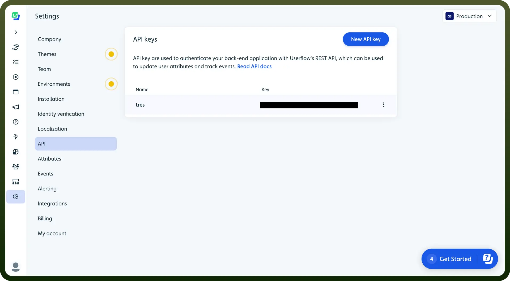

# Userflow connector

Source: https://www.unifyapps.com/docs/unify-integrations/userflow
Section: integrations

---

Userflow is a no-code platform for creating in-app onboarding experiences and product tours. It helps businesses improve user adoption with interactive walkthroughs and surveys.

Integrating your application with Userflow allows you to create personalized onboarding experiences, automate user guidance, and enhance user engagement.

## Authentication

Before you begin, make sure you have the following information:

- `Connection Name`**:** Choose a descriptive name for your connection, such as "MyAppUserflowIntegration". This helps in easily identifying the connection in your application or integration settings.
- `Authentication Type`**:** Userflow supports API Key authentication. This method ensures secure access to Userflow's functionalities and data.

### API Key Based Authentication

- Log into your Userflow account and navigate to the "`Settings`" section from the menu.
- In the "`API`" tab, you will find your unique API Key.
- If an API Key is not yet generated, click on "`Generate New API Key`" to create one.
- Copy the API Key and keep it secure, as it grants access to your Userflow account.

  

## Actions

| Actions | Description |
|---|---|
| `Create/Update group` | Creates or updates a group (company/account/tenant/organization) in Userflow |
| `Create/Update user` | Creates or updates a user in Userflow |
| `Find group` | Finds a group in Userflow |
| `Find user` | Finds a user in Userflow |
| `Track event` | Tracks an event in Userflow |

## **Triggers**

| Triggers | Description |
|---|---|
| `Group created/updated` | Triggers when a group is created or updated in Userflow |
| `User created/updated` | Triggers when a user is created or updated in Userflow |
