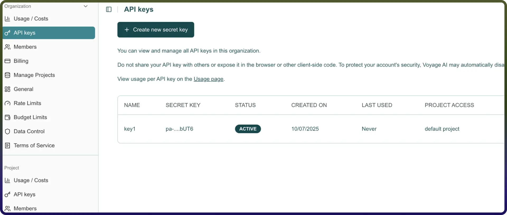

# Voyage AI connector

Source: https://www.unifyapps.com/docs/unify-integrations/voyage-ai
Section: integrations

---

# Voyage AI

Voyage AI provides advanced embeddings and vectorization capabilities that enable developers to convert text, documents, and other unstructured content into high-quality vector representations. These embeddings can be used in search, retrieval-augmented generation (RAG), recommendation systems, and other AI-driven workflows. 
 By integrating Voyage AI, you can efficiently transform data into meaningful representations for downstream LLM and AI applications.

### Authentication :

Before you begin, make sure you have the following information:

`Connection Name`: Choose a descriptive name for your connection, like “Voyage AI connection”. This helps you easily identify the connection within your integration settings. 
`Authentication Type`: Voyage AI supports API token based authentication.

### API Token Based:

1. Log in to your Voyage AI account.
2. Go to the API Keys section under your account dashboard or settings.
3. Generate a new API key or copy an existing one.
4. Enter the API key in your application’s connection setup form.
5. Click Authorize to validate the key and establish the connection.

### ACTIONS **:**

| **Action Name** | **Descriptions** |
|---|---|
| `Create embeddings` | Create embeddings using Voyage AI model |
