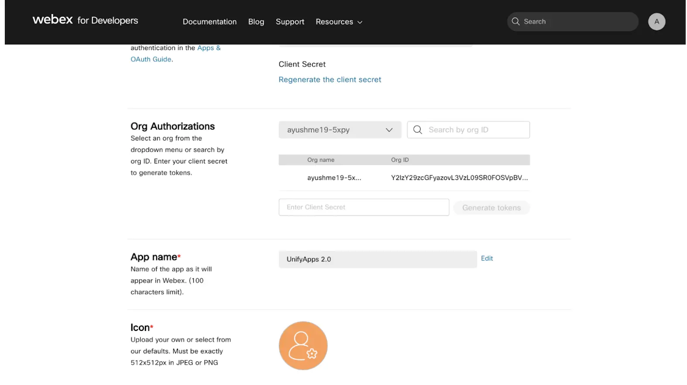

# Webex Teams connector

Source: https://www.unifyapps.com/docs/unify-integrations/webex-teams
Section: integrations

---

## Webex Teams

Webex Teams helps organizations collaborate effectively through secure messaging, meetings, file sharing, and real-time communication. It enables teams to stay connected across devices with enterprise-grade security and seamless integrations. By integrating Webex Teams, applications can automate conversations, manage users and spaces, and enhance collaboration workflows.

### **Authentication**

Integrating your application with Webex Teams enables secure access to Webex APIs for messaging, meetings, and collaboration features. Before starting, ensure you have the following information ready:

`Connection Name`**:** Choose a meaningful name for your connection. This name helps you identify the connection within your application or integration settings. For example, "MyAppWebexIntegration".

`Authentication Type`**:** Webex Teams supports the following authentication methods:

- Access Token
- OAuth
- OAuth with Client Configuration

### OAuth with Client Configuration Based Authentication:

**Steps:**

1. Log in to Webex for Developers.
2. Go to My Webex Apps and click Create a New App.
3. Choose Integration. Provide the app name, redirect URI, and required scopes.
4. Save the app to generate the Client ID and Client Secret.
5. Use the Client ID and Client Secret in the platform.
6. Click Authorize.
7. You will be redirected to the Webex login page.
8. Sign in with your Webex credentials.
9. Review the requested permissions and click Authorize.
10. After successful authorization, you will be redirected back to the platform with a confirmation that the account is connected.

### **OAuth Based Authentication:**

This method is ideal for user-based authentication flows.

**Steps:**

1. Click the Authorize button.
2. You will be redirected to the Webex sign-in page.
3. Enter your Webex account credentials if not already logged in.
4. Webex will display a permissions consent screen showing the app name and requested scopes.
5. Review the permissions and click Authorize.
6. You will be redirected back to the platform with a success confirmation.

`User Access Token`**:** Enter the Webex API access token generated from the Webex Developer Portal. This token authorizes API requests to your Webex account and should be treated as confidential.

#### **How to access API token in Webex**

1. Log in to[**https://developer.webex.com**](https://developer.webex.com) using your developer account (or sign up if you don’t have one).
2. Click on your profile icon in the top-right corner and navigate to “My Webex Apps”.
3. In the My Apps section, click “Create New App”.
4. Under Create New App, select “Create a Service App”.
5. Provide the service app name and email address, define the required scopes for your integration, and click “Add Service App”.
6. Click “Request Admin Authorization” to get the app approved by your organization administrator.
7. Once the app is authorized, copy the Client Secret from the authorization section.
8. In the Org Authorization section, paste the client secret and click Generate Token.
9. Copy the generated access token and use it in the connection setup.

### ACTIONS :

| **Action Name** | **Description** |
|---|---|
| `Add person to room` | Adds a person to a room in Webex Teams |
| `Create room` | Creates a room in Webex Teams |
| `Create team` | Creates a team in Webex Teams |
| `Download attachment` | Download attachment in webex teams |
| `Get all one to one chats` | Get all one to one chats in webex teams |
| `Get all members of room` | Get all members of room in webex teams |
| `Get all rooms` | Get all rooms in webex teams |
| `Get all teams` | Get all teams in webex teams |
| `Get attachment details` | Gets attachment details in Webex Teams |
| `Get message details` | Gets message details in Webex Teams |
| `Get person details` | Gets person details in Webex Teams |
| `Get room details` | Gets room details in Webex Teams |
| `List all messages of chat` | List all messages of chat in webex teams |
| `List all messages of room` | List all messages of room in webex teams |
| `Post message` | Posts a message in Webex Teams |
| `Update room` | Updates room topic in Webex Teams |

### TRIGGERS :

| **Triggers Name** | **Description** |
|---|---|
| `New button submission` | New button submission in Webex Teams |
| `New message` | Triggers on a new message in Webex Teams |
