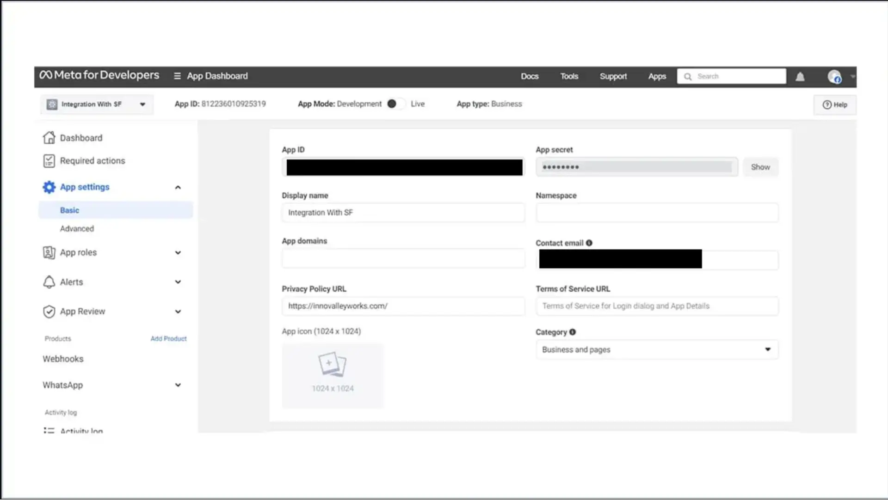
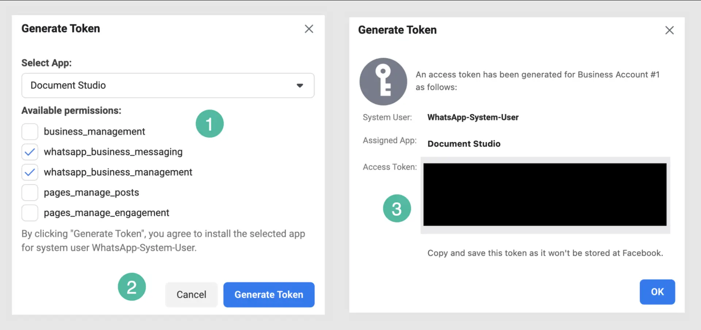

# Whatsapp connector

Source: https://www.unifyapps.com/docs/unify-integrations/whatsapp
Section: integrations

---

## **Whatsapp**

WhatsApp integration enables your application to communicate with customers directly through the WhatsApp Business API or WhatsApp Cloud API. With secure authentication and robust messaging endpoints, you can send messages, notifications, and manage customer interactions seamlessly.

### **Authentication:**

Integrating your application with WhatsApp allows you to use powerful APIs for automating and scaling customer engagement. Before you begin, ensure you have the following information:

**Connection Name :** Choose a meaningful name for your connection. This name helps you identify the connection within your application or integration settings. It could be something descriptive like "MyAppWhatsappIntegration".

**Authentication Type :** Whatsapp supports three types of authentications. They are :

- OAuth with client credentials
- API Token
- OAuth

### **OAuth with client credentials Based :**

1. Go to the [Meta for Developers Console](https://developers.facebook.com/apps/) and create a new app.
2. Select the appropriate app type (usually Business) to enable WhatsApp API access.
3. Provide required details like App Name, Business Account, and Redirect URI.
4. After creation, Meta generates the "App ID" and "App Secret". Copy and securely store them.
5. Configure your Redirect URI to receive the authorization code after user consent.

### **API Token Based :**

1. Go to **System Users** → **Generate Token** in Meta Business Manager.
2. Create a permanent access token with the required scopes.
3. Copy your **Phone Number ID** and **Business Account ID** from the WhatsApp setup screen.
4. Use this token for further authentication purposes.

### 

### **OAuth Based :**

1. Click on the **Authorize** button to authenticate your connection.
2. You’ll be redirected to the Meta login page.
3. Enter the email address and password of the account you wish to integrate UnifyApps with and click on the **Next** button to authenticate.
4. Whatsapp will display a permissions request screen. You'll see the specific permissions we request access to.
5. Review the permissions we are asking for. If you're comfortable with the permissions, click the **Allow** or **Grant Access** button.
6. After granting access, you'll be automatically redirected back to our platform. You should see a confirmation message that your Whatsapp account is now connected.

### **ACTIONS**

| **Action Name** | **Description** |
|---|---|
| **Fetch attachment** | Fetches Base64 encoded content of attachment |
| **Send attachment** | Sends an attachment message from Whatsapp |
| **Send card template** | Sends an interactive reply button template from Whatsapp |
| **Send CTA URL button template** | Sends a CTA URL button template from Whatsapp |
| **Send HSM template** | Sends an HSM pre-approved template from Whatsapp |
| **Send list picker template** | Sends an interactive list template from Whatsapp |
| **Send simple text message** | Sends a simple text message from Whatsapp |

### **TRIGGERS**

| **Trigger Name** | **Description** |
|---|---|
| **New message** | Triggers when a new inbound message is received in Whatsapp |
