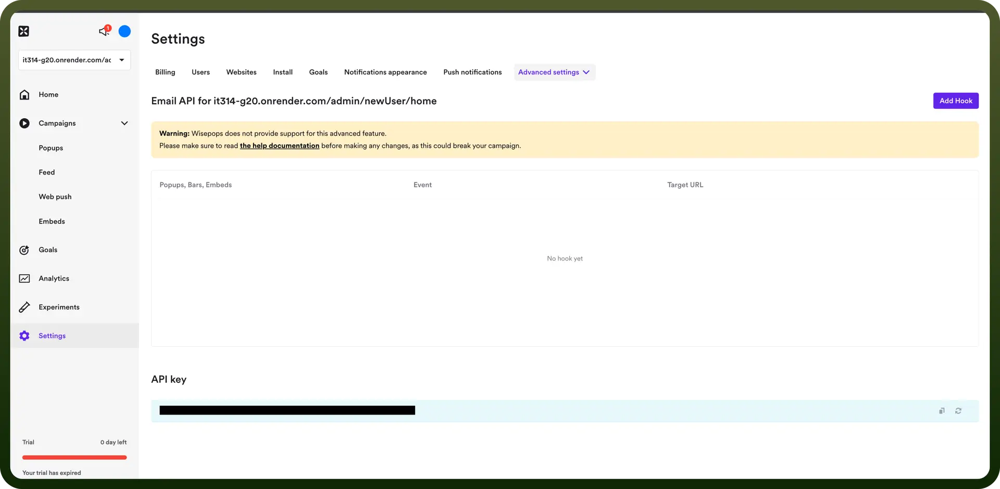

# Wisepops connector

Source: https://www.unifyapps.com/docs/unify-integrations/wisepops
Section: integrations

---

Wisepops is a conversion optimization tool for creating targeted pop-ups and banners. It helps businesses engage visitors, grow email lists, and boost sales with personalized messaging.

Integrating WisePops helps you boost conversions by creating targeted pop-ups and banners without coding.

## Authentication

Before you begin, make sure you have the following information:

- `Connection Name`: Choose a meaningful name for your connection. This name helps you identify the connection within your application or integration settings. It could be something descriptive like "MyAppWisepopsIntegration".
- `Authentication Type`: Wisepops supports API key based authentication.

### API Key Based Authentication

1. Log in to your Wisepops account.
2. Navigate to Settings in the left-hand menu.
3. From the top navigation bar select Email API inside Advanced Popups settings and navigate to the bottom. **Note:** The API key is associated with a specific website. If you have multiple websites configured in Wisepops, you'll need to use the correct key for each website.
4. Copy the generated API key.
5. Store the API key securely, treating it like a password.

  

## Actions

| Actions | Description |
|---|---|
| `Get collected contacts` | Gets collected contacts from Wisepops |
| `Get performance data` | Gets performance data from Wisepops |

## Triggers

| Triggers | Description |
|---|---|
| `Create email` | Triggers when a new email is created in Wisepops |
| `Create phone` | Triggers when a new phone is created in Wisepops |
| `Create survey` | Triggers when a new survey is created in Wisepops |
