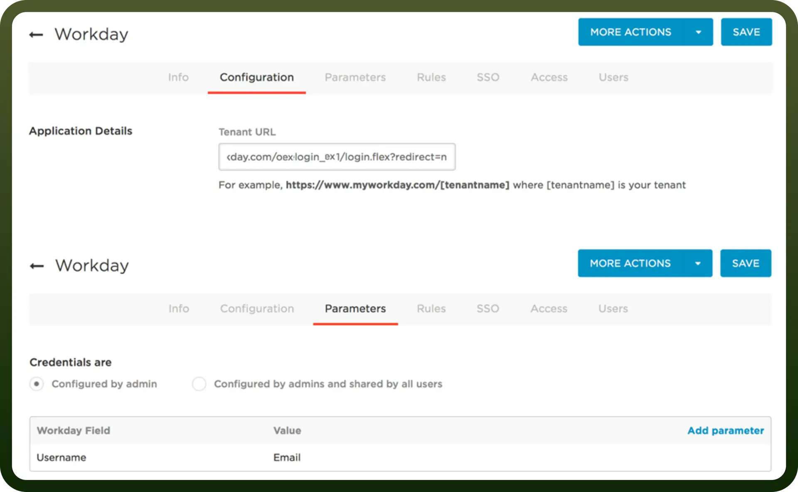
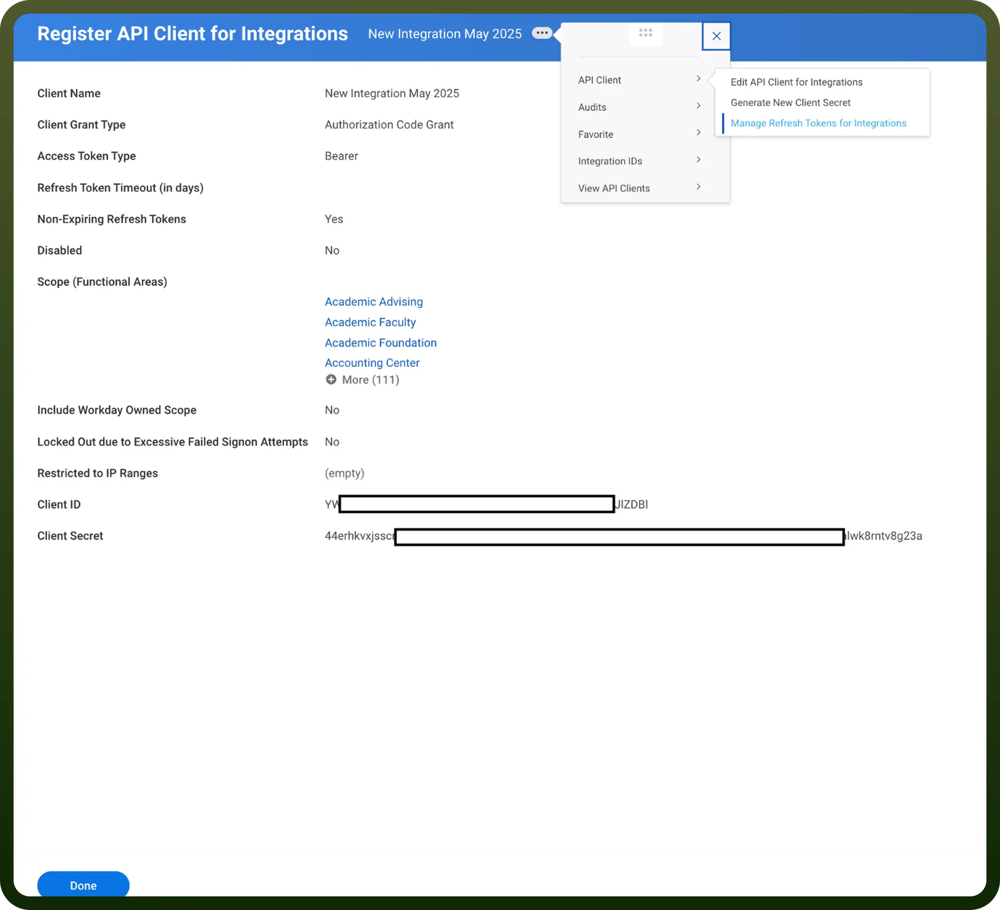

# Workday connector

Source: https://www.unifyapps.com/docs/unify-integrations/workday
Section: integrations

---

Workday is a cloud-based software platform for enterprise resource planning (ERP) that provides solutions for human capital management (HCM), financial management, and analytics. It helps organizations streamline HR, payroll, and business processes in a unified system.

Integrating Workday with your application, enhances data insights, boosts compliance, and improves overall efficiency and employee experience.

## Authentication

Before integrating Worday, ensure you have the following information:

- `Connection Name`**:** Choose a descriptive name for your Gmail connection to help you identify it within your application or integration settings. A meaningful name, like "MyAppWorkdayIntegration," helps maintain organization, especially when managing multiple integrations.
- `Authentication Type`**:** Select the type of authentication to connect to your workday account securely:
  - Basic
  - OAuth

### Basic Authentication

To set up your Workday connection with basic authentication, complete the following steps:

1. Locate and enter your `Tenant ID` from the URL when logged into Workday.
2. Provide the `WSDL URL` associated with your Workday services.
3. Input your Workday Login name and Password.

### OAuth based Authentication

To set up your Workday connection with OAuth, complete the following steps:

1. Locate and enter your `Tenant ID` from the URL when logged into Workday.
2. Provide the `WSDL URL` associated with your Workday services.
3. Enter the `Client ID` and `Client Secret` from your API client settings.
4. To get the Client ID and Client Secret follow the following steps:
  - In Workday's search bar, look for Register API Client for Integrations.
  - Select the Register API Client for Integrations task to open the registration page.
  - Provide a name for your API client in the Client Name field.
  - Choose the Non-Expiring Refresh Tokens option.
  - Define the API client's access scope, ensuring you include the Integration scope. This scope must cover key domain security policies like Integration Build, Integration Debug, Integration Process, and Integration Event. This is the minimum requirement for connecting with Workday, along with any specific operations needed for your integration.
  - Click OK to generate the Client ID and Client Secret.

Actions

The following actions are available to create custom automations on the Unifyapps platform:

| **Action** | **Description** |
|---|---|
| `Create expense entry` | Creates a new quick expense record in Workday, enabling users to log individual expenses for tracking and reimbursement |
| `Create expense report line` | Adds a specific line item to an existing expense report, detailing a discrete expense within the report |
| `Create/Update custom object` | Creates a new custom object or updates an existing one in Workday to capture specialized, user-defined data |
| `Get custom object` | Retrieves data for a particular custom object instance stored within Workday |
| `Get expense entry` | Fetches details of a quick expense entry by its unique Workday ID (WID) |
| `Get expense item` | Retrieves comprehensive information about an expense item linked to a given WID |
| `Get expense report` | Retrieves full details of an expense report identified by its WID, including all associated line items |
| `Get worker by ID` | Accesses detailed worker (employee) information in Workday by the worker's unique ID |
| `Get workers` | Retrieves a list or collection of worker records within Workday |
| `List expense entries` | Obtains a collection of logged quick expenses across the Workday system |
| `List expense items` | Retrieves a set of expense items associated with multiple records |
| `List expense reports` | Provides a list of expense reports available in Workday |
| `Fetch employee absence types` | Fetches the different categories of absences that a specific employee is eligible for or has recorded |
| `Retrieves balance` | Obtains balance information, such as time off balances or financial balances, from Workday |
| `Fetch eligible absence types` | Retrieves absence categories the worker qualifies to use |
| `Fetch leaves of absence (by ID)` | Lists leaves of absence records for a worker identified by ID |
| `Fetch leaves of absence` | Lists leave records associated with a given worker |
| `Retrieves specified balance` | Queries a particular balance type specified by parameters in Workday |
| `Fetch worker staffing details` | Retrieves the current staffing (employment) details for an individual worker |
| `Fetch multiple worker staffing details` | Obtains staffing data for multiple workers |
| `Fetch valid time-off dates` | Retrieves dates on which the worker is permitted to take time off |
| `Return holiday events` | Returns a list of recognized holiday events recorded in Workday |
| `Update expense entry` | Modifies an existing quick expense record identified by WID with new or corrected data |
