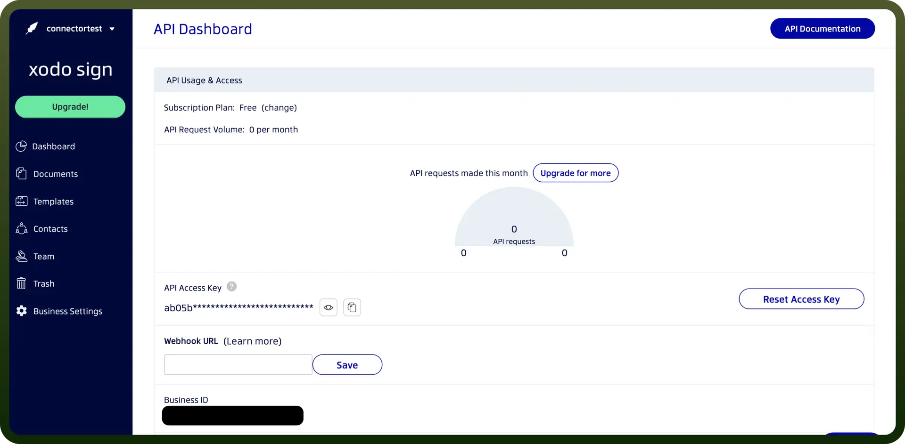

# XodoSign connector

Source: https://www.unifyapps.com/docs/unify-integrations/xodosign
Section: integrations

---

XodoSign is a secure eSignature platform that enables users to sign, send, and manage documents online with legally binding digital signatures. It simplifies contract workflows for individuals and teams with real-time tracking and cloud integration.

Integrating your application with XodoSign allows you to streamline document signing processes.

## Authentication

- `Connection Name`**:** Select a descriptive name for your connection, like "MyAppXodosignIntegration." This helps in easily identifying the connection within your application or integration settings.
- `Authentication Type`**:** XodoSign supports API key and Business ID for authentication. This method ensures secure access to XodoSign functionalities and data.

### API Key Based Authentication

- Log in to your Xodo account and navigate to your Developer section.
- Click on "`Collect your API key and Business ID`".
- Go to `XodoSign` -> `Developer` -> `API key`.
- Store this token securely, as it grants access to your XodoSign account.

  

## Actions

| Actions | Description |
|---|---|
| `Cancel document` | Cancels document using XodoSign |
| `Get final PDF` | Gets final PDF of a document using XodoSign |
| `Get template` | Gets template using XodoSign |
| `Send reminder` | Sends reminder to signer using XodoSign |
| `Use template` | Uses template to send document using XodoSign |

## Triggers

| Triggers | Description |
|---|---|
| `On document completed` | Triggers when a document is completed |
| `On document send` | Triggers when a document is sent |
