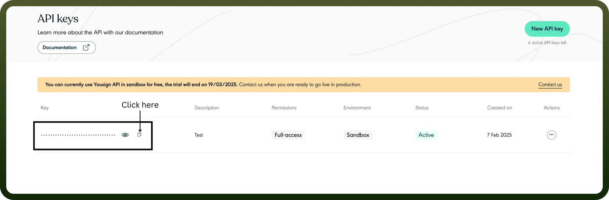

# Yousign connector

Source: https://www.unifyapps.com/docs/unify-integrations/yousign
Section: integrations

---

**Yousign** is a secure electronic signature platform designed for businesses to streamline document approvals and legally bind agreements online. It offers features like digital sealing, workflow automation, and compliance with eIDAS regulations.

Integrating Yousign simplifies document workflows, ensures legal compliance, and accelerates secure approvals with electronic signatures.

## Authentication

Before you begin, make sure you have the following information:

- `Connection Name`: Select a descriptive name for your connection, like "MyAppYousignIntegration". This helps in easily identifying the connection within your application or integration settings.
- `Authentication Type`**:** Yousign supports API tokens for authentication.

### API Key Based

1. Signup or login to your Yousign account.
2. Navigate to the API on the left side and click on it.
3. Assign the permissions accordingly (eg. Full Access, Read Only)
4. Copy your API key for the API keys section and store it securely as it provides access to your Yousign account.

## Actions

| Actions | Description |
|---|---|
| `Add document to signature request` | Adds a document to a given signature request in Yousign |
| `Create Contact` | Creates a new contact in Yousign |
| `Create contact` | Creates a new contact in Yousign (duplicate of above) |
| `Create electronic seal` | Creates a new electronic seal in Yousign |
| `Delete document` | Deletes a given document from a signature request in Yousign |
| `Initiate signature request` | Initiates a new signature request in Yousign |
| `List signature request's documents` | Returns a list of documents for a given signature request in Yousign |
| `Update document` | Updates a given document in Yousign |
| `Upload document to signature request` | Uploads a document to a given signature request |
| `Upload electronic seal document` | Uploads an electronic seal document (only PDF are accepted) in Yousign |
