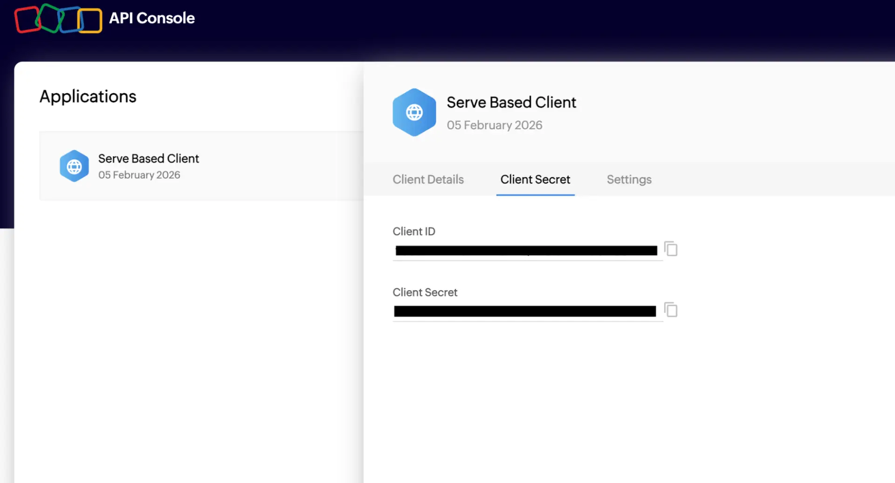

# Zoho CRM connector

Source: https://www.unifyapps.com/docs/unify-integrations/zoho-crm
Section: integrations

---

# Zoho CRM

Integrating your application with Zoho CRM enhances customer relationship management by streamlining lead management, sales pipelines, and automation workflows in one centralized platform. Zoho CRM helps teams automate personalized customer interactions, manage contacts and deals, and maintain sales transparency with improved efficiency.

### **Authentication:**

Integrating your application to Zoho CRM enables seamless lead capture, pipeline tracking, and intelligent sales automation workflows. Before you begin, ensure you have the following information:

Connection Name : Choose a meaningful name for your connection. This name helps you identify the connection within your application or integration settings. It could be something descriptive like "MyAppZohoCRMIntegration".

Account URL : Enter the account_url of your Zoho CRM instance. eg: https://accounts.zoho.in for India, https://accounts.zoho.com for US, etc.

OAuth Based:

1. Register your application with Zoho's Developer Console to get your Client ID and Client secret.
2. Visit Zoho Developer Console and click on Add Client.
3. Select Server-based applications.
4. Fill in the required details to complete the registration.
5. Upon successful registration, you'll receive Client ID and Client secret.
6. Use these credentials for further authentication purposes.

### ACTIONS :

| **Action Name** | **Description** |
|---|---|
| `Create account` | Creates an account in Zoho CRM |
| `Create campaign` | Creates a campaign in Zoho CRM |
| `Create contact` | Creates a contact in Zoho CRM |
| `Create deal` | Creates a deal in Zoho CRM |
| `Create invoice` | Create invoice in Zoho CRM |
| `Create lead` | Creates a lead in Zoho CRM |
| `Create vendor` | Create vendor in Zoho CRM |
| `Delete standard object` | Delete a standard object in Zoho CRM |
| `Get account by ID` | Gets an account by ID from Zoho CRM |
| `Get campaign by ID` | Gets a campaign by ID from Zoho CRM |
| `Get contact by ID` | Gets a contact by ID from Zoho CRM |
| `Get deal by ID` | Gets a deal by ID from Zoho CRM |
| `Get invoice by ID` | Gets a invoice by ID from Zoho CRM |
| `Get lead by ID` | Gets a lead by ID from Zoho CRM |
| `Get product by ID` | Gets a product by ID from Zoho CRM |
| `Get purchase order by ID` | Gets a purchase order by ID from Zoho CRM |
| `Get sales order by ID` | Gets a sales order by ID from Zoho CRM |
| `Get vendor by ID` | Gets a vendor by ID from Zoho CRM |
| `List accounts` | Lists accounts from Zoho CRM |
| `List campaigns` | Lists campaigns from Zoho CRM |
| `List contacts` | Lists contacts from Zoho CRM |
| `List deals` | Lists deals from Zoho CRM |
| `List invoices` | Lists invoices from Zoho CRM |
| `List leads` | Lists leads from Zoho CRM |
| `List products` | Lists products from Zoho CRM |
| `List purchase orders` | Lists purchase orders from Zoho CRM |
| `List sales orders` | Lists sales orders from Zoho CRM |
| `List users` | Lists users from Zoho CRM |
| `List vendors` | Lists from Zoho CRM |
| `Search accounts` | Searches for an account in Zoho CRM |
| `Search campaigns` | Searches for a campaign in Zoho CRM |
| `Search contacts` | Searches for a contact in Zoho CRM |
| `Search deals` | Searches for a deal in Zoho CRM |
| `Search invoices` | Searches for a invoice in Zoho CRM |
| `Search leads` | Searches for a lead in Zoho CRM |
| `Search product` | Searches for a product in Zoho CRM |
| `Search purchase order` | Searches for a purchase order in Zoho CRM |
| `Search sales orders` | Search sales orders from Zoho CRM |
| `Search vendors` | Search vendors from Zoho CRM |
| `Update account` | Updates an account in Zoho CRM |
| `Update campaign` | Updates a campaign in Zoho CRM |
| `Update contact` | Updates a contact in Zoho CRM |
| `Update deal` | Updates a deal in Zoho CRM |
| `Update lead` | Updates a lead in Zoho CRM |

### TRIGGERS :

| **Trigger Name** | **Description** |
|---|---|
| `On New Account` | Triggers on creation of a new account in Zoho CRM |
| `On New Call` | Triggers on a new call in Zoho CRM |
| `On New Contact` | Triggers on creation of a new contact in Zoho CRM |
| `On New Deal` | Triggers on creation of a new deal in Zoho CRM |
| `On New Lead` | Triggers on creation of a new lead in Zoho CRM |
| `On New or updated Account` | Triggers on creation or updating of an account in Zoho CRM |
| `On New or updated Deal` | Triggers on creation or updating a deal in Zoho CRM |
| `On New Lead` | Triggers on creation or updating a lead in Zoho CRM |
