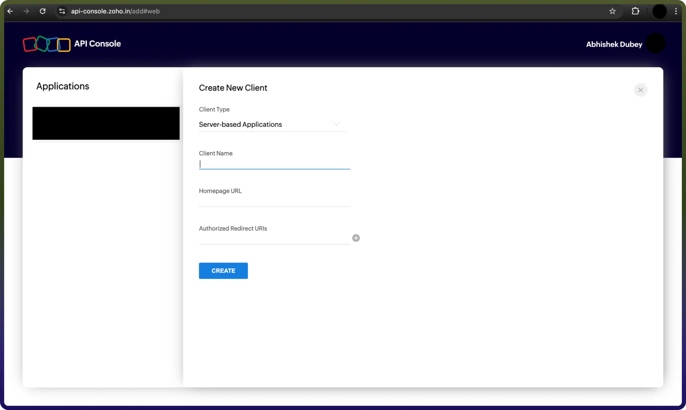

# Zoho Inventory integration | connect with UnifyApps

Source: https://www.unifyapps.com/docs/unify-integrations/zoho-inventory
Section: integrations

---

Zoho Inventory streamlines your inventory management by providing efficient, scalable, and customizable solutions. This integration allows for real-time tracking of stock levels, order management, invoicing, and reporting.

For a smooth integration process, ensure you have the following information ready:

## Authentication

Connecting your application to Zoho Inventory enables efficient inventory management, ensuring smooth operations and real-time tracking of stock.

Before starting, ensure you have the following information:

- `Connection Name:` Choose a meaningful name for your connection. This name helps you identify the connection within your application or integration settings. It could be something descriptive like "MyAppZohoInventoryIntegration".
- `Authentication Type`**:** Select the authentication method as OAuth.
- `Organization ID`**:** The Organization ID for the Zoho Inventory application can be found in the Admin Console under Organization Profile → Organization ID.

### OAuth Based :

1. Visit Zoho Developer Console and click on Add Client ID.
2. Select Server-based applications.
3. Fill in the required details to complete the registration.
4. Upon successful registration, you'll receive your OAuth 2.0 credentials: Client ID and Client Secret.
5. Keep these credentials secure and do not share them.

## Actions **:**

| **Action Name** | **Description** |
|---|---|
| `Create item` | Creates an item in Zoho Inventory |
| `Create transfer order` | Creates a transfer order in Zoho Inventory |
| `Create vendor credit` | Creates a vendor credit in Zoho Inventory |
| `Create warehouse` | Creates a warehouse in Zoho Inventory |
| `Delete item` | Deletes an item in Zoho Inventory |
| `Delete vendor credit` | Deletes a vendor credit in Zoho Inventory |
| `Delete warehouse` | Deletes a warehouse in Zoho Inventory |
| `Download invoice document` | Downloads an invoice document in Zoho Inventory |
| `Get contact` | Gets a contact in Zoho Inventory |
| `Get credit note` | Gets a credit note in Zoho Inventory |
| `Get invoice` | Gets an invoice in Zoho Inventory |
| `Get item` | Gets an item in Zoho Inventory |
| `Get purchase order` | Gets a purchase order in Zoho Inventory |
| `Get retainer invoice` | Gets a retainer invoice in Zoho Inventory |
| `Get sales order` | Gets a sales order in Zoho Inventory |
| `Get shipment` | Gets a shipment in Zoho Inventory |
| `Get vendor credit` | Gets a vendor credit in Zoho Inventory |
| `List all credit notes` | Lists all credit notes in Zoho Inventory |
| `List all customers` | Lists all customers in Zoho Inventory |
| `List all invoices` | Lists all invoices in Zoho Inventory |
| `List all items` | Lists all items in Zoho Inventory |
| `List all purchase orders` | Lists all purchase orders in Zoho Inventory |
| `List all retainer invoices` | Lists all retainer invoices in Zoho Inventory |
| `List all sales orders` | Lists all sales orders in Zoho Inventory |
| `List all shipments` | Lists all shipments in Zoho Inventory |
| `List all transfer orders` | Lists all transfer orders in Zoho Inventory |
| `List all users` | Lists all users in Zoho Inventory |
| `List all warehouses` | Lists all warehouses in Zoho Inventory |
| `List comments for a contact` | List comments for a contact |
| `Update item` | Updates an item in Zoho Inventory |
| `Update vendor credit` | Updates a vendor credit in Zoho Inventory |
| `Update warehouse` | Updates a warehouse in Zoho Inventory |
