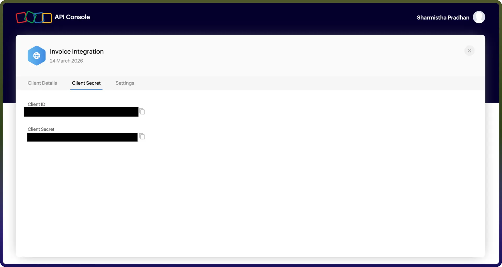

# Zoho Invoice integration

Source: https://www.unifyapps.com/docs/unify-integrations/zoho-invoice
Section: integrations

---

Integrating your application with Zoho Invoice enables seamless invoicing, payment tracking, and customer management. It allows businesses to automate billing workflows, generate professional invoices, monitor payment statuses, and streamline financial operations efficiently.

## Authentication:

Connecting your application with Zoho Invoice enables smooth invoice creation, real-time tracking, and automated financial workflows. Before you begin, ensure you have the following information :

`Connection Name:` Choose a meaningful name for your connection. This helps you identify it within your application or integration settings

(e.g., "MyAppZohoInvoiceIntegration").

`Domain` **:** Select your Zoho domain.

`Organization ID :` Your Zoho Invoice organization ID.

### OAuth-Based Authentication:

Zoho Invoice uses OAuth 2.0 for secure authentication.

1. Go to the Zoho Developer Console.
2. Create a new client.
3. Choose Server-based Applications.
4. Provide required details (Client Name, Redirect URI, etc.).
5. After creation, note the following:
6. Generate a Grant Token using the authorization URL.
7. Exchange the grant token for:
8. Use the access token in API requests for authentication.

## Actions

| **Action Name** | **Descriptions** |
|---|---|
| `Add task` | Add a task in Zoho Invoice |
| `Create contact` | Creates a contact in Zoho Invoice |
| `Create expense` | Create a expense in Zoho Invoice |
| `Create invoice` | Creates an invoice in Zoho Invoice |
| `Create project` | Creates a project in Zoho Invoice |
| `Delete contact` | Delete a contact in Zoho invoice |
| `Delete invoice` | Delete an invoice in Zoho invoice |
| `Delete project` | Delete a project in Zoho invoice |
| `Delete task` | Delete a task in Zoho invoice |
| `Get contact details` | Get the contact details in Zoho Invoice |
| `Get expense` | Get expenses in Zoho Invoice |
| `Get expenses in Zoho Invoice` | Get an invoice details in Zoho Invoice |
| `Get project details` | Get the project details in Zoho Invoice |
| `Get task details` | Get the task details in Zoho Invoice |
| `List expenses` | List expenses from Zoho Invoice |
| `List Invoices` | List invoices in Zoho Invoice |
| `Update contact` | Updates a contact in Zoho Invoice |
| `Update expense` | Update expense in Zoho Invoice |
| `Update invoice` | Updates an invoice in Zoho Invoice |
| `Update project` | Updates a project in Zoho Invoice |
| `Update task` | Updates a task in Zoho Invoice |
