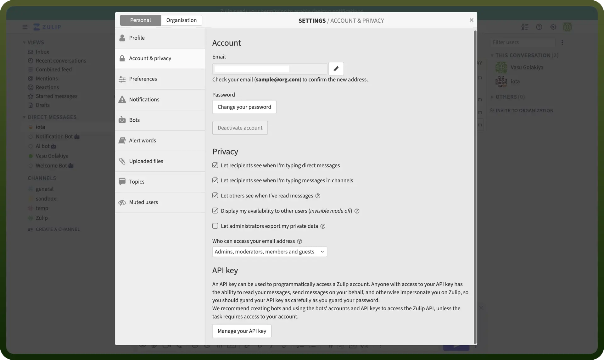

# Zulip connector

Source: https://www.unifyapps.com/docs/unify-integrations/zulip
Section: integrations

---

Zulip is a powerful team chat app that combines real-time and threaded messaging for organized, focused communication. It helps teams manage conversations across topics without losing context.

Integrating your application with Zulip allows you to create organizations, send messages in streams, send messages to users, and interact with Zulip streams programmatically.

## Authentication

Ensure you have the following information ready for a smooth integration process:

- `Connection Name`**:** Select a descriptive name for your connection, like "MyAppZulipIntegration". This helps in easily identifying the connection within your application or integration settings.
- `Authentication Type`**:** Zulip supports API tokens for authentication.
- `Email`**:** Your Zulip account email.

### API Key Based Authentication

1. Click on the gear icon in the upper right corner of the web or desktop app.
2. Select "`Personal settings`".
3. On the left, click "`Account & privacy`".
4. Under the API key, click "`Manage your API key`".
5. Enter your password, and click "`Get API key`".
6. Copy your API key.

## Actions

| Actions | Description |
|---|---|
| `Delete message` | Deletes a message in Zulip |
| `Edit private message` | Edits a private message in Zulip |
| `Send private message` | Sends a private message in Zulip |
| `Send stream message` | Sends a stream message in Zulip |
