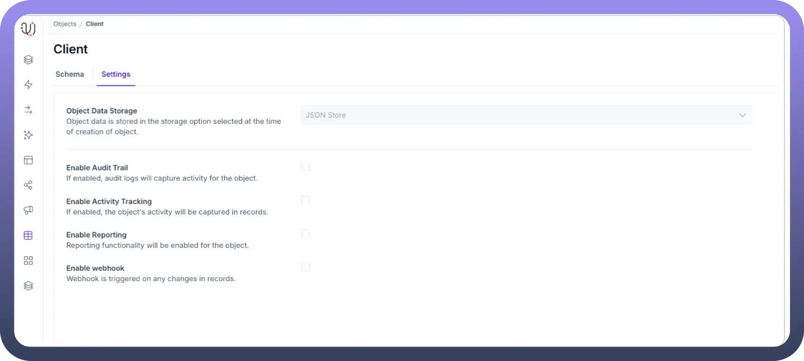
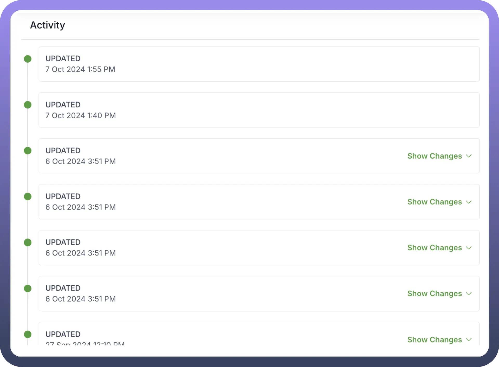
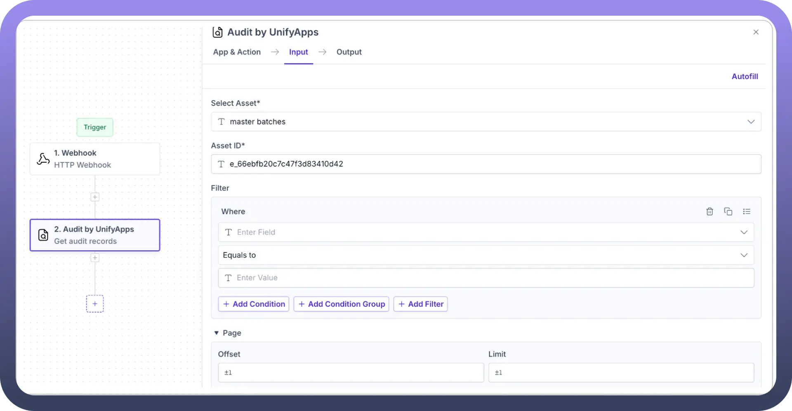
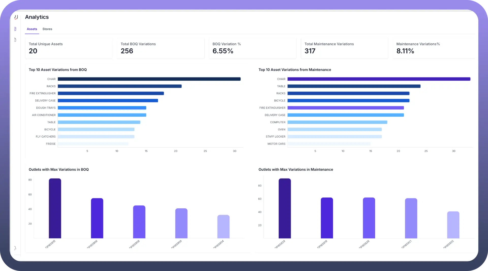
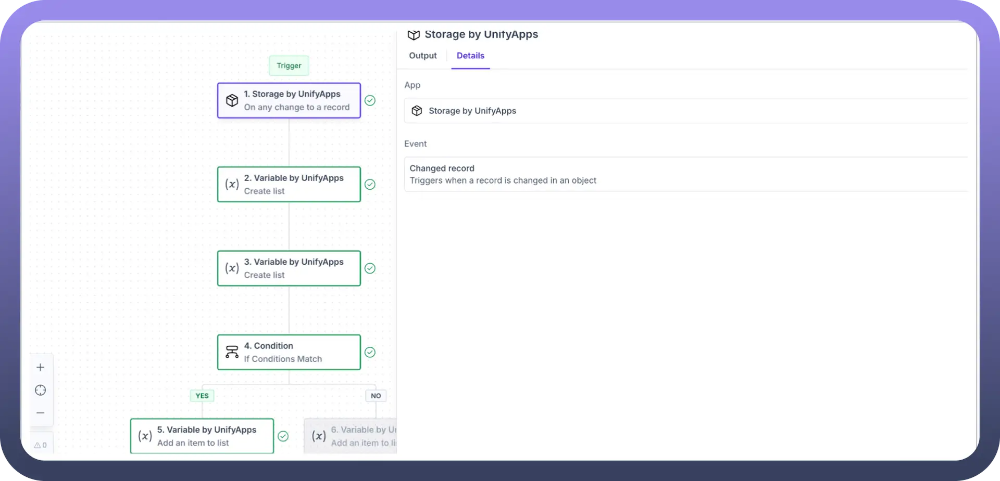

# Advanced configurations

Source: https://www.unifyapps.com/docs/platform-tools/advanced-configurations
Section: platform-tools

---

## Configure Advanced Settings

To manage advanced configuration options for your object, navigate to the edit schema page and select the settings tab. This section contains various checkbox options that control key object behaviors, including data storage preferences, audit logging, activity monitoring, reporting capabilities, and webhook functionality.

- Enable Audit Trail
  - The Audit Trail feature comprehensively tracks all modifications to an object's records.
  - This functionality automatically logs every create, read, update, and delete operation performed on the object when enabled.
  - Each audit entry includes crucial metadata such as the timestamp, specific field modifications (including both previous and new values), and the type of operation executed.
  - A sample use case would be to store the audit logs of products in a catalogue management application to keep track of all the changes made to a product's specifications.

    

  - Additionally, to fetch the audit logs, you must use the `Audit by UnifyApps` node in your automation and specify the object name, asset ID, and optional filters.

    

- Enable Activity Tracking
  - Activity Tracking monitors and records business process workflows and user interactions within a dedicated activity log.
  - Unlike the detailed technical logging of the Audit Trail, Activity Tracking captures higher-level business events such as status transitions, assignment changes, user comments, and workflow progressions.
- Enable Reporting
  - The Reporting feature integrates your object's data with UnifyApps' analytics capabilities.
  - This setting allows object data to be included in the platform's reporting tools when activated. Users can generate standard reports, create custom visualisations, and build interactive dashboards. **Note:** Reporting must be enabled before any records are added for them to reflect in the analytics engine. If enabled at a later point of time, the previously added records must be updated or re added.

    

- Enable Webhook
  - Webhooks establish automated connections between your objects and external systems.
  - This feature creates event-triggered communication channels that respond to record changes when enabled.
  - The webhook automatically sends customised data payloads to specified endpoints, enabling real-time integration with other workflows.
  - A sample use case would be to trigger a validation workflow every time a record is created or updated in the object.

    
