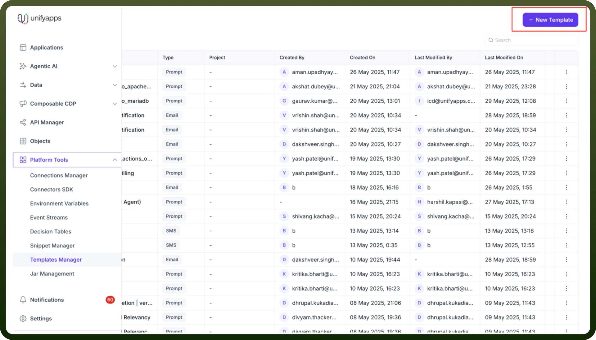
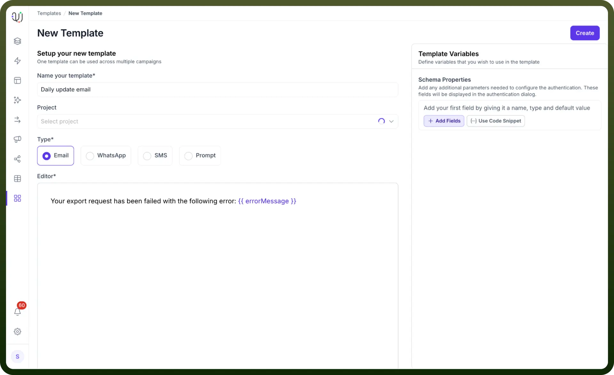
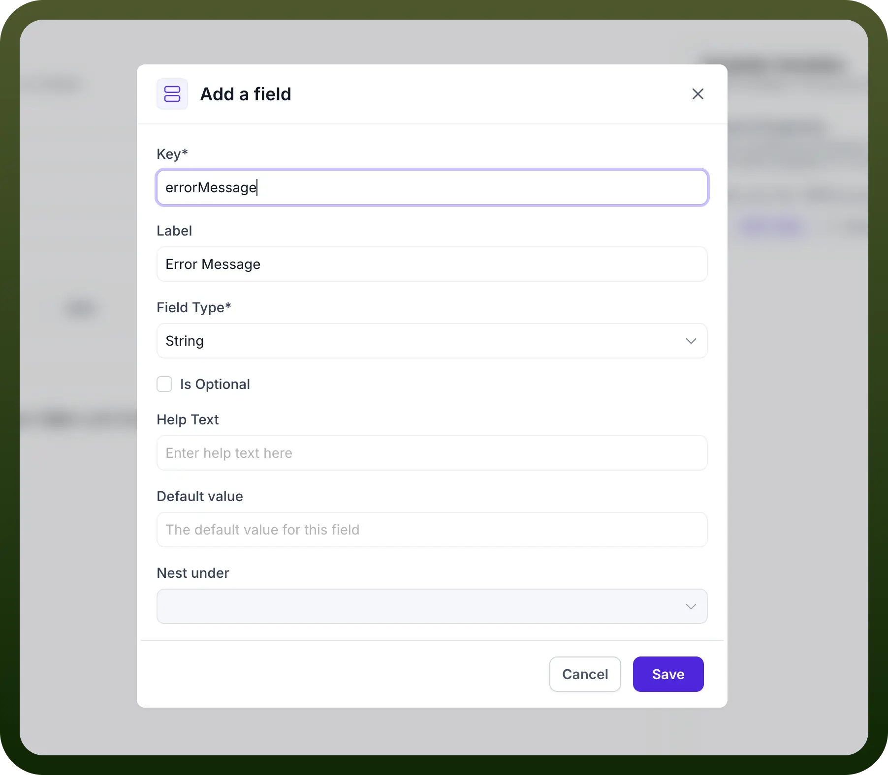
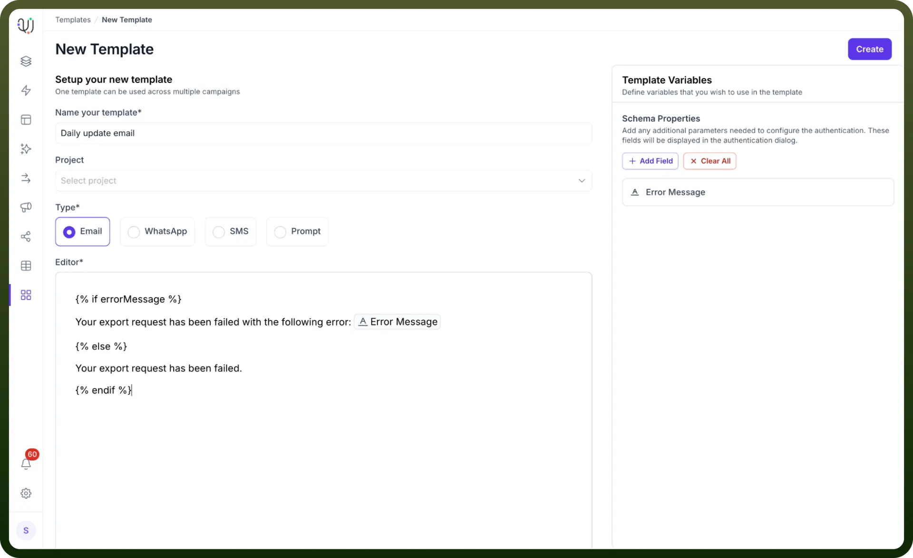
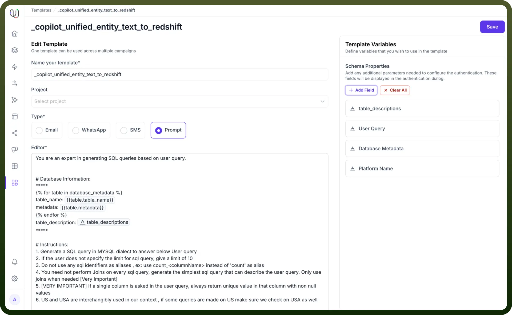
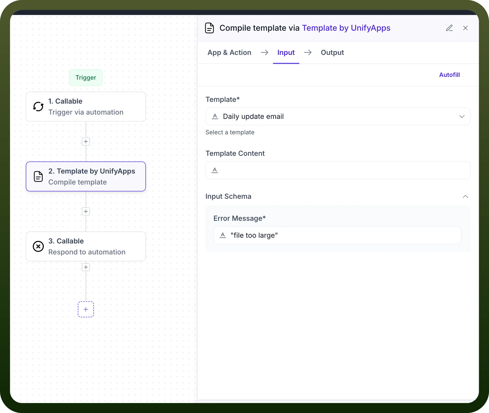

# Build Your First Template

Source: https://www.unifyapps.com/docs/platform-tools/build-your-first-template
Section: platform-tools

---

## Overview

Templates in UnifyApps are versatile tools that allow you to create reusable text-based content for various communication channels, including emails, SMS, WhatsApp, and AI prompts.

## Getting Started with Templates

### Accessing Templates Manager

1. Navigate to the `Platform Tools` section in the UnifyApps dashboard
2. Click on `Templates Manager`
3. Select "`+ New Template`" to begin creating a template

### Creating a New Template

When creating a new template, you'll need to configure several key settings:

**Template Basics**

- `Name your template`: Provide a descriptive name (e.g., "`Daily update email`")
- `Project` (optional): Select the relevant project from the dropdown
- `Type`: Choose the communication channel
  - Email (highlighted in screenshots)
  - WhatsApp
  - SMS
  - Prompt

**Template Variables**

- Use the "`Template Variables`" section to add dynamic fields
- Click "`+ Add Fields`" to include variables like:
  - Error Message
  - Custom parameters specific to your use case

**Adding Template Content**

- Use the editor to write your template content
- Incorporate variables using {{ }} syntax
- For error handling templates, you can add conditional logic

**Example Template Scenarios**

1. **Email Template**
  - Daily update email with dynamic content
  - Include error handling messages
2. **SMS and Whatsapp Template**
  - Short, concise messages
  - Incorporate variable data
3. **Prompt Template**
  - AI-driven templates with specific instructions
  - Flexible input for different use cases

## Using Templates in Automation

**Compile Template Node**

1. In your automation workflow, add the "`Template by UnifyApps`" node
2. Select your created template
3. Configure input parameters
4. Use the template's output in subsequent steps

**Common Use Cases**

- Error notifications
- Daily reporting
- Automated messaging
- AI prompt generation

## Best Practices

- Keep templates concise and clear
- Use meaningful variable names
- Test templates thoroughly in different scenarios
- Leverage conditional logic for robust error handling
