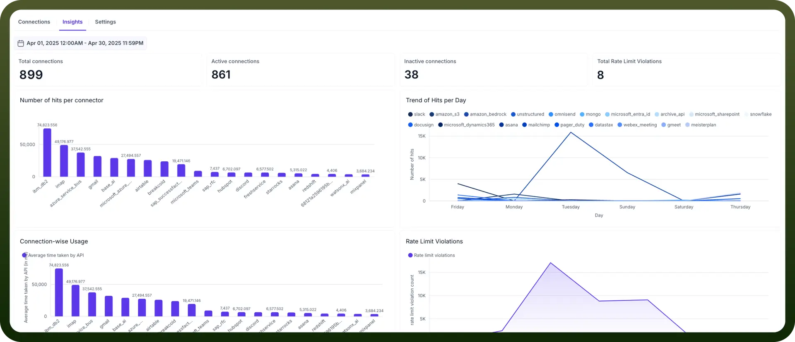

# Connections Insights

Source: https://www.unifyapps.com/docs/platform-tools/connections-insights
Section: platform-tools

---

**Connection Insights** is a powerful feature within the UnifyApps Platform Tools that allows users to view detailed analytics for all their added connections.This helps them understand the usage,trend, failure and multiple other important KPIs related to the added connections

## Why Connection Insights?

In today’s integrated tech ecosystems, businesses rely on a variety of applications. Managing connections to each of these apps manually can be time-consuming, error-prone, and difficult to scale. UnifyApps' Connection Manager centralizes and simplifies this process by giving you a single interface to manage all your app connections.

With this centralization, monitoring these connections also becomes critical to understand the performance and more importantly any failures which might impact the performance of the connections and hence the overall business.

## Key Features

1. **Overview Metrics:** Once user lands onto the Insights page, following metrics are visible in the top rail which provide an overview:
  - `Total connections`**:** Total number of app connections added by the user
  - `Total Active`**:** Number of connections which are in active state
  - `Total Inactive`**:** Number of connections which are in inactive state
  - `Total rate limit violation`**:** Number of times the API rate limit was exceeded across connections.
2. **Date filter:** This helps user to choose a specific date range and see metrics from that duration
3. **No. of hits per connector:**
  - “Hits” refer to the total number of API calls or requests made through each connector
  - This graph helps to understand the total hits coming on each connector. This can be used to get an idea of the most used connectors
4. **Trend of Hits per day:**
  - “Hits” refer to the total number of API calls or requests made through each connector
  - This graph helps to understand the daywise trend of hits coming on different connectors. This can be used to get an idea of the busiest day of the week with most usage of connectors
5. **Rate limit violations:**
  - “Rate limit violations” refers to a situation where API rate limit was exceeded by the connection
  - This graph helps to understand the rate limit violation trend over each day of the week
6. **Connection wise usage:**
  - This metric shows daily distribution of connector usage over time.
  - This graph helps to understand the average time taken (in ms) by each connection so that user can compare the time taken by each connection and make optimizations if needed

## Use Cases

- **IT Teams** can monitor all third-party integrations across internal tools.
- **Product Managers** can track connection health for customer-facing features.
- **Support Teams** can troubleshoot issues quickly by checking connection status and history.

## Example: How it looks in action

Here’s a sample view from the Connection Insights dashboard:

